# Claude Code Instructions for HuskyCat Project

## Sprint Plan Reference

See `docs/SPRINT_PLAN.md` for comprehensive development roadmap covering:
- **Product Mode Architecture**: 5 distinct modes (Git Hooks, CI, CLI, Pipeline, MCP)
- **Execution Modes**: Container vs Binary
- **Auto-Fix Framework**: Confidence tiers, mode-specific behavior
- **Sprint 0-8**: From architecture foundation to auto-fix implementation

## CRITICAL: Git Commit Rules

**Prefer using validation hooks, but `--no-verify` is acceptable during development.**

HuskyCat IS a verification and validation project. We should use our own
validation tools, but strict MyPy errors may require bypassing hooks temporarily.

### Preferred approach:

```bash
git commit -m "message"  # Let hooks run (container-only validation)
```

### During development with validation issues:

```bash
git commit --no-verify -m "message"  # Acceptable when MyPy blocks commits
git push --no-verify  # Acceptable when validation is too strict
```

## 🏗️ **CORE ARCHITECTURE PARADIGM**

> **CRITICAL**: Container-only execution is now implemented. All validation uses containers for consistency and isolation.

### **Container-Only Execution Architecture**

```mermaid
graph TD
    A[User Action] --> B[Entry Point]
    B --> C[./dist/huskycat Binary]
    B --> D[NPM Scripts]
    B --> E[MCP Server]
    
    C --> F[Container Runtime Check]
    D --> F
    E --> F
    
    F --> G{Container Available?}
    G -->|Yes| H[Container Execution]
    G -->|No| I[❌ Install Container Runtime]
    
    H --> J[Complete Toolchain]
    H --> K[Repository Isolation]
    H --> L[Consistent Environment]
    
    style H fill:#87CEEB
    style J fill:#90EE90
    style I fill:#FFB6C1
```



### **Container-Only Tool Strategy**

| Entry Point | Execution | Tools Available | Performance |
|---|---|---|---|
| **Binary** (`./dist/huskycat`) | Container-only | Complete toolchain | ~1-3s |
| **NPM Scripts** (`uv run`) | Container-only | Complete toolchain | ~1-3s |
| **MCP Server** (`--stdio`) | Container-only | Complete toolchain | Persistent |

**Benefits**: Consistent environment, no "tool not found" errors, repository isolation

### **Critical Files & Responsibilities**

- **`src/huskycat/__main__.py`** → CLI interface, factory dispatch
- **`huskycat_main.py`** → Binary entry point wrapper  
- **`src/huskycat/commands/hooks.py`** → Git hooks with binary-first logic
- **`src/huskycat/mcp_server.py`** → MCP stdio protocol implementation
- **`src/huskycat/unified_validation.py`** → Validation engine with auto-fix
- **`ContainerFile`** → Comprehensive tool environment

## Architecture: Container-Only Execution Paradigm

HuskyCat enforces **container-only** validation designed for consistency, isolation, and comprehensive tooling:


### Container-Only Benefits

1. **Consistency** - Same toolchain across all environments
2. **Isolation** - Repository safety, binary config separation
3. **Reliability** - No "tool not found" errors
4. **Security** - Tools cannot modify repository directly

### Tool Distribution Strategy


## Build System: Multi-Modal Command Interface

HuskyCat supports multiple execution modes optimized for different use cases:

### 1. Binary Execution (Preferred for Git Hooks)
```bash
# Fast binary execution - single file, no Python env needed
./dist/huskycat validate --staged
./dist/huskycat setup-hooks
./dist/huskycat status
```

### 2. NPM-Mediated Development Commands

Development builds are mediated through npm scripts for lean reproducibility:

```bash
# Development
npm run dev                    # Run HuskyCat CLI
npm run validate              # Validate current directory
npm run validate:ci           # Validate CI configuration
npm run hooks:install         # Install git hooks (calls setup-hooks)
npm run mcp:server           # Start MCP server for Claude Code
npm run clean                # Clean cache and temporary files
npm run status               # Show HuskyCat status

# Building & Testing  
npm run container:build       # Build validation container
npm run container:test        # Test container works
npm run build:binary         # Create PyInstaller binary
npm run build:upx           # Create UPX-compressed binary
npm run build:all           # Build container and UPX binary
npm run test:unit           # Run unit tests only
npm run test:integration    # Run integration tests only
npm run test:all            # Run all tests (excludes removed E2E tests)

# Documentation
npm run docs:build          # Build MkDocs
npm run docs:serve          # Serve docs locally
npm run pages:deploy        # Deploy to GitHub Pages

# Installation & Dependencies
npm run install:local       # Install locally with uv
npm run install:deps        # Install development dependencies
```

## Project Context

HuskyCat is a comprehensive code validation platform that includes:

- GitLab CI/CD validation
- Git hooks integration
- MCP server for Claude Code
- Container-based validation tools
- Property-based testing with Hypothesis

## Development Workflow

1. **Always validate before committing** - Let the git hooks run
2. **Use HuskyCat's own tools** to validate changes:
   - Run `npm run validate:ci` for GitLab CI validation
   - Use `npm run container:build` for container testing
   - Run individual test suites with `npm run test:unit` (PBT tests have import issues)

3. **Debug validation failures** instead of bypassing them
4. **If hooks fail**, fix the issues rather than skipping verification

## Auto-Fix Validation System

HuskyCat now includes comprehensive auto-fix capabilities with interactive prompts:

### Git Integration with Auto-Fix
When you run `npm run dev -- setup-hooks`, HuskyCat automatically configures:
- **Git hooks** (pre-commit, pre-push, commit-msg) for automatic validation
- **Git alias** `git addf` for interactive auto-fix validation before staging files

### Auto-Fix Workflow
```bash
# Interactive auto-fix before staging
git addf src/file.py          # Validates file, prompts for auto-fix if needed
git addf .                    # Validates all files with interactive prompts

# Direct auto-fix commands
./dist/huskycat validate --fix                    # Auto-fix without prompts
./dist/huskycat validate --staged --interactive   # Interactive fix for staged files
```

### Supported Auto-Fix Validators
- **Black**: Python code formatting
- **YAMLlint**: YAML formatting (trailing spaces, newlines)
- **Future**: autoflake, ansible-lint, ESLint (when available)

### Binary-First Auto-Fix
The auto-fix system follows the binary-first execution paradigm:
1. `./dist/huskycat` (fastest, git hooks)
2. `huskycat` (global installation)
3. `uv run python3 -m src.huskycat` (development)
4. Container fallback (comprehensive tooling)

## MCP Server Integration

HuskyCat includes a **stdio-based MCP server** for Claude Code integration:


### MCP Tools Exposed:
- `validate` - Validate files/directories
- `validate_staged` - Validate git staged files
- `validate_black`, `validate_mypy`, etc. - Individual tool validators

### Starting MCP Server:
```bash
# Binary execution (stdio)
./dist/huskycat mcp-server

# NPM script
npm run mcp:server

# Test connection
echo '{"jsonrpc": "2.0", "method": "tools/list", "id": 1}' | npm run mcp:server
```

## Available CLI Commands

HuskyCat provides these commands (use binary or npm scripts):

```bash
# Core validation commands
npm run dev -- validate           # Run validation on files
npm run dev -- validate --staged  # Validate only staged git files  
npm run dev -- validate --all     # Validate all files in repository
npm run dev -- ci-validate FILE   # Validate CI configuration files

# Auto-fix validation commands (NEW)
npm run dev -- validate --fix         # Run validation with auto-fix
npm run dev -- validate --staged --fix    # Auto-fix staged files
git addf <files>                   # NEW: Git alias for interactive auto-fix before add
git addf .                         # NEW: Validate and auto-fix all files before staging

# Setup and management
npm run dev -- install            # Install HuskyCat and dependencies
npm run dev -- setup-hooks        # Setup git hooks (NOT "install hooks")
npm run dev -- update-schemas     # Update validation schemas
npm run dev -- clean              # Clean cache and temporary files
npm run dev -- status             # Show HuskyCat status and configuration

# Advanced features
npm run dev -- auto-devops        # Validate Auto-DevOps Helm/K8s manifests
npm run dev -- mcp-server         # Start MCP server for AI integration

# Direct UV commands (if needed)
uv run black src/ tests/          # Code formatting
uv run flake8 src/ tests/         # Linting
uv run mypy src/                  # Type checking
uv run ruff check src/ tests/     # Fast linting

# External tools (if available)
glab ci lint .gitlab-ci.yml       # GitLab CI validation (requires glab CLI)
```

## Repository Standards

- Python code uses UV package manager
- All code must pass Black, Flake8, MyPy, and Ruff checks
- GitLab CI must validate with both `npm run validate:ci` and yamllint
- Tests use property-based testing with Hypothesis (currently has import issues)
- Documentation in MkDocs format
- Container builds with Podman/Docker using ContainerFile

## Current Test Status

⚠️ **Note**: The test suite currently has several issues:

**Import/Dependency Issues:**
- Missing dependencies: `websockets`
- Module import issues: `mcp_server`, `unified_validation`
- Several PBT (Property-Based Testing) files have broken imports

**Container Testing Issues:**
- Container entrypoint conflicts with test expectations (runs HuskyCat CLI instead of arbitrary commands)
- Many container tests fail due to ENTRYPOINT design

**Recommended Testing Approach:**
- Use direct Python execution: `uv run python -m src.huskycat COMMAND` 
- Individual validation: `uv run black src/`, `uv run mypy src/`
- Container build testing: `npm run container:build && npm run container:test`
- Avoid `npm run test:all` until import issues are resolved

## Quick Reference: Working Commands

**✅ Verified working commands:**

```bash
# Basic CLI operations
npm run dev                          # Show HuskyCat help
npm run dev -- --help               # Show detailed help
npm run dev -- setup-hooks --help   # Setup git hooks (corrected command)
npm run validate                     # Validate current directory
npm run validate:ci                  # Validate .gitlab-ci.yml  
npm run clean                        # Clean cache
npm run status                       # Show status

# NEW: Auto-fix validation commands
npm run dev -- validate --fix       # Auto-fix validation issues
git addf <files>                     # Interactive auto-fix before staging
git addf .                          # Validate and auto-fix all files

# Container operations
npm run container:build              # Build validation container
npm run container:test               # Test container basic functionality

# Binary operations
npm run build:binary                 # Build PyInstaller binary (now working)
./dist/huskycat validate --staged   # Fast binary validation

# Documentation
npm run docs:build                   # Build MkDocs documentation
npm run docs:serve                   # Serve documentation locally

# Direct UV operations (bypass npm)
uv run python -m src.huskycat --help    # Direct CLI access
uv run black src/                        # Format code
uv run mypy src/                         # Type checking
```

**⚠️ Commands with issues:**
- `npm run test:all` - Import errors (missing websockets dependency)
- `npm run build:upx` - UPX disabled on macOS due to signing compatibility issues

## Bootstrap Operations & Critical Paths

### What MUST be in src/ for Binary-First Paradigm:

```mermaid
graph TD
    A[\"src/huskycat/__main__.py\"] --> B[\"CLI Entry Point\"]
    B --> C[\"core/factory.py\"]
    C --> D[\"Factory Pattern\"]
    D --> E[\"commands/*.py\"]
    E --> F[\"Individual Commands\"]
    
    G[\"unified_validation.py\"] --> H[\"ValidationEngine\"]
    H --> I[\"Tool Validators\"]
    
    J[\"mcp_server.py\"] --> K[\"MCP stdio Server\"]
    K --> H
    
    F --> H
    
    style A fill:#e1f5fe\n    style C fill:#e1f5fe\n    style G fill:#e1f5fe\n    style J fill:#e8f5e8\n```\n\n### Critical Implementation Requirements:\n\n1. **Entry Point Consistency**: \n   - `src/huskycat/__main__.py` must work for both binary and `python -m src.huskycat`\n   - Factory must handle dynamic command loading\n\n2. **Tool Dependencies Hierarchy**:\n   - **Binary**: Core Python tools (black, flake8, mypy, ruff) + git operations\n   - **Container**: All tools (shellcheck, hadolint, yamllint, security scanners)\n   - **MCP Server**: Uses ValidationEngine to expose all available tools\n\n3. **Validation Engine Requirements**:\n   - Must detect available tools automatically\n   - Must gracefully degrade if tools missing\n   - Must support both local and container execution\n\n4. **MCP Server Protocol**:\n   - stdio-based JSON-RPC 2.0 protocol\n   - Exposes validation tools as MCP tools for Claude Code\n   - Must not interfere with stdout/stdin of validation tools\n\n### Current Implementation Gaps Identified:\n\n⚠️ **Known Issues from Analysis**:\n\n1. **Entry Point Confusion**: \n   - `src/__main__.py` missing but referenced in Makefile\n   - Current entry at `src/huskycat/__main__.py` \n   - NPM scripts use `src.huskycat` module path\n\n2. **Binary Build Process**:\n   - Makefile references `$(SRC_DIR)/__main__.py` (doesn't exist)\n   - Should reference `src/huskycat/__main__.py`\n   - PyInstaller spec needs verification\n\n3. **Container vs Binary Tool Availability**:\n   - Container has comprehensive tooling\n   - Binary likely missing some tools (shellcheck, hadolint)\n   - ValidationEngine needs smart fallback logic\n\n## Factory Pattern Implementation Details\n\nThe `HuskyCatFactory` class in `core/factory.py` provides unified command dispatch:\n\n```python\n# Commands registered:\n\"validate\": ValidateCommand\n\"setup-hooks\": SetupHooksCommand\n\"ci-validate\": CIValidateCommand\n\"mcp-server\": MCPServerCommand\n# ... etc\n```\n\n**Key Architectural Decisions**:\n- **Single entry point** for all execution modes\n- **Dynamic command loading** with graceful failure\n- **Shared configuration directory** (~/.huskycat)\n- **Consistent result format** via CommandResult dataclass\n\n## Remember\n\nThis project is about code quality and validation. We must demonstrate best\npractices by using our own tools consistently. **No shortcuts on verification!**\n\n**For Future Agents**: This is attempt #8 at getting the architecture right. The \n**binary-first, container-extensible** paradigm is core. Don't rebuild - enhance!
