# Claude Code Instructions for HuskyCat Project

## CRITICAL: Git Commit Rules

**NEVER use `--no-verify` flag when committing in this repository!**

HuskyCat IS a verification and validation project. We must use our own
validation tools and git hooks for every commit. This is non-negotiable.

### Always use:

```bash
git commit -m "message"  # Let hooks run
```

### Never use:

```bash
git commit --no-verify -m "message"  # FORBIDDEN in HuskyCat
```

## 🏗️ **CORE ARCHITECTURE PARADIGM**

> **CRITICAL**: This is the 8th attempt at this project. The architecture is **SOUND** - focus on **FIXING GAPS**, not rebuilding.

### **Binary-First Execution Hierarchy**

```mermaid
graph TD
    A[User Action] --> B{Binary Available?}
    B -->|Yes| C[./dist/huskycat]
    B -->|No| D{Global huskycat?}
    D -->|Yes| E[huskycat command]
    D -->|No| F{Container Available?}
    F -->|Yes| G[podman run huskycat:local]
    F -->|No| H[❌ Install Required]
    
    C --> I[Fast Execution < 500ms]
    E --> I
    G --> J[Comprehensive Tools < 3s]
    
    style C fill:#90EE90
    style G fill:#87CEEB
    style H fill:#FFB6C1
```



### **Tool Distribution Strategy**

| Execution Mode | Tools Available | Use Case | Performance |
|---|---|---|---|
| **Binary** (`./dist/huskycat`) | Essential subset | Git hooks, CLI | < 500ms |
| **Container** (`huskycat:local`) | Complete toolchain | CI/CD, Fallback | < 3s |
| **MCP Server** (`--stdio`) | Container tools | Claude Code | Real-time |

### **Critical Files & Responsibilities**

- **`src/huskycat/__main__.py`** → CLI interface, factory dispatch
- **`huskycat_main.py`** → Binary entry point wrapper  
- **`src/huskycat/commands/hooks.py`** → Git hooks with binary-first logic
- **`src/huskycat/mcp_server.py`** → MCP stdio protocol implementation
- **`src/huskycat/unified_validation.py`** → Validation engine with auto-fix
- **`ContainerFile`** → Comprehensive tool environment

## Architecture: Binary-First Execution Paradigm

HuskyCat follows a **binary-first, container-extensible** architecture designed for performance and comprehensive tooling:


### Execution Hierarchy (Priority Order)

1. **Binary First** (`./dist/huskycat`) - Fastest execution, git hooks, production usage
2. **Container for Comprehensive** - Full toolchain when binary lacks specific validators  
3. **NPM Scripts for Development** - Convenience wrapper for development/testing
4. **MCP Server for AI** - Claude Code integration via stdio protocol

### Tool Distribution Strategy


## Build System: Multi-Modal Command Interface

HuskyCat supports multiple execution modes optimized for different use cases:

### 1. Binary Execution (Preferred for Git Hooks)
```bash
# Fast binary execution - single file, no Python env needed
./dist/huskycat validate --staged
./dist/huskycat setup-hooks
./dist/huskycat status
```

### 2. NPM-Mediated Development Commands

Development builds are mediated through npm scripts for lean reproducibility:

```bash
# Development
npm run dev                    # Run HuskyCat CLI
npm run validate              # Validate current directory
npm run validate:ci           # Validate CI configuration
npm run hooks:install         # Install git hooks (calls setup-hooks)
npm run mcp:server           # Start MCP server for Claude Code
npm run clean                # Clean cache and temporary files
npm run status               # Show HuskyCat status

# Building & Testing  
npm run container:build       # Build validation container
npm run container:test        # Test container works
npm run build:binary         # Create PyInstaller binary
npm run build:upx           # Create UPX-compressed binary
npm run build:all           # Build container and UPX binary
npm run test:unit           # Run unit tests only
npm run test:integration    # Run integration tests only
npm run test:e2e            # Run end-to-end tests only
npm run test:all            # Run all tests (may have import errors)

# Documentation
npm run docs:build          # Build MkDocs
npm run docs:serve          # Serve docs locally
npm run pages:deploy        # Deploy to GitHub Pages

# Installation & Dependencies
npm run install:local       # Install locally with uv
npm run install:deps        # Install development dependencies
```

## Project Context

HuskyCat is a comprehensive code validation platform that includes:

- GitLab CI/CD validation
- Git hooks integration
- MCP server for Claude Code
- Container-based validation tools
- Property-based testing with Hypothesis

## Development Workflow

1. **Always validate before committing** - Let the git hooks run
2. **Use HuskyCat's own tools** to validate changes:
   - Run `npm run validate:ci` for GitLab CI validation
   - Use `npm run container:build` for container testing
   - Run individual test suites with `npm run test:unit` (PBT tests have import issues)

3. **Debug validation failures** instead of bypassing them
4. **If hooks fail**, fix the issues rather than skipping verification

## MCP Server Integration

HuskyCat includes a **stdio-based MCP server** for Claude Code integration:


### MCP Tools Exposed:
- `validate` - Validate files/directories
- `validate_staged` - Validate git staged files
- `validate_black`, `validate_mypy`, etc. - Individual tool validators

### Starting MCP Server:
```bash
# Binary execution (stdio)
./dist/huskycat mcp-server

# NPM script
npm run mcp:server

# Test connection
echo '{"jsonrpc": "2.0", "method": "tools/list", "id": 1}' | npm run mcp:server
```

## Available CLI Commands

HuskyCat provides these commands (use binary or npm scripts):

```bash
# Core validation commands
npm run dev -- validate           # Run validation on files
npm run dev -- validate --staged  # Validate only staged git files  
npm run dev -- validate --all     # Validate all files in repository
npm run dev -- ci-validate FILE   # Validate CI configuration files

# Setup and management
npm run dev -- install            # Install HuskyCat and dependencies
npm run dev -- setup-hooks        # Setup git hooks (NOT "install hooks")
npm run dev -- update-schemas     # Update validation schemas
npm run dev -- clean              # Clean cache and temporary files
npm run dev -- status             # Show HuskyCat status and configuration

# Advanced features
npm run dev -- auto-devops        # Validate Auto-DevOps Helm/K8s manifests
npm run dev -- mcp-server         # Start MCP server for AI integration

# Direct UV commands (if needed)
uv run black src/ tests/          # Code formatting
uv run flake8 src/ tests/         # Linting
uv run mypy src/                  # Type checking
uv run ruff check src/ tests/     # Fast linting

# External tools (if available)
glab ci lint .gitlab-ci.yml       # GitLab CI validation (requires glab CLI)
```

## Repository Standards

- Python code uses UV package manager
- All code must pass Black, Flake8, MyPy, and Ruff checks
- GitLab CI must validate with both `npm run validate:ci` and yamllint
- Tests use property-based testing with Hypothesis (currently has import issues)
- Documentation in MkDocs format
- Container builds with Podman/Docker using ContainerFile

## Current Test Status

⚠️ **Note**: The test suite currently has several issues:

**Import/Dependency Issues:**
- Missing dependencies: `websockets`, `playwright` 
- Module import issues: `mcp_server`, `unified_validation`
- Several PBT (Property-Based Testing) files have broken imports

**Container Testing Issues:**
- Container entrypoint conflicts with test expectations (runs HuskyCat CLI instead of arbitrary commands)
- Many container tests fail due to ENTRYPOINT design

**Recommended Testing Approach:**
- Use direct Python execution: `uv run python -m src.huskycat COMMAND` 
- Individual validation: `uv run black src/`, `uv run mypy src/`
- Container build testing: `npm run container:build && npm run container:test`
- Avoid `npm run test:all` until import issues are resolved

## Quick Reference: Working Commands

**✅ Verified working commands:**

```bash
# Basic CLI operations
npm run dev                          # Show HuskyCat help
npm run dev -- --help               # Show detailed help
npm run dev -- setup-hooks --help   # Setup git hooks (corrected command)
npm run validate                     # Validate current directory
npm run validate:ci                  # Validate .gitlab-ci.yml  
npm run clean                        # Clean cache
npm run status                       # Show status

# Container operations
npm run container:build              # Build validation container
npm run container:test               # Test container basic functionality

# Documentation
npm run docs:build                   # Build MkDocs documentation
npm run docs:serve                   # Serve documentation locally

# Direct UV operations (bypass npm)
uv run python -m src.huskycat --help    # Direct CLI access
uv run black src/                        # Format code
uv run mypy src/                         # Type checking
```

**⚠️ Commands with issues:**
- `npm run test:all` - Import errors
- `npm run build:binary` - May need PyInstaller setup
- `npm run build:upx` - Requires UPX installation

## Bootstrap Operations & Critical Paths

### What MUST be in src/ for Binary-First Paradigm:

```mermaid
graph TD
    A[\"src/huskycat/__main__.py\"] --> B[\"CLI Entry Point\"]
    B --> C[\"core/factory.py\"]
    C --> D[\"Factory Pattern\"]
    D --> E[\"commands/*.py\"]
    E --> F[\"Individual Commands\"]
    
    G[\"unified_validation.py\"] --> H[\"ValidationEngine\"]
    H --> I[\"Tool Validators\"]
    
    J[\"mcp_server.py\"] --> K[\"MCP stdio Server\"]
    K --> H
    
    F --> H
    
    style A fill:#e1f5fe\n    style C fill:#e1f5fe\n    style G fill:#e1f5fe\n    style J fill:#e8f5e8\n```\n\n### Critical Implementation Requirements:\n\n1. **Entry Point Consistency**: \n   - `src/huskycat/__main__.py` must work for both binary and `python -m src.huskycat`\n   - Factory must handle dynamic command loading\n\n2. **Tool Dependencies Hierarchy**:\n   - **Binary**: Core Python tools (black, flake8, mypy, ruff) + git operations\n   - **Container**: All tools (shellcheck, hadolint, yamllint, security scanners)\n   - **MCP Server**: Uses ValidationEngine to expose all available tools\n\n3. **Validation Engine Requirements**:\n   - Must detect available tools automatically\n   - Must gracefully degrade if tools missing\n   - Must support both local and container execution\n\n4. **MCP Server Protocol**:\n   - stdio-based JSON-RPC 2.0 protocol\n   - Exposes validation tools as MCP tools for Claude Code\n   - Must not interfere with stdout/stdin of validation tools\n\n### Current Implementation Gaps Identified:\n\n⚠️ **Known Issues from Analysis**:\n\n1. **Entry Point Confusion**: \n   - `src/__main__.py` missing but referenced in Makefile\n   - Current entry at `src/huskycat/__main__.py` \n   - NPM scripts use `src.huskycat` module path\n\n2. **Binary Build Process**:\n   - Makefile references `$(SRC_DIR)/__main__.py` (doesn't exist)\n   - Should reference `src/huskycat/__main__.py`\n   - PyInstaller spec needs verification\n\n3. **Container vs Binary Tool Availability**:\n   - Container has comprehensive tooling\n   - Binary likely missing some tools (shellcheck, hadolint)\n   - ValidationEngine needs smart fallback logic\n\n## Factory Pattern Implementation Details\n\nThe `HuskyCatFactory` class in `core/factory.py` provides unified command dispatch:\n\n```python\n# Commands registered:\n\"validate\": ValidateCommand\n\"setup-hooks\": SetupHooksCommand\n\"ci-validate\": CIValidateCommand\n\"mcp-server\": MCPServerCommand\n# ... etc\n```\n\n**Key Architectural Decisions**:\n- **Single entry point** for all execution modes\n- **Dynamic command loading** with graceful failure\n- **Shared configuration directory** (~/.huskycat)\n- **Consistent result format** via CommandResult dataclass\n\n## Remember\n\nThis project is about code quality and validation. We must demonstrate best\npractices by using our own tools consistently. **No shortcuts on verification!**\n\n**For Future Agents**: This is attempt #8 at getting the architecture right. The \n**binary-first, container-extensible** paradigm is core. Don't rebuild - enhance!
