# HuskyCat - Universal Code Validation Platform

A **binary-first, container-extensible** validation platform designed for fast git workflows, comprehensive tooling, and AI integration through MCP server protocol.

## Architecture Overview

HuskyCat follows a multi-modal execution paradigm optimized for different use cases:

```mermaid
graph LR
    A["🚀 Fast Execution"] --> B["Binary"]
    C["🛠️ Development"] --> D["NPM Scripts"]
    E["📦 Comprehensive"] --> F["Container"]
    G["🤖 AI Integration"] --> H["MCP Server"]
    
    B --> I["Git Hooks\nProduction"]
    D --> J["Development\nTesting"]
    F --> K["All Tools\nIsolated Environment"]
    H --> L["Claude Code\nValidation"]
    
    style B fill:#e1f5fe
    style F fill:#f3e5f5
    style H fill:#e8f5e8
```



## Key Features

### 🏃‍♂️ **Binary-First Execution**
- Single executable for git hooks and CLI usage
- Zero Python environment dependency for core workflows
- Sub-second validation for staged files

### 📦 **Container Extensibility**
- Complete toolchain: Python, Node.js, Shell, Docker validation
- Isolated execution environment
- Security scanners and advanced tooling

### 🤖 **AI Integration via MCP**
- stdio-based MCP server for Claude Code
- Exposes validation tools as AI-callable functions
- Real-time code quality feedback

### 🔄 **Universal Validation**
- **Core Tools**: Black, Flake8, MyPy, Ruff
- **Extended Tools**: yamllint, shellcheck, hadolint, eslint
- **Security**: bandit, safety, dependency scanning
- **GitLab CI**: Schema validation and pipeline testing

## Quick Start

### 1. Build and Setup
```bash
# Install dependencies
npm install
uv sync --dev

# Build binary (preferred for production)
npm run build:binary

# Or build container (comprehensive tooling)
npm run container:build

# Verify installation
./dist/huskycat --version
./dist/huskycat status
```

### 2. Core Operations
```bash
# Fast binary execution (git hooks, production)
./dist/huskycat validate --staged    # Validate staged files
./dist/huskycat setup-hooks          # Install git hooks
./dist/huskycat ci-validate .gitlab-ci.yml

# Development mode (NPM scripts)
npm run validate                     # Quick validation
npm run validate:ci                  # CI configuration
npm run mcp:server                   # Start MCP server

# Container mode (comprehensive)
npm run container:test:validate      # Full toolchain
```

### 3. Claude Code Integration
```bash
# Start MCP server (stdio protocol)
./dist/huskycat mcp-server

# Test connection
echo '{"jsonrpc": "2.0", "method": "tools/list", "id": 1}' | npm run mcp:server
```

## Execution Modes Explained

### 🚀 Binary Execution (Recommended)
```bash
./dist/huskycat [command]            # Fastest, single file, no dependencies
```
**Best for**: Git hooks, CI/CD, production deployments
**Tools**: Core Python validators (black, flake8, mypy, ruff)

### 🛠️ NPM Script Development
```bash
npm run dev -- [command]            # Python module via NPM
```
**Best for**: Development, testing, convenience
**Tools**: Same as binary, easier debugging

### 📦 Container Mode
```bash
npm run container:build              # Build comprehensive container
podman run --rm -v $(pwd):/workspace huskycat:local validate --all
```
**Best for**: Comprehensive validation, CI/CD, security scanning
**Tools**: All tools (Python + Node.js + Shell + Docker + Security)

### 🤖 MCP Server Mode
```bash
./dist/huskycat mcp-server           # stdio JSON-RPC server
```
**Best for**: Claude Code integration, AI-powered validation
**Tools**: Exposes all available validators as callable functions

## Available Commands

| Command | Description | Options |
|---------|-------------|---------|
| `validate` | Run validation on files | `--staged`, `--all`, `[files...]` |
| `install` | Install HuskyCat and dependencies | `--dev`, `--global` |
| `setup-hooks` | Setup git hooks for automatic validation | `--force` |
| `update-schemas` | Update validation schemas from official sources | `--force` |
| `ci-validate` | Validate CI configuration files | `[files...]` |
| `auto-devops` | Validate Auto-DevOps Helm charts and Kubernetes | `--no-helm`, `--no-k8s`, `--simulate`, `--strict` |
| `mcp-server` | Start MCP server for AI integration | `--port PORT` |
| `clean` | Clean cache and temporary files | `--all` |
| `status` | Show HuskyCat status and configuration | |

## Requirements

### Core Requirements
- Python 3.8+ (for binary build and NPM mode)
- UV package manager (`pip install uv`)
- Node.js and npm (build system)

### Optional Requirements
- Podman/Docker (container mode)
- PyInstaller + UPX (binary compression)
- Git (for hooks and staged file validation)

### Tool Dependencies by Mode
| Mode | Python Tools | System Tools | Container Tools |
|------|-------------|--------------|----------------|
| Binary | ✅ Core | ❌ Limited | ❌ None |
| NPM Scripts | ✅ Core | ❌ Limited | ❌ None |
| Container | ✅ All | ✅ All | ✅ All |

## Installation

1. **Clone and build**:
   ```bash
   git clone <repository>
   cd huskycats-bates
   npm install
   npm run build:binary
   ```

2. **Install Python dependencies**:
   ```bash
   uv sync --dev
   ```

3. **Verify installation**:
   ```bash
   ./dist/huskycat --version
   ./dist/huskycat status
   ```

## Architecture Deep Dive

### Factory Pattern & Command Dispatch
HuskyCat uses a unified factory pattern for all execution modes:

```python
# All commands flow through HuskyCatFactory
factory = HuskyCatFactory(config_dir=~/.huskycat)
result = factory.execute_command("validate", files=["src/"])
```

### Tool Detection & Graceful Degradation
- **Binary**: Ships with core Python tools
- **Container**: Provides complete toolchain 
- **ValidationEngine**: Automatically detects available tools
- **Fallback Logic**: Gracefully handles missing validators

### MCP Server Protocol
Uses stdio-based JSON-RPC 2.0 for Claude Code integration:
```json
{"jsonrpc": "2.0", "method": "tools/call", "params": {
  "name": "validate", 
  "arguments": {"path": "src/", "fix": false}
}}
```

### Performance Characteristics
- **Binary**: ~50ms startup, sub-second for staged files
- **NPM Scripts**: ~200ms startup (Python import overhead)
- **Container**: ~1-2s startup, comprehensive tooling
- **MCP Server**: Persistent process, instant responses

## Implementation Details

### Critical Files for Binary-First Paradigm:
- `src/huskycat/__main__.py` - CLI entry point
- `src/huskycat/core/factory.py` - Unified command factory
- `src/huskycat/unified_validation.py` - Validation engine
- `src/huskycat/mcp_server.py` - MCP stdio server
- `ContainerFile` - Comprehensive toolchain container

### Current Known Issues:
⚠️ **Entry Point Path**: Makefile references missing `src/__main__.py`  
⚠️ **Tool Availability**: ValidationEngine needs container fallback logic  
⚠️ **Test Suite**: Some property-based tests have import issues  

## Documentation

Visit [huskycat.pages.io](https://huskycat.pages.io) for complete documentation.

**For Developers**: See `/Users/jsullivan2/git/huskycats-bates/CLAUDE.md` for detailed architecture notes and `/Users/jsullivan2/git/huskycats-bates/ARCHITECTURE_GAPS.md` for implementation gap analysis.

## Quick Architecture Reference

