# HuskyCat - Universal Code Validation Platform

Fast, flexible, and AI-integrated validation for modern development workflows.

[](https://gitlab.com/jsullivan2/huskycats-bates/-/pipelines)

## Quick Install

**One-line install** (macOS & Linux):
```bash
curl -fsSL https://tinyland.gitlab.io/ai/huskycat/install.sh | bash
```

**Manual downloads**: [Binary Downloads →](https://tinyland.gitlab.io/ai/huskycat/downloads/)

**Documentation**: [docs/ →](docs/)

## What is HuskyCat?

HuskyCat is a universal code validation platform with:

- ⚡ **Non-Blocking Git Hooks** - Commits complete in <100ms while validation runs in background
- 📦 **Fat Binary Distribution** - Standalone binaries with embedded tools (no dependencies)
- 🔧 **15+ Validation Tools** - Black, MyPy, Ruff, shellcheck, hadolint, yamllint, and more
- 🤖 **AI Integration** - MCP server for Claude Code
- 🎯 **Multi-Modal Execution** - Binary, Container, or UV development modes
- 🔄 **Auto-Fix Support** - Interactive prompts to automatically fix issues

## Architecture Overview

### Five Product Modes

HuskyCat operates in 5 distinct modes with different performance and output requirements:


**Mode Details**: [docs/architecture/product-modes.md](docs/architecture/product-modes.md)

### Three Execution Models


**Execution Details**: [docs/architecture/execution-models.md](docs/architecture/execution-models.md)

### Non-Blocking Git Hooks

Commits proceed immediately while validation runs in background:

```mermaid
graph LR
    A[Git Commit] --> B[Parent Process<br/><100ms]
    B --> C[Check Previous Run]
    C -->|Failed| D[Prompt User]
    C -->|OK| E[Fork Child]
    D -->|Continue| E
    E --> F[Save PID]
    F --> G[Return to Git]
    G --> H[Commit Proceeds ✓]

    E -.-> I[Child Process<br/>Background]
    I --> J[Initialize TUI]
    J --> K[Run 15+ Tools<br/>in Parallel]
    K --> L[Save Results]

    style H fill:#c8e6c9
    style K fill:#fff3e0
```



**Non-Blocking Details**: [docs/nonblocking-hooks.md](docs/nonblocking-hooks.md)

## Key Features

### ⚡ Non-Blocking Git Hooks (Sprint 10)
- **300x faster** commits: <100ms vs 30s blocking
- Validation runs in background with real-time TUI progress
- All 15+ tools run automatically (not just fast subset)
- Previous failure detection prevents committing with errors
- **7.5x speedup** with parallel tool execution

**Enable non-blocking mode:**
```bash
git config --local huskycat.nonblocking true
```

### 📦 Fat Binary Distribution (Sprint 10)
- Standalone 150-200MB binaries with embedded tools
- No container runtime dependency
- **4.5x faster** than container mode
- Cross-platform: macOS (ARM64), Linux (AMD64/ARM64)
- One-time tool extraction to `~/.huskycat/tools/`

**Supported platforms:**
- Linux AMD64 (x86_64)
- Linux ARM64 (aarch64)
- macOS ARM64 (M1/M2/M3/M4)
- macOS Intel (via Rosetta 2)

### 🔧 Universal Validation
- **Python**: black, flake8, mypy, ruff, pylint, bandit, isort
- **Shell**: shellcheck
- **Docker**: hadolint
- **YAML**: yamllint, ansible-lint
- **TOML**: taplo
- **GitLab CI**: Schema validation
- **Chapel**: First-class Chapel language support

### 🤖 AI Integration (MCP Server)
```bash
# Start MCP server for Claude Code
huskycat mcp-server

# Add to Claude Code
claude mcp add huskycat -- huskycat mcp-server
```

Exposes validation tools as AI-callable functions for real-time code quality feedback.

## Quick Start

### 1. Install HuskyCat

**One-line install:**
```bash
curl -fsSL https://tinyland.gitlab.io/ai/huskycat/install.sh | bash
```

**Manual download:**

See [docs/binary-downloads.md](docs/binary-downloads.md) for platform-specific download links.

**macOS note**: Remove quarantine after download:
```bash
xattr -d com.apple.quarantine huskycat
```

**Verify installation:**
```bash
huskycat --version  # Should show: huskycat 2.0.0
huskycat status     # Show installation details
```

### 2. Setup Git Hooks

```bash
cd /path/to/your/repo
huskycat setup-hooks

# Enable fast non-blocking mode (recommended)
git config --local huskycat.nonblocking true
```

### 3. Validate Code

```bash
# Validate staged files
huskycat validate --staged

# Validate all files
huskycat validate --all

# Auto-fix issues
huskycat validate --fix

# Validate GitLab CI
huskycat ci-validate .gitlab-ci.yml
```

### 4. Test Non-Blocking Hooks

```bash
echo "# test" >> README.md
git add README.md
git commit -m "test: verify huskycat works"

# Expected output:
# ⚡ Non-blocking validation mode enabled
# 🚀 Launching background validation... (PID 12345)
# [main abc1234] test: verify huskycat works
#  1 file changed, 1 insertion(+)
```

Commit completes immediately while validation runs in background!

## Mode Comparison

| Mode | Speed | Tools | Output | Use Case |
|------|-------|-------|--------|----------|
| **Git Hooks (Non-Blocking)** | <100ms | All (15+) | TUI progress | Fast commits with comprehensive validation |
| **Git Hooks (Blocking)** | 5-30s | Fast (4) | Minimal | Legacy mode, immediate feedback |
| **CI Mode** | Variable | All (15+) | JUnit XML | Pipeline integration |
| **CLI Mode** | Variable | Configured | Colored | Interactive development |
| **Pipeline Mode** | Variable | All (15+) | JSON | Scriptable automation |
| **MCP Server** | Sub-second | All (15+) | JSON-RPC | AI integration |

## Performance

| Metric | Blocking Hooks | Non-Blocking Hooks | Improvement |
|--------|----------------|-------------------|-------------|
| **Time to commit** | 30s | <0.1s | **300x faster** |
| **Full validation** | 30s | 10s | **3x faster** |
| **Tools run** | 4 | 15+ | **3.75x more** |
| **Parallel speedup** | - | 7.5x | **vs sequential** |
| **Embedded tools** | 1.87s/tool | 0.42s/tool | **4.5x faster** |

## Documentation

### User Guides
- [Installation Guide](docs/installation.md) - Detailed installation for all platforms
- [Beta Testing Guide](docs/BETA_TESTING.md) - Beta testing instructions
- [Binary Downloads](docs/binary-downloads.md) - Download links for all platforms
- [Troubleshooting](docs/troubleshooting.md) - Common issues and solutions
- [CLI Reference](docs/cli-reference.md) - Command-line usage

### Architecture
- [Product Modes](docs/architecture/product-modes.md) - 5 modes (6 adapters)
- [Execution Models](docs/architecture/execution-models.md) - Binary, Container, UV
- [Fat Binaries](docs/architecture/fat-binaries.md) - Embedded tools architecture
- [TUI Framework](docs/architecture/tui.md) - Real-time progress display

### Features
- [Non-Blocking Hooks](docs/nonblocking-hooks.md) - Fast commit workflow
- [MCP Server](docs/features/mcp-server.md) - AI integration
- [Parallel Executor](docs/parallel_executor.md) - Concurrent tool execution

### CI/CD
- [GitLab CI Documentation](docs/ci-cd/gitlab.md) - Complete pipeline reference
- [CI/CD Migration Notes](docs/ci-cd/MIGRATION_NOTES.md) - CI updates

### Development
- [Dogfooding](docs/dogfooding.md) - Using HuskyCat to validate itself
- [Claude Instructions](CLAUDE.md) - AI assistant integration

## Downloads

**Latest Release** (main branch):

| Platform | Architecture | Download |
|----------|-------------|----------|
| Linux | x86_64 (amd64) | [Download →](https://gitlab.com/jsullivan2/huskycats-bates/-/jobs/artifacts/main/raw/dist/bin/huskycat-linux-amd64?job=build:binary:linux-amd64) |
| Linux | ARM64 (aarch64) | [Download →](https://gitlab.com/jsullivan2/huskycats-bates/-/jobs/artifacts/main/raw/dist/bin/huskycat-linux-arm64?job=build:binary:linux-arm64) |
| macOS | ARM64 (M1/M2/M3/M4) | [Download →](https://gitlab.com/jsullivan2/huskycats-bates/-/jobs/artifacts/main/raw/dist/bin/huskycat-darwin-arm64?job=build:binary:darwin-arm64) |

**Binary sizes**: 150-200MB (includes all validation tools)

**See also**: [Binary Downloads Guide](docs/binary-downloads.md) for checksums and verification.

## Differentiating Features

### GitLab CI Schema Validation
Industry-leading GitLab CI/CD validation with official schema support:
- Dynamic schema fetching from GitLab upstream
- Smart caching with automatic refresh
- Multi-source fallback for reliability
- Line-by-line error reporting

```bash
huskycat ci-validate .gitlab-ci.yml
```

### Chapel Language Support
**First and only** validation platform with built-in Chapel language support:
- Compiler-free formatting (pure Python implementation)
- Three-layer formatting (whitespace → syntax → indentation)
- Auto-fix integration

```bash
huskycat validate --fix src/*.chpl
```

### Auto-DevOps Validation
Complete Auto-DevOps pipeline validation:
- Helm chart validation
- Kubernetes manifest validation
- Security template verification
- Deployment simulation

```bash
huskycat auto-devops
```

## Contributing

HuskyCat dogfoods its own validation using tracked git hooks:

```bash
git clone https://gitlab.com/jsullivan2/huskycats-bates.git
cd huskycats-bates
uv sync --dev

# Hooks are already configured via core.hooksPath = .githooks
git config --local --get core.hooksPath  # Should show: .githooks

# Enable non-blocking mode
git config --local huskycat.nonblocking true

# Test with a commit
echo "# test" >> README.md
git add README.md
git commit -m "test: verify hooks"
```

See [docs/dogfooding.md](docs/dogfooding.md) for details.

## License

[License details here]

## Links

- **GitLab**: https://gitlab.com/jsullivan2/huskycats-bates
- **Documentation**: [docs/](docs/)
- **Downloads**: https://tinyland.gitlab.io/ai/huskycat/downloads/
- **CI/CD Pipeline**: https://gitlab.com/jsullivan2/huskycats-bates/-/pipelines
- **Issues**: https://gitlab.com/jsullivan2/huskycats-bates/-/issues

---

**Status**: Sprint 11 Complete - Beta Testing Ready

**Current Version**: 2.0.0 (Sprint 11 - Fat Binary Bootstrap)

🤖 Built with [Claude Code](https://claude.com/claude-code)
