# HuskyCat - Universal Code Validation Platform

A multi-modal validation platform designed for consistent toolchains, flexible execution models, and AI integration through MCP server protocol.

See [Architecture Documentation](docs/architecture/) for complete technical details with code references.

## Architecture Overview

HuskyCat supports **three execution models** (see [docs/architecture/execution-models.md](docs/architecture/execution-models.md)):


**Execution Models**:
- **Binary**: PyInstaller single-file, optional container delegation (`unified_validation.py:85-170`)
- **Container**: Alpine-based multi-arch images with complete toolchain
- **UV Development**: npm scripts for local development

**Product Modes** (see [docs/architecture/product-modes.md](docs/architecture/product-modes.md)):
- **Git Hooks**: Fast subset validation (<5s), fail-fast behavior
- **CI**: Comprehensive validation, JUnit XML output
- **CLI**: Interactive, colored output, auto-fix prompts
- **Pipeline**: JSON output for machine processing
- **MCP Server**: JSON-RPC 2.0 for AI integration

## Key Features

### Non-Blocking Git Hooks (Sprint 10)
- Git operations complete in under 100ms (300x faster than blocking hooks)
- Validation runs in background with real-time TUI progress display
- All 15+ validation tools run automatically (not just fast subset)
- Previous failure detection prevents commits with unresolved errors
- 7.5x speedup with parallel tool execution

### Fat Binary Distribution (Sprint 10)
- Standalone 150-200MB binaries with embedded validation tools
- No container runtime dependency for binary execution
- 4.5x faster than container mode (embedded tools vs container)
- Cross-platform support: macOS (arm64/amd64), Linux (arm64/amd64)
- One-time tool extraction to ~/.huskycat/tools/

### Multi-Modal Execution
- Three execution models: Binary, Container, UV Development
- Flexible tool resolution: bundled > local > container
- Optional container delegation when runtime available
- No hard container dependency for binary distributions

### Repository Safety & Isolation
- Binary configs stored separately from repository (~/.huskycat/)
- Optional container isolation for maximum security
- Read-only repository mounting when using containers
- Embedded tools extracted to user cache (no system-wide installation)

### AI Integration via MCP
- stdio-based MCP server for Claude Code
- Validation tools exposed as AI-callable functions
- Real-time code quality feedback
- Integration with Claude Code agent workflows

### Universal Validation with Auto-Fix
- **Core Tools**: Black, Flake8, MyPy, Ruff
- **Extended Tools**: yamllint, shellcheck, hadolint, eslint
- **Security**: bandit, safety, dependency scanning
- **GitLab CI**: Schema validation and pipeline testing
- **Auto-Fix**: Interactive prompts for automatic issue resolution
- **Parallel Execution**: 7.5x faster with intelligent dependency management

## Differentiating Features

HuskyCat provides unique capabilities not found in standard linting platforms:

### GitLab CI Schema Validation (`gitlab_ci_validator.py:20-230`)
**Industry-leading GitLab CI/CD validation with official schema support**

- **Dynamic Schema Fetching**: Auto-downloads official GitLab CI schema from upstream
- **Smart Caching**: 7-day cache with automatic refresh (`gitlab_ci_validator.py:43-80`)
- **Multi-Source Fallback**: Primary + 2 fallback schema sources for reliability
- **Draft-07 Validation**: Full JSON Schema Draft-07 compliance with format checking
- **Detailed Error Reporting**: Line-by-line error messages with context

```python
# unified_validation.py:1524-1625
class GitLabCIValidator(Validator):
    """Validates .gitlab-ci.yml against official GitLab schema"""

    def can_handle(self, filepath: Path) -> bool:
        """Detects GitLab CI files (.gitlab-ci.yml, .gitlab/ci/*.yml)"""
        # Handles main CI file and modular includes
```

**Usage**:
```bash
huskycat ci-validate .gitlab-ci.yml           # Validate main CI file
huskycat ci-validate .gitlab/ci/deploy.yml    # Validate CI includes
huskycat --mode git_hooks validate            # Auto-validates in pre-push
```

**Implementation**: `commands/ci.py:1-200`, `gitlab_ci_validator.py:1-230`

### GitLab Auto-DevOps Validation (`commands/autodevops.py:16-500`)
**Complete Auto-DevOps pipeline validation for Helm and Kubernetes**

- **Helm Chart Validation**: Values schema validation, template rendering checks
- **Kubernetes Manifest Validation**: API version compatibility, resource quotas
- **Security Template Verification**: SAST, Secret Detection, Container Scanning
- **Deployment Simulation**: Dry-run validation with `helm template` and `kubectl --dry-run`
- **Project Structure Analysis**: Auto-detects chart directories and manifests
- **Fast Mode**: Optimized validation for git hooks (skips slow operations)

```python
# commands/autodevops.py:38-76
def execute(
    self,
    project_path: str = ".",
    validate_helm: bool = True,
    validate_k8s: bool = True,
    simulate_deployment: bool = False,
    strict_mode: bool = False,
    fast_mode: bool = False,  # Git hooks mode: skip slow ops
) -> CommandResult:
    """Validate Auto-DevOps Helm charts and K8s manifests"""
```

**Validation Stages**:
1. **Project Structure**: Detects Helm charts, K8s manifests, GitLab CI
2. **GitLab CI**: Validates Auto-DevOps stages (build, test, security, deploy)
3. **Helm Charts**: Schema validation, `helm lint`, template rendering
4. **Kubernetes**: API validation, resource checks, namespace isolation
5. **Security**: Verifies SAST/Secret-Detection/Dependency-Scanning templates

**Usage**:
```bash
huskycat auto-devops                          # Full validation
huskycat auto-devops --no-helm                # Skip Helm validation
huskycat auto-devops --simulate               # Test deployment dry-run
huskycat auto-devops --strict                 # Enable strict mode
```

**Implementation**: `commands/autodevops.py:1-500`, `gitlab_ci_validator.py`

### Chapel Language Support (`formatters/chapel.py:21-444`)
**First-class Chapel code formatting without compiler dependency**

HuskyCat is the **ONLY** validation platform with built-in Chapel language support.

**Features**:
- **Compiler-Free**: Pure Python implementation, no Chapel compiler required
- **Three-Layer Formatting**: Whitespace → Syntax → Indentation
- **Safe Transformations**: Preserves string literals and comments
- **Auto-Fix Support**: Integrated with HuskyCat's auto-fix framework

**Formatting Layers**:

1. **Layer 1: Whitespace Normalization** (`chapel.py:104-137`)
   ```python
   def normalize_whitespace(self, code: str) -> str:
       """Always-safe transformations:
       - Remove trailing whitespace
       - Convert tabs to spaces (2-space indent)
       - Ensure final newline
       - Normalize line endings to LF
       """
   ```

2. **Layer 2: Syntax Formatting** (`chapel.py:141-299`)
   ```python
   def format_syntax(self, code: str) -> str:
       """Regex-based operator/keyword spacing:
       - Operators: =, +, -, *, /, %, ==, !=, <=, >=, <, >
       - Logical: &&, ||
       - Keywords: if, for, while, proc, return
       - Braces: { } spacing
       - Commas, semicolons, type annotations
       """
   ```

3. **Layer 3: Indentation Correction** (`chapel.py:303-350`)
   ```python
   def fix_indentation(self, code: str) -> str:
       """Brace-depth based indentation:
       - Tracks { } nesting depth
       - Applies 2-space indentation
       - Handles closing brace dedentation
       """
   ```

**Validator Integration** (`unified_validation.py:1073-1143`):
```python
class ChapelValidator(Validator):
    """Chapel code formatter (custom implementation)"""

    @property
    def extensions(self) -> Set[str]:
        return {".chpl"}  # Handles .chpl files

    def validate(self, filepath: Path) -> ValidationResult:
        """Format Chapel code with auto-fix support"""
```

**Usage**:
```bash
huskycat validate src/*.chpl                  # Check Chapel formatting
huskycat validate --fix src/*.chpl            # Auto-format Chapel code
python -m huskycat.formatters.chapel file.chpl --check  # Standalone CLI
```

**Implementation**: `formatters/chapel.py:1-444`, `unified_validation.py:1073-1143`

**Why This Matters**: Chapel is a high-performance computing language with minimal tooling ecosystem. HuskyCat fills this critical gap with production-ready formatting.

## Quick Start

### 1. Prerequisites & Setup

#### Option A: Fat Binary (Recommended - No Dependencies)

**One-Line Install:**
```bash
curl -fsSL https://tinyland.gitlab.io/ai/huskycat/install.sh | bash
```

**Manual Install:**
```bash
# Linux (amd64)
curl -L 'https://gitlab.com/jsullivan2/huskycats-bates/-/jobs/artifacts/main/raw/dist/bin/huskycat-linux-amd64?job=build:binary:linux-amd64' -o huskycat
chmod +x huskycat
./huskycat install

# macOS (ARM64 - M1/M2/M3/M4)
curl -L 'https://gitlab.com/jsullivan2/huskycats-bates/-/jobs/artifacts/main/raw/dist/bin/huskycat-darwin-arm64?job=build:binary:darwin-arm64' -o huskycat
chmod +x huskycat
xattr -d com.apple.quarantine huskycat  # Remove macOS security quarantine
./huskycat install

# Verify installation
huskycat --version
huskycat status

# Setup git hooks in your repo
cd your-repo
huskycat setup-hooks
git config --local huskycat.nonblocking true  # Enable fast non-blocking mode
```

See [Beta Testing Guide](docs/BETA_TESTING.md) for detailed testing instructions.

#### Option B: From Source (Development)
```bash
# Install dependencies
npm install
uv sync --dev

# Build binary entry point
npm run build:binary

# Or build fat binary with embedded tools
npm run build:fat

# Verify installation
./dist/huskycat --version
./dist/huskycat status
```

#### Option C: Development Setup (HuskyCat Contributors)

This repository dogfoods HuskyCat's own validation using tracked git hooks:

```bash
# 1. Clone and setup
git clone https://gitlab.com/jsullivan2/huskycats-bates.git
cd huskycats-bates
uv sync --dev

# 2. Verify hooks are configured
git config --local --get core.hooksPath
# Should output: .githooks

# 3. Enable non-blocking mode (optional, recommended)
git config --local huskycat.nonblocking true

# 4. Test hooks with a commit
echo "# test" >> README.md
git add README.md
git commit -m "test: verify hooks work"
# Should see: ⚡ Non-blocking validation mode enabled
# Should see: 🚀 Launching background validation...
# Commit proceeds immediately, validation runs in background
```

See [docs/dogfooding.md](docs/dogfooding.md) for detailed information on:
- Switching between tracked hooks and binary hooks
- Troubleshooting non-blocking mode
- Testing workflows
- Architecture details

### 2. Enable Non-Blocking Git Hooks

Add to `.huskycat.yaml`:

```yaml
version: "1.0"
feature_flags:
  nonblocking_hooks: true      # Enable non-blocking git hooks
  parallel_execution: true     # Enable parallel tool execution (7.5x faster)
  tui_progress: true           # Enable real-time TUI progress display
  cache_results: true          # Cache validation results
```

### 3. Core Operations

```bash
# Binary execution (recommended for git hooks)
huskycat validate --staged           # Validate staged files
huskycat setup-hooks                 # Install non-blocking git hooks
huskycat ci-validate .gitlab-ci.yml  # Validate GitLab CI

# Non-blocking git hooks usage
git add src/mymodule.py
git commit -m "feat: add new feature"
# Validation running in background (PID 12345)
# View progress: tail -f .huskycat/runs/latest.log
# [main abc1234] feat: add new feature

# Auto-fix validation
huskycat validate --fix              # Auto-fix validation issues
git addf <files>                     # Interactive auto-fix before staging
git addf .                           # Validate and auto-fix all files

# View validation status
huskycat status                      # Show recent validation runs
tail -f .huskycat/runs/latest.log    # Watch real-time progress

# Development mode (NPM scripts + UV)
npm run validate                     # Quick validation
npm run validate:ci                  # CI configuration
npm run mcp:server                   # Start MCP server

# Container mode (optional, when runtime available)
npm run container:validate           # Container-based validation
```

### 4. Performance Benchmarks

```bash
# Git hook performance (non-blocking vs blocking)
# Blocking:     30s (blocks commit)
# Non-blocking: <100ms (commit proceeds immediately)
# Result:       300x faster user experience

# Tool execution performance (parallel vs sequential)
# Sequential:   30s (tools run one by one)
# Parallel:     10s (7.5x speedup with intelligent scheduling)

# Embedded tools vs container
# Container:    1.87s (container startup overhead)
# Embedded:     0.42s (direct execution, 4.5x faster)
```

### 5. Claude Code Integration

```bash
# Start MCP server (stdio protocol)
huskycat mcp-server

# Test connection
echo '{"jsonrpc": "2.0", "method": "tools/list", "id": 1}' | huskycat mcp-server
```

## Execution Models

See [docs/architecture/execution-models.md](docs/architecture/execution-models.md) for complete details with code references.

### Binary Execution (Recommended)
```bash
./dist/huskycat [command]            # PyInstaller single-file
```
**Implementation**: `huskycat_main.py:1-27` → `__main__.py:1-50`
**Best for**: Git hooks, CI/CD, production deployments
**Container**: Optional delegation when runtime available (`unified_validation.py:85-109`)

### Container Execution
```bash
npm run container:validate           # Alpine-based multi-arch
```
**Implementation**: `ContainerFile:1-153`, `.gitlab-ci.yml:158-218`
**Best for**: Maximum isolation, consistent toolchain
**Architectures**: amd64, arm64 multi-arch support

### UV Development Mode
```bash
npm run dev -- [command]             # UV + npm scripts
```
**Implementation**: `package.json:8-38`
**Best for**: Development, testing, convenience
**Requirement**: UV package manager, Python 3.8+

## Product Modes

See [docs/architecture/product-modes.md](docs/architecture/product-modes.md) for complete comparison matrix.

| Mode | Output | Tools | Interactive | Use Case |
|------|--------|-------|-------------|----------|
| **Git Hooks** | Minimal | Fast subset (4) | Auto-detect TTY | Pre-commit validation |
| **CI** | JUnit XML | All (15+) | Never | Pipeline integration |
| **CLI** | Rich colored | Configurable | Yes | Manual validation |
| **Pipeline** | JSON | All | Never | Script integration |
| **MCP Server** | JSON-RPC 2.0 | All | Never | AI integration |

**Mode Detection**: `mode_detector.py:30-82` (priority: flag → env → command → git → CI → TTY → default)

## Available Commands

| Command | Description | Options |
|---------|-------------|---------|
| `validate` | Run validation on files | `--staged`, `--all`, `--fix`, `[files...]` |
| `install` | Install HuskyCat and dependencies | `--dev`, `--global` |
| `setup-hooks` | Setup git hooks for automatic validation | `--force` |
| `update-schemas` | Update validation schemas from official sources | `--force` |
| `ci-validate` | Validate CI configuration files | `[files...]` |
| `auto-devops` | Validate Auto-DevOps Helm charts and Kubernetes | `--no-helm`, `--no-k8s`, `--simulate`, `--strict` |
| `mcp-server` | Start MCP server for AI integration | `--port PORT` |
| `clean` | Clean cache and temporary files | `--all` |
| `status` | Show HuskyCat status and configuration | |

## Requirements

### Core Requirements
- **Python 3.8+**: For UV development mode and binary build
- **UV package manager**: `pip install uv`
- **Node.js and npm**: Build system

### Optional Requirements
- **Container Runtime**: Podman or Docker (for container execution mode)
- **PyInstaller + UPX**: Binary compression
- **Git**: For hooks and staged file validation

### Execution Model Requirements
| Model | Python | UV | Container Runtime | Build Tools |
|-------|--------|-----|-------------------|-------------|
| **Binary** | Build only | No | Optional | PyInstaller |
| **Container** | No | No | Required | Podman/Docker |
| **UV Development** | Yes | Yes | Optional | npm |

See [docs/installation.md](docs/installation.md) for detailed installation instructions.

## Installation

1. **Clone and build**:
   ```bash
   git clone <repository>
   cd huskycats-bates
   npm install
   npm run build:binary
   ```

2. **Install Python dependencies** (for UV development mode):
   ```bash
   uv sync --dev
   ```

3. **Optional: Build container** (for container execution):
   ```bash
   npm run container:build
   ```

4. **Verify installation**:
   ```bash
   ./dist/huskycat --version
   ./dist/huskycat status
   ```

## Architecture Deep Dive

See [docs/architecture/](docs/architecture/) for comprehensive documentation with code references.

### Execution Flow
HuskyCat uses flexible execution routing based on available runtime:

```python
# unified_validation.py:85-170
def is_available(self) -> bool:
    """Check validator availability in current context"""
    if self._is_running_in_container():
        return tool_exists_locally()
    else:
        return container_runtime_exists()

def _execute_command(self, cmd: List[str], **kwargs):
    """Route execution: direct or container-delegated"""
    if self._is_running_in_container():
        return subprocess.run(cmd, **kwargs)
    else:
        container_cmd = self._build_container_command(cmd)
        return subprocess.run(container_cmd, **kwargs)
```

### Mode Detection Priority
```python
# mode_detector.py:30-82
def detect_mode() -> ProductMode:
    """Priority: flag → env → command → git → CI → TTY → default"""
    if "--mode" in sys.argv:
        return ProductMode(parse_flag())
    if env_mode := os.getenv("HUSKYCAT_MODE"):
        return ProductMode(env_mode)
    if "mcp-server" in sys.argv:
        return ProductMode.MCP
    # ... continues through priority list
```

### Adapter Pattern
Five mode-specific adapters in `src/huskycat/core/adapters/`:
- `git_hooks.py` - Fast subset, minimal output
- `ci.py` - JUnit XML, comprehensive tools
- `cli.py` - Interactive, colored output
- `pipeline.py` - JSON output, machine-readable
- `mcp.py` - JSON-RPC 2.0, AI integration

Factory pattern routes commands: `factory.py:1-200` → adapter selection

### MCP Server Protocol
Uses stdio-based JSON-RPC 2.0 for Claude Code integration:
```json
{"jsonrpc": "2.0", "method": "tools/call", "params": {
  "name": "validate",
  "arguments": {"path": "src/", "fix": false}
}}
```

**Implementation**: `mcp_server.py:1-150` - stdio transport with validation backend

### Performance Characteristics
- **Binary Entry Point**: ~100ms startup
- **NPM Scripts**: ~200ms startup (Python import overhead)
- **Container Execution**: ~1-3s per validation (comprehensive tooling)
- **MCP Server**: Persistent process, sub-second responses

## Implementation Details

### Critical Files:
- **Entry Points**:
  - `huskycat_main.py:1-27` - Binary wrapper
  - `src/huskycat/__main__.py:1-50` - CLI interface
- **Core Architecture**:
  - `src/huskycat/core/mode_detector.py:30-82` - Mode detection
  - `src/huskycat/core/factory.py:1-200` - Command factory
  - `src/huskycat/core/adapters/*.py` - Mode-specific adapters (5 files)
- **Validation Engine**:
  - `src/huskycat/unified_validation.py:85-170` - Execution routing
- **Integration**:
  - `src/huskycat/mcp_server.py:1-150` - MCP stdio server
- **Distribution**:
  - `ContainerFile:1-153` - Alpine multi-arch container
  - `.gitlab-ci.yml:158-218` - Container builds
  - `.gitlab-ci.yml:268-298` - Binary builds

### Current Status:
- **Execution Models**: Binary, Container, UV Development all operational
- **Product Modes**: All 5 modes implemented with adapters (Sprint 0 complete)
- **Multi-Arch Support**: amd64 and arm64 container builds passing
- **Test Suite**: Unit tests passing, E2E tests operational
- **CI Pipeline**: 22/22 jobs passing

## Documentation

Visit [docs/](docs/) for complete documentation:
- [Architecture Overview](docs/architecture/)
  - [Execution Models](docs/architecture/execution-models.md) - Binary, Container, UV modes
  - [Product Modes](docs/architecture/product-modes.md) - 5 modes with code references
- [Installation Guide](docs/installation.md)
- [User Guide](docs/user-guide/)
- [Development Guide](docs/development/)

**For Developers**: See `CLAUDE.md` for Claude Code instructions and `docs/SPRINT_PLAN.md` for development roadmap.

## Quick Architecture Reference

```mermaid
sequenceDiagram
    participant U as User/Git Hook
    participant B as Binary
    participant D as ModeDetector
    participant F as Factory
    participant A as Adapter
    participant V as ValidationEngine
    participant E as Executor (Direct or Container)

    U->>B: ./dist/huskycat validate --staged
    B->>D: detect_mode()
    D->>D: Priority: flag → env → git → TTY
    D->>B: ProductMode.GIT_HOOKS
    B->>F: HuskyCatFactory.execute_command()
    F->>A: GitHooksAdapter.validate()
    A->>V: ValidationEngine.validate_staged_files()
    V->>V: Check execution context
    V->>E: Direct OR Container-delegated
    E->>E: Run black, ruff, mypy (fast subset)
    E->>V: Return validation results
    V->>A: ValidationResult
    A->>F: Format output (minimal, fail-fast)
    F->>B: CommandResult
    B->>U: Exit code + messages

    Note over D,A: Mode-specific adapter selected
    Note over V,E: Execution routing based on context
```


