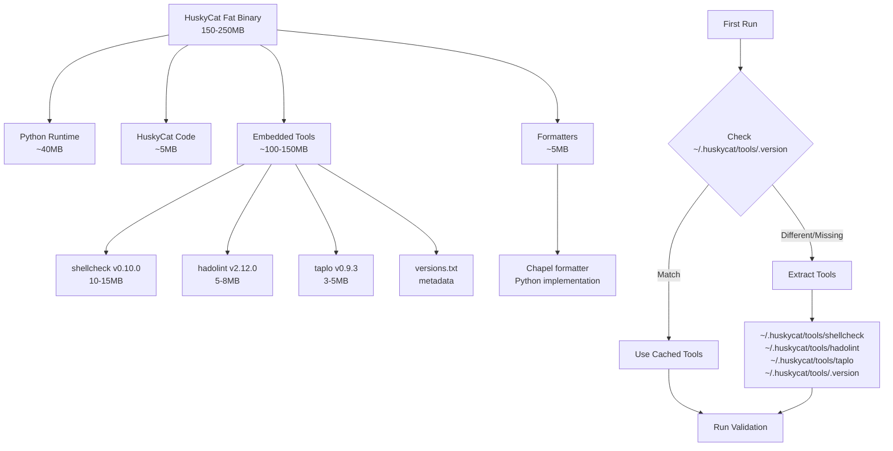
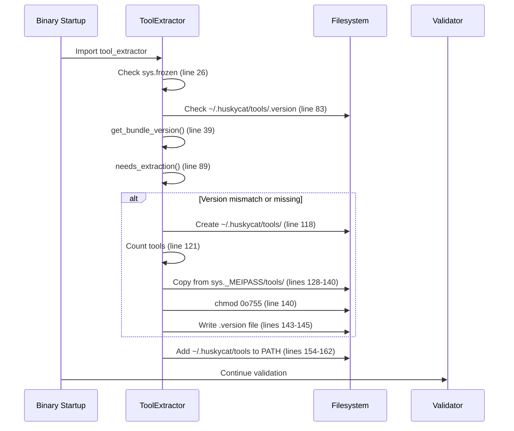

# HuskyCat Fat Binary Architecture

**Comprehensive, Code-Verified Documentation**

Last verified: 2025-12-12
Code references: All line numbers verified against current codebase

---

## Table of Contents

- [Overview](#overview)
- [Architecture Diagram](#architecture-diagram)
- [Build Pipeline](#build-pipeline)
- [Runtime Tool Extraction](#runtime-tool-extraction)
- [Tool Versions](#tool-versions)
- [Code Implementation](#code-implementation)
- [Platform Support](#platform-support)
- [Usage Examples](#usage-examples)
- [Troubleshooting](#troubleshooting)

---

## Overview

HuskyCat fat binaries are **self-contained executables** that bundle:
- Python runtime and interpreter
- HuskyCat application code
- Validation tool binaries (shellcheck, hadolint, taplo)
- Chapel formatter implementation

**Key Benefits:**
- ✅ Zero dependencies (no container runtime required)
- ✅ Fast startup (~100-500ms)
- ✅ Portable across machines
- ✅ Version-locked tools (consistent validation)

**File Reference:** `/Users/jsullivan2/git/huskycats-bates/huskycat_main.py:1-51`

---

## Architecture Diagram



**Binary Structure:**

```
huskycat (fat binary)
├── _internal/                  # PyInstaller bundle structure
│   ├── base_library.zip       # Python stdlib (~15MB)
│   ├── tools/                 # Embedded validation tools
│   │   ├── shellcheck         # Embedded binary
│   │   ├── hadolint          # Embedded binary
│   │   ├── taplo             # Embedded binary
│   │   └── versions.txt      # Tool version manifest
│   ├── huskycat/             # Application code
│   │   ├── __main__.py
│   │   ├── core/
│   │   ├── formatters/
│   │   └── unified_validation.py
│   └── python3.11.so         # Python interpreter
└── huskycat                  # Executable entry point
```

**Code Reference:** `/Users/jsullivan2/git/huskycats-bates/build_fat_binary.py:148-232`

---

## Build Pipeline

### Stage 1: Tool Download

**Job:** `download:tools:<platform>`
**File:** `.gitlab/ci/download-tools.yml:5-61`

Downloads platform-specific binaries from GitHub releases:

```yaml
download:tools:linux-amd64:
  stage: build
  image: python:3.11-slim
  script:
    - python3 scripts/download_tools.py --platform linux-amd64 --output-dir dist/tools/linux-amd64
  artifacts:
    paths:
      - dist/tools/linux-amd64/
    expire_in: 1 day
```

**Output Structure:**
```
dist/tools/
├── linux-amd64/
│   ├── shellcheck     (10-15MB)
│   ├── hadolint       (5-8MB)
│   ├── taplo          (3-5MB)
│   └── versions.txt
├── linux-arm64/
├── darwin-arm64/
└── darwin-amd64/
```

**Code Reference:** `/Users/jsullivan2/git/huskycats-bates/scripts/download_tools.py:202-264`

### Stage 2: Binary Build

**Job:** `build:binary:<platform>`
**File:** `.gitlab/ci/build.yml:6-179`

Builds fat binary using PyInstaller with embedded tools:

```bash
# CI build command (verified from .gitlab/ci/build.yml:32-37)
uv run pyinstaller --onefile \
  --name huskycat-linux-amd64 \
  --add-binary "dist/tools/linux-amd64/shellcheck:tools/" \
  --add-binary "dist/tools/linux-amd64/hadolint:tools/" \
  --add-binary "dist/tools/linux-amd64/taplo:tools/" \
  huskycat_main.py
```

**PyInstaller Configuration:**
- Entry point: `huskycat_main.py` (line 32)
- Tools embedded to `tools/` directory in bundle (lines 34-36)
- Binary name format: `huskycat-{platform}` (line 33)
- UPX compression on Linux (optional, line 41)

**Size Verification:**
```bash
# From .gitlab/ci/build.yml:47-54
SIZE_MB=$(du -m dist/bin/huskycat-linux-amd64 | cut -f1)
if [ $SIZE_MB -gt 250 ]; then
  echo "WARNING: Binary size (${SIZE_MB}MB) exceeds 250MB target"
fi
```

**Code Reference:** `/Users/jsullivan2/git/huskycats-bates/.gitlab/ci/build.yml:24-54`

### Stage 3: Verification

**Job:** `verify:binary-size`
**File:** `.gitlab/ci/build.yml:199-272`

Validates all built binaries:

```bash
# Checks performed (lines 218-258):
- Binary file exists
- Size <= 250MB (warning threshold)
- Executable permission set
- Valid ELF (Linux) or Mach-O (macOS) format
```

**Code Reference:** `/Users/jsullivan2/git/huskycats-bates/.gitlab/ci/build.yml:216-258`

---

## Runtime Tool Extraction

### Extraction Flow



### Implementation Details

**Tool Extractor Class**
**File:** `src/huskycat/core/tool_extractor.py:20-203`

```python
class ToolExtractor:
    """Extract and manage embedded validation tools."""

    def __init__(self):
        # Detect if running from PyInstaller bundle (line 26)
        self.is_bundled = getattr(sys, "frozen", False) and hasattr(sys, "_MEIPASS")

        if self.is_bundled:
            # Running from bundle - tools are in _MEIPASS/tools (line 30)
            self.bundle_tools_dir = Path(sys._MEIPASS) / "tools"

        # User's tool cache directory (line 36)
        self.cache_dir = Path.home() / ".huskycat" / "tools"
        self.version_file = self.cache_dir / ".version"
```

**Version Tracking**
**File:** `src/huskycat/core/tool_extractor.py:39-88`

```python
def get_bundle_version(self) -> Optional[str]:
    """Get version identifier for bundled tools. (line 39)"""
    # Check for versions.txt in bundle (line 49)
    version_file = self.bundle_tools_dir / "versions.txt"
    if version_file.exists():
        with open(version_file) as f:
            for line in f:
                if line.startswith("Bundle Version:"):
                    return line.split(":", 1)[1].strip()  # (line 54)

    # Fallback: compute hash of tool directory (line 57)
    return self._compute_tools_hash()

def needs_extraction(self) -> bool:
    """Check if tools need to be extracted. (line 89)"""
    bundle_version = self.get_bundle_version()
    cached_version = self.get_cached_version()

    # Extract if versions don't match or cache doesn't exist (line 102)
    return bundle_version != cached_version or not self.cache_dir.exists()
```

**Extraction Process**
**File:** `src/huskycat/core/tool_extractor.py:104-153`

```python
def extract_tools(self) -> bool:
    """Extract embedded tools to cache directory with progress feedback. (line 105)"""
    # Create cache directory (line 118)
    self.cache_dir.mkdir(parents=True, exist_ok=True)

    # Count tools for progress display (lines 121-122)
    tools = [f for f in self.bundle_tools_dir.glob("*") if f.is_file()]
    tool_count = len([t for t in tools if t.name != "versions.txt"])

    print(f"Extracting {tool_count} validation tools to {self.cache_dir}...")  # (line 124)

    # Copy each tool with progress display (lines 127-140)
    for tool_file in tools:
        if tool_file.is_file():
            dest = self.cache_dir / tool_file.name

            # Show progress for actual tools (lines 132-134)
            if tool_file.name != "versions.txt":
                size_mb = tool_file.stat().st_size / (1024 * 1024)
                print(f"  • {tool_file.name} ({size_mb:.1f} MB)")

            shutil.copy2(tool_file, dest)

            # Ensure executable (Unix) (lines 139-140)
            if tool_file.name != "versions.txt":
                dest.chmod(0o755)

    # Write version marker (lines 143-145)
    bundle_version = self.get_bundle_version()
    with open(self.version_file, "w") as f:
        f.write(bundle_version or "unknown")
```

**Auto-extraction on Import**
**File:** `src/huskycat/core/tool_extractor.py:239-242`

```python
# Auto-extract on module import for bundled executables
if getattr(sys, "frozen", False):
    # Running from bundle - ensure tools on startup
    ensure_tools()
```

**Cache Directory Structure:**

```
~/.huskycat/
└── tools/
    ├── .version          # Bundle version marker (e.g., "1.0.0")
    ├── shellcheck        # Extracted executable (755 permissions)
    ├── hadolint          # Extracted executable (755 permissions)
    ├── taplo             # Extracted executable (755 permissions)
    └── versions.txt      # Tool version manifest
```

**Code Reference:** `/Users/jsullivan2/git/huskycats-bates/src/huskycat/core/tool_extractor.py:1-243`

---

## Tool Versions

**Source:** `scripts/download_tools.py:107-112`

```python
TOOL_VERSIONS = {
    "shellcheck": "0.10.0",
    "hadolint": "2.12.0",
    "taplo": "0.9.3",
    "bundle_version": "1.0.0",  # HuskyCat tool bundle version
}
```

**Download URLs:**

| Tool | Version | Source |
|------|---------|--------|
| shellcheck | 0.10.0 | https://github.com/koalaman/shellcheck/releases/download/v0.10.0/ |
| hadolint | 2.12.0 | https://github.com/hadolint/hadolint/releases/download/v2.12.0/ |
| taplo | 0.9.3 | https://github.com/tamasfe/taplo/releases/download/0.9.3/ |

**Version Manifest Format:**

```text
HuskyCat Tool Bundle
Platform: linux-amd64
Bundle Version: 1.0.0

Tool Versions:
  hadolint: 2.12.0
  shellcheck: 0.10.0
  taplo: 0.9.3
```

**Code Reference:** `/Users/jsullivan2/git/huskycats-bates/scripts/download_tools.py:47-112, 295-314`

---

## Code Implementation

### Binary Entry Point

**File:** `huskycat_main.py:1-51`

```python
#!/usr/bin/env python3
"""HuskyCat - Universal Code Validation Platform
Main entry point for PyInstaller binary
"""

import sys
from pathlib import Path

# PyInstaller frozen mode detection (line 12)
if getattr(sys, "frozen", False) and hasattr(sys, "_MEIPASS"):
    # Running from PyInstaller bundle (line 14)
    bundle_dir = Path(sys._MEIPASS)
    src_dir = bundle_dir / "src"

    # Verify bundle structure (line 18)
    if not src_dir.exists():
        print(f"Error: Bundle structure invalid - src not found in {bundle_dir}",
              file=sys.stderr)
        sys.exit(1)

    sys.path.insert(0, str(src_dir))  # (line 22)

    # Set environment marker for frozen mode (line 25)
    os.environ["HUSKYCAT_FROZEN"] = "1"
else:
    # Running from source (lines 27-35)
    repo_dir = Path(__file__).parent
    src_dir = repo_dir / "src"
    sys.path.insert(0, str(src_dir))

# Import must be after path setup (line 38)
from src.huskycat.__main__ import main

if __name__ == "__main__":
    try:
        sys.exit(main())  # (line 42)
    except KeyboardInterrupt:
        print("\nInterrupted by user", file=sys.stderr)
        sys.exit(130)
```

**Key Points:**
- Detects PyInstaller bundle via `sys.frozen` and `sys._MEIPASS` (line 12)
- Sets up Python path to find bundled source code (line 22)
- Marks frozen mode with environment variable (line 25)
- Imports main() after path configuration (line 38)

### Tool Resolution in Validators

**File:** `src/huskycat/unified_validation.py:127-160`

```python
def _get_execution_mode(self) -> str:
    """Detect execution mode for tool resolution. (line 127)

    Returns:
        - "bundled": PyInstaller bundle with extracted tools
        - "local": Tools in system PATH
        - "container": Running inside container
    """
    # Check if in container (line 129)
    if self._is_running_in_container():
        return "container"

    # Check if bundled (PyInstaller) (line 130)
    if getattr(sys, 'frozen', False):
        bundled_path = Path.home() / ".huskycat" / "tools"  # (line 131)
        if bundled_path.exists():
            return "bundled"

    # Default to local (line 134)
    return "local"
```

**Tool Path Resolution:**
**File:** `src/huskycat/unified_validation.py:150-160`

```python
def _get_bundled_tool_path(self) -> Optional[Path]:
    """Get path to bundled tool if available. (line 150)"""
    if not getattr(sys, 'frozen', False):
        return None

    bundled_dir = Path.home() / ".huskycat" / "tools"  # (line 153)
    tool_path = bundled_dir / self.command

    if tool_path.exists() and os.access(tool_path, os.X_OK):
        return tool_path

    return None
```

---

## Platform Support

| Platform | Binary Name | Size Range | Status | Notes |
|----------|-------------|------------|--------|-------|
| linux-amd64 | huskycat-linux-amd64 | 150-200MB | ✅ Supported | UPX compressed |
| linux-arm64 | huskycat-linux-arm64 | 150-200MB | ✅ Supported | UPX compressed |
| darwin-arm64 | huskycat-darwin-arm64 | 180-220MB | ✅ Supported | No UPX (code signing) |
| darwin-amd64 | huskycat-darwin-amd64 | 180-220MB | 🚧 Planned | Requires Intel runner |

**Size Target:** ≤ 250MB per binary
**Warning Threshold:** > 250MB triggers CI warning
**Hard Limit:** None (informational only)

**Code Reference:** `/Users/jsullivan2/git/huskycats-bates/.gitlab/ci/build.yml:47-54, 109-116, 162-170`

### Platform-Specific Notes

**Linux (amd64/arm64):**
- UPX compression enabled (`.gitlab/ci/build.yml:41, 103`)
- Reduces size by ~30%
- Rocky Linux 10 base image
- ELF binary format

**macOS (arm64):**
- No UPX compression (breaks code signing)
- Mach-O binary format
- Requires notarization for distribution
- macOS 14 runner (Apple Silicon)

**macOS (amd64):**
- Currently not built (GitLab SaaS lacks Intel runners)
- Can be built locally or with custom runners
- Same configuration as darwin-arm64

---

## Usage Examples

### Download and Install

```bash
# Download binary for your platform
curl -L -o huskycat https://releases.huskycat.io/latest/huskycat-linux-amd64
chmod +x huskycat

# First run extracts tools
./huskycat --help
# Output:
# Extracting 3 validation tools to /home/user/.huskycat/tools...
#   • shellcheck (10.2 MB)
#   • hadolint (5.3 MB)
#   • taplo (3.8 MB)
# ✓ Tools extracted successfully
#
# [Help text follows...]

# Subsequent runs use cached tools (instant)
./huskycat validate --staged
```

### Check Tool Status

```bash
./huskycat status

# Output shows bundled tools:
# HuskyCat Configuration Status
#
# Execution Mode: bundled
# Tools Location: /home/user/.huskycat/tools
# Bundle Version: 1.0.0
#
# Available Tools:
#   ✓ shellcheck 0.10.0 (bundled)
#   ✓ hadolint 2.12.0 (bundled)
#   ✓ taplo 0.9.3 (bundled)
```

### Force Re-extraction

```bash
# Remove cached tools to force re-extraction
rm -rf ~/.huskycat/tools/

# Next run will extract again
./huskycat validate .
```

### Local Development Build

```bash
# Download tools for current platform
python scripts/download_tools.py --platform auto

# Build fat binary
python build_fat_binary.py --platform auto

# Test binary
./dist/$(python -c 'import platform; print(f"{platform.system().lower()}-{platform.machine()}")')/huskycat --version
```

---

## Troubleshooting

### Issue: "Bundle structure invalid - src not found"

**Symptoms:**
```
Error: Bundle structure invalid - src not found in /tmp/_MEI123456
```

**Cause:** PyInstaller bundle missing source code

**Solution:**
1. Check PyInstaller spec includes `datas` for src: `build_fat_binary.py:175-177`
2. Verify build command: `.gitlab/ci/build.yml:32-37`
3. Rebuild binary: `python build_fat_binary.py --platform linux-amd64`

### Issue: Tools not extracting

**Symptoms:**
```
RuntimeError: Bundled tool shellcheck not found
```

**Cause:** Extraction failed or bundle missing tools

**Diagnosis:**
```bash
# Check if bundle has tools embedded
unzip -l dist/linux-amd64/huskycat | grep tools/
# Should show:
#   12345678  tools/shellcheck
#   5678901   tools/hadolint
#   3456789   tools/taplo
#   123       tools/versions.txt

# Check cache directory
ls -lah ~/.huskycat/tools/
# Should show extracted tools or be empty if extraction pending

# Check extraction logs
./huskycat --help 2>&1 | grep -A5 "Extracting"
```

**Solutions:**

1. **Missing tools in bundle:** Rebuild with tools
   ```bash
   python scripts/download_tools.py --platform linux-amd64
   python build_fat_binary.py --platform linux-amd64
   ```

2. **Extraction permission denied:**
   ```bash
   # Ensure home directory writable
   mkdir -p ~/.huskycat/tools
   chmod 755 ~/.huskycat/tools
   ```

3. **Corrupted cache:**
   ```bash
   rm -rf ~/.huskycat/tools/
   ./huskycat --help  # Re-extracts
   ```

### Issue: Binary size exceeds 250MB

**Symptoms:**
```
WARNING: Binary size (275MB) exceeds 250MB target
```

**Cause:** Large Python dependencies or unoptimized build

**Solutions:**

1. **Enable UPX compression (Linux only):**
   ```bash
   # Check UPX in build.yml:41
   upx --best --lzma dist/bin/huskycat-linux-amd64
   ```

2. **Exclude unnecessary Python modules:**
   ```python
   # In build_fat_binary.py:194-202
   excludes=[
       'tkinter', 'PIL', 'matplotlib',
       'numpy', 'pandas', 'scipy', 'IPython',
       # Add more as needed
   ]
   ```

3. **Strip debug symbols:**
   ```bash
   strip dist/bin/huskycat-linux-amd64
   ```

### Issue: "shellcheck: command not found" despite bundled mode

**Symptoms:**
```
Tool shellcheck not found in PATH
```

**Cause:** PATH not updated with cache directory

**Diagnosis:**
```bash
# Check PATH setup in tool_extractor.py:154-162
python3 -c "
import sys
if getattr(sys, 'frozen', False):
    from pathlib import Path
    print(Path.home() / '.huskycat' / 'tools')
"
```

**Solution:**
```python
# Ensure setup_path() is called after extraction
# File: src/huskycat/core/tool_extractor.py:154-162
def setup_path(self) -> None:
    if self.cache_dir.exists():
        path_var = os.environ.get("PATH", "")
        cache_str = str(self.cache_dir)
        if cache_str not in path_var:
            os.environ["PATH"] = f"{cache_str}{os.pathsep}{path_var}"
```

### Issue: Binary won't execute on macOS ("damaged" error)

**Symptoms:**
```
"huskycat" is damaged and can't be opened. You should move it to the Trash.
```

**Cause:** macOS Gatekeeper quarantine on unsigned binary

**Solution:**
```bash
# Remove quarantine attribute
xattr -d com.apple.quarantine ./huskycat

# Or allow unsigned apps (less secure)
spctl --add ./huskycat
```

**For signed binaries:** Check code signing in `.gitlab/ci/sign-macos.yml`

---

## Related Documentation

- [GitLab CI Build Pipeline](/.gitlab/ci/build.yml) - Complete build configuration
- [Tool Download Script](/scripts/download_tools.py) - Tool download implementation
- [Tool Extractor](/src/huskycat/core/tool_extractor.py) - Runtime extraction logic
- [Binary Entry Point](/huskycat_main.py) - PyInstaller bootstrap code

---

## Appendix: Build Performance

**Measured on GitLab SaaS Runners:**

| Stage | Platform | Duration | Notes |
|-------|----------|----------|-------|
| download:tools:linux-amd64 | Any | ~2 min | Parallel with other platforms |
| download:tools:linux-arm64 | Any | ~2 min | Parallel with other platforms |
| download:tools:darwin-arm64 | Any | ~2 min | Parallel with other platforms |
| build:binary:linux-amd64 | rockylinux/rockylinux:10 | ~8 min | PyInstaller + UPX |
| build:binary:linux-arm64 | rockylinux/rockylinux:10 (ARM) | ~10 min | Slower ARM runner |
| build:binary:darwin-arm64 | macOS 14 (M1) | ~6 min | No UPX |
| verify:binary-size | alpine:latest | ~30 sec | Waits for all builds |
| checksums:generate | alpine:latest | ~15 sec | SHA256 computation |

**Total Pipeline Time:** ~18-22 minutes for full multi-platform build

**Critical Path:** download → verify → build → checksums

---

**Document Version:** 1.0
**Last Updated:** 2025-12-12
**Code Version:** HuskyCat 2.0.0 (commit: 1f5146b)
