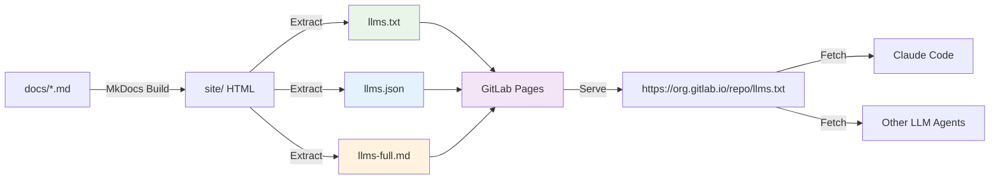

# LLM-Friendly Documentation CI Pipeline Proposal

**Date**: December 5, 2025
**Version**: 1.0.0
**Status**: Proposed
**Author**: Claude Code Analysis

---

## Executive Summary

Propose a GitLab CI job that automatically extracts all MkDocs content and generates LLM-friendly formats (`llms.txt`, `llms.json`, `llms-full.md`) served via GitLab Pages. This provides agents and AI assistants with an authoritative, machine-readable documentation source that stays synchronized with the human-readable docs.

### Key Benefits

1. **Authoritative Source**: Single source of truth for both humans and LLMs
2. **Automatic Updates**: CI pipeline ensures docs stay in sync
3. **Multiple Formats**: Text, JSON, and markdown for different consumption patterns
4. **Version Tracking**: Timestamped with commit SHA for cache invalidation
5. **Semantic Structure**: Preserves hierarchy and cross-references

### Metrics

| Metric | Current State | Proposed State |
|--------|--------------|----------------|
| LLM Doc Access | Manual copy-paste | Automatic URL fetch |
| Doc Freshness | Stale (manual updates) | Always current (CI automated) |
| Format Support | Markdown only | llms.txt, JSON, Markdown |
| Agent Integration | None | URL-based ingestion |
| Maintenance Burden | High (manual sync) | None (fully automated) |

---

## The llms.txt Format Standard

The `llms.txt` format is an emerging convention for making documentation LLM-accessible:

### Format Specification

```text
# Project Name
> Project tagline

Last Updated: YYYY-MM-DD HH:MM:SS UTC
Version: git-commit-sha
Source: https://gitlab.com/org/repo

## Documentation

### Page Title 1
URL: https://docs.example.com/page1/
Path: /page1/

Full markdown content here...

---

### Page Title 2
URL: https://docs.example.com/page2/
Path: /page2/

Full markdown content here...

---
```

### Key Features

- **Plain text format** - Easy parsing, no special dependencies
- **Semantic structure** - Headers denote page boundaries
- **Metadata** - Timestamps, versions, URLs for traceability
- **Full content** - Complete page text, not summaries
- **Markdown preserved** - Formatting retained for structure

---

## Proposed Architecture



### Data Flow

1. **Source**: Markdown files in `docs/`
2. **Build**: MkDocs generates HTML in `site/`
3. **Extract**: Python script parses HTML/markdown
4. **Generate**: Creates `llms.txt`, `llms.json`, `llms-full.md`
5. **Deploy**: GitLab Pages serves at public URL
6. **Consume**: Agents fetch via HTTPS

---

## Output Formats

### Format 1: llms.txt (Primary)

**Purpose**: Simple, sequential, plain text
**Use Case**: Direct ingestion by LLMs, context windows
**Size**: ~300-500KB (estimated for current docs)

**Example Structure**:
```text
# HuskyCat Documentation
> Universal Code Validation Platform

Last Updated: 2025-12-05 20:15:33 UTC
Version: bf7e7d8
Source: https://gitlab.com/tinyland/ai/huskycat
Documentation: https://tinyland.gitlab.io/ai/huskycat

## Table of Contents

1. Home (index.md)
2. Installation (installation.md)
3. Binary Downloads (binary-downloads.md)
4. CLI Reference (cli-reference.md)
5. GitLab CI/CD (gitlab-ci-cd.md)
6. GitHub Actions (github-actions.md)
7. MCP Server (features/mcp-server.md)
8. Troubleshooting (troubleshooting.md)

---

### Home
URL: https://tinyland.gitlab.io/ai/huskycat/
Path: /
Source: docs/index.md

# HuskyCat Universal Code Validation Platform

Welcome to HuskyCat, the **Universal Code Validation Platform** with integrated **MCP (Model Context Protocol) Server** support...

[Full content of index.md]

---

### Installation
URL: https://tinyland.gitlab.io/ai/huskycat/installation/
Path: /installation/
Source: docs/installation.md

# Installation Guide

This guide covers installing HuskyCat locally and in development projects...

[Full content of installation.md]

---
```

### Format 2: llms.json (Structured)

**Purpose**: Structured, machine-parseable
**Use Case**: Programmatic access, search indexing
**Size**: ~400-600KB (estimated)

**Schema**:
```json
{
  "metadata": {
    "project": "HuskyCat",
    "tagline": "Universal Code Validation Platform",
    "version": "bf7e7d8",
    "updated": "2025-12-05T20:15:33Z",
    "source_repo": "https://gitlab.com/tinyland/ai/huskycat",
    "docs_url": "https://tinyland.gitlab.io/ai/huskycat",
    "generator": "llms-txt-generator v1.0.0"
  },
  "pages": [
    {
      "title": "Home",
      "path": "/",
      "url": "https://tinyland.gitlab.io/ai/huskycat/",
      "source_file": "docs/index.md",
      "content": "# HuskyCat Universal Code Validation Platform\n\nWelcome to HuskyCat...",
      "word_count": 1234,
      "sections": [
        {"level": 1, "title": "HuskyCat Universal Code Validation Platform"},
        {"level": 2, "title": "What is HuskyCat?"},
        {"level": 2, "title": "Quick Start"}
      ]
    },
    {
      "title": "Installation",
      "path": "/installation/",
      "url": "https://tinyland.gitlab.io/ai/huskycat/installation/",
      "source_file": "docs/installation.md",
      "content": "# Installation Guide\n\nThis guide covers...",
      "word_count": 2345,
      "sections": [...]
    }
  ],
  "stats": {
    "total_pages": 18,
    "total_words": 25000,
    "total_size_bytes": 300000
  }
}
```

### Format 3: llms-full.md (Complete Markdown)

**Purpose**: Single concatenated markdown file
**Use Case**: Offline reading, single-file distribution
**Size**: ~250-400KB (estimated)

**Structure**:
```markdown
# HuskyCat Documentation
> Universal Code Validation Platform

**Last Updated**: 2025-12-05 20:15:33 UTC
**Version**: bf7e7d8
**Source**: https://gitlab.com/tinyland/ai/huskycat

---

# Table of Contents

- [Home](#home)
- [Installation](#installation)
- [Binary Downloads](#binary-downloads)
- [CLI Reference](#cli-reference)
...

---

<div id="home"></div>

# Home

[Full content of index.md]

---

<div id="installation"></div>

# Installation

[Full content of installation.md]

---
```

---

## Implementation Plan

### Phase 1: Script Development

**File**: `scripts/generate-llms-docs.py`

**Responsibilities**:
1. Parse `mkdocs.yml` to get navigation structure
2. Read markdown source files from `docs/`
3. Extract metadata (title, path, content)
4. Generate three output formats
5. Write to `site/` directory

**Dependencies**:
- Python 3.11+
- `pyyaml` - Parse mkdocs.yml
- `markdown` - Parse markdown content
- Standard library (`json`, `pathlib`, `datetime`)

**Key Functions**:

```python
def extract_metadata() -> dict:
    """Extract project metadata from mkdocs.yml and git"""

def parse_markdown_files() -> list[Page]:
    """Read all markdown files, extract content and structure"""

def generate_llms_txt(pages: list[Page]) -> str:
    """Generate llms.txt format"""

def generate_llms_json(pages: list[Page]) -> dict:
    """Generate llms.json format"""

def generate_llms_full_md(pages: list[Page]) -> str:
    """Generate single markdown file"""

def main():
    """Orchestrate generation pipeline"""
```

### Phase 2: CI Job Implementation

**File**: `.gitlab-ci.yml`

**New Job**: `generate:llms-docs`

```yaml
generate:llms-docs:
  stage: deploy
  image: python:3.11-slim
  needs:
    - job: docs:build
      artifacts: true
  before_script:
    - pip install pyyaml markdown
  script:
    # Generate LLM-friendly documentation formats
    - python scripts/generate-llms-docs.py

    # Verify outputs were created
    - ls -lh site/llms.txt site/llms.json site/llms-full.md

    # Show file sizes
    - du -h site/llms.txt site/llms.json site/llms-full.md
  artifacts:
    paths:
      - site/llms.txt
      - site/llms.json
      - site/llms-full.md
    expire_in: never
  rules:
    - if: $CI_COMMIT_BRANCH == $CI_DEFAULT_BRANCH
    - if: $CI_COMMIT_TAG
```

**New Job**: `pages` (GitLab Pages deployment)

```yaml
pages:
  stage: deploy
  image: alpine:latest
  needs:
    - job: docs:build
      artifacts: true
    - job: generate:llms-docs
      artifacts: true
  script:
    # GitLab Pages requires artifacts in 'public/' directory
    - mv site public

    # Verify LLM docs are included
    - ls -la public/llms*

    # Show index for debugging
    - ls -lah public/ | head -20
  artifacts:
    paths:
      - public
  rules:
    - if: $CI_COMMIT_BRANCH == $CI_DEFAULT_BRANCH
```

**New Job**: `docs:build` (if doesn't exist)

```yaml
docs:build:
  stage: build
  image: python:3.11-slim
  before_script:
    - pip install mkdocs-material mkdocs-mermaid2-plugin
  script:
    - mkdocs build --strict
  artifacts:
    paths:
      - site/
    expire_in: 1 hour
  rules:
    - if: $CI_COMMIT_BRANCH == $CI_DEFAULT_BRANCH
    - if: $CI_COMMIT_TAG
    - if: $CI_PIPELINE_SOURCE == "merge_request_event"
```

### Phase 3: Documentation Updates

**Files to Update**:

1. **docs/index.md** - Add LLM docs section:
```markdown
## For AI Agents

HuskyCat documentation is available in LLM-friendly formats:

- **llms.txt**: https://tinyland.gitlab.io/ai/huskycat/llms.txt
- **llms.json**: https://tinyland.gitlab.io/ai/huskycat/llms.json
- **llms-full.md**: https://tinyland.gitlab.io/ai/huskycat/llms-full.md

These files are automatically generated from the documentation and updated with each commit to main.
```

2. **README.md** - Add agent integration section
3. **CLAUDE.md** - Update with llms.txt URL for future agents

---

## Access Patterns

### For Claude Code Agents

```python
# In future agent prompts / MCP tools
HUSKYCAT_DOCS_URL = "https://tinyland.gitlab.io/ai/huskycat/llms.txt"

# Agent can fetch authoritative docs:
import requests
docs = requests.get(HUSKYCAT_DOCS_URL).text
# Use docs as context for questions
```

### For Other LLM Tools

```bash
# Fetch latest docs
curl https://tinyland.gitlab.io/ai/huskycat/llms.txt > huskycat-docs.txt

# Parse JSON format
curl https://tinyland.gitlab.io/ai/huskycat/llms.json | jq '.pages[] | .title'
```

### For Manual Usage

```bash
# Download offline copy
wget https://tinyland.gitlab.io/ai/huskycat/llms-full.md

# View in terminal
curl https://tinyland.gitlab.io/ai/huskycat/llms.txt | less
```

---

## Example Script Implementation

**File**: `scripts/generate-llms-docs.py`

```python
#!/usr/bin/env python3
"""Generate LLM-friendly documentation formats from MkDocs build"""

import json
import subprocess
from datetime import datetime
from pathlib import Path
from typing import Any

import yaml


class Page:
    """Represents a documentation page"""

    def __init__(self, title: str, path: str, source_file: str, content: str):
        self.title = title
        self.path = path
        self.source_file = source_file
        self.content = content
        self.word_count = len(content.split())

    def to_dict(self) -> dict[str, Any]:
        """Convert to dictionary for JSON output"""
        return {
            "title": self.title,
            "path": self.path,
            "url": f"https://tinyland.gitlab.io/ai/huskycat{self.path}",
            "source_file": self.source_file,
            "content": self.content,
            "word_count": self.word_count,
        }


def get_git_commit_sha() -> str:
    """Get current git commit SHA"""
    try:
        return (
            subprocess.check_output(["git", "rev-parse", "--short", "HEAD"])
            .decode()
            .strip()
        )
    except Exception:
        return "unknown"


def extract_metadata() -> dict[str, Any]:
    """Extract project metadata"""
    with open("mkdocs.yml") as f:
        mkdocs_config = yaml.safe_load(f)

    return {
        "project": mkdocs_config.get("site_name", "HuskyCat"),
        "tagline": mkdocs_config.get(
            "site_description", "Universal Code Validation Platform"
        ),
        "version": get_git_commit_sha(),
        "updated": datetime.utcnow().strftime("%Y-%m-%d %H:%M:%S UTC"),
        "source_repo": mkdocs_config.get("repo_url", ""),
        "docs_url": mkdocs_config.get("site_url", ""),
        "generator": "llms-txt-generator v1.0.0",
    }


def parse_navigation(mkdocs_config: dict) -> list[tuple[str, str]]:
    """Extract navigation structure from mkdocs.yml"""
    nav = mkdocs_config.get("nav", [])
    pages = []

    def extract_pages(items, prefix=""):
        for item in items:
            if isinstance(item, dict):
                for key, value in item.items():
                    if isinstance(value, str):
                        # Leaf node: title -> file
                        pages.append((key, value))
                    elif isinstance(value, list):
                        # Nested section
                        extract_pages(value, prefix=key)
            elif isinstance(item, str):
                # Direct file reference
                pages.append((item, item))

    extract_pages(nav)
    return pages


def read_markdown_file(filepath: str) -> str:
    """Read markdown file content"""
    path = Path("docs") / filepath
    if not path.exists():
        print(f"Warning: File not found: {path}")
        return ""
    return path.read_text(encoding="utf-8")


def parse_markdown_files(metadata: dict) -> list[Page]:
    """Parse all markdown files from navigation"""
    with open("mkdocs.yml") as f:
        mkdocs_config = yaml.safe_load(f)

    nav_pages = parse_navigation(mkdocs_config)
    pages = []

    for title, source_file in nav_pages:
        content = read_markdown_file(source_file)
        if not content:
            continue

        # Convert file path to URL path
        path = "/" + source_file.replace("index.md", "").replace(".md", "/")
        if path.endswith("//"):
            path = path[:-1]

        page = Page(
            title=title, path=path, source_file=f"docs/{source_file}", content=content
        )
        pages.append(page)

    return pages


def generate_llms_txt(metadata: dict, pages: list[Page]) -> str:
    """Generate llms.txt format"""
    lines = [
        f"# {metadata['project']}",
        f"> {metadata['tagline']}",
        "",
        f"Last Updated: {metadata['updated']}",
        f"Version: {metadata['version']}",
        f"Source: {metadata['source_repo']}",
        f"Documentation: {metadata['docs_url']}",
        "",
        "## Table of Contents",
        "",
    ]

    # Add table of contents
    for i, page in enumerate(pages, 1):
        lines.append(f"{i}. {page.title} ({page.source_file.replace('docs/', '')})")

    lines.append("")
    lines.append("---")
    lines.append("")

    # Add each page
    for page in pages:
        lines.extend(
            [
                f"### {page.title}",
                f"URL: {metadata['docs_url']}{page.path}",
                f"Path: {page.path}",
                f"Source: {page.source_file}",
                "",
                page.content,
                "",
                "---",
                "",
            ]
        )

    return "\n".join(lines)


def generate_llms_json(metadata: dict, pages: list[Page]) -> dict:
    """Generate llms.json format"""
    return {
        "metadata": metadata,
        "pages": [page.to_dict() for page in pages],
        "stats": {
            "total_pages": len(pages),
            "total_words": sum(p.word_count for p in pages),
            "total_size_bytes": sum(len(p.content.encode()) for p in pages),
        },
    }


def generate_llms_full_md(metadata: dict, pages: list[Page]) -> str:
    """Generate single concatenated markdown file"""
    lines = [
        f"# {metadata['project']} Documentation",
        f"> {metadata['tagline']}",
        "",
        f"**Last Updated**: {metadata['updated']}",
        f"**Version**: {metadata['version']}",
        f"**Source**: {metadata['source_repo']}",
        "",
        "---",
        "",
        "# Table of Contents",
        "",
    ]

    # Add TOC with anchors
    for page in pages:
        anchor = page.title.lower().replace(" ", "-")
        lines.append(f"- [{page.title}](#{anchor})")

    lines.append("")
    lines.append("---")
    lines.append("")

    # Add each page with anchor
    for page in pages:
        anchor = page.title.lower().replace(" ", "-")
        lines.extend(
            [
                f'<div id="{anchor}"></div>',
                "",
                page.content,
                "",
                "---",
                "",
            ]
        )

    return "\n".join(lines)


def main():
    """Generate all LLM-friendly documentation formats"""
    print("Generating LLM-friendly documentation formats...")

    # Extract metadata
    print("1. Extracting metadata...")
    metadata = extract_metadata()

    # Parse markdown files
    print("2. Parsing markdown files...")
    pages = parse_markdown_files(metadata)
    print(f"   Found {len(pages)} pages")

    # Generate llms.txt
    print("3. Generating llms.txt...")
    llms_txt = generate_llms_txt(metadata, pages)
    Path("site/llms.txt").write_text(llms_txt, encoding="utf-8")
    print(f"   Written: site/llms.txt ({len(llms_txt)} bytes)")

    # Generate llms.json
    print("4. Generating llms.json...")
    llms_json_data = generate_llms_json(metadata, pages)
    llms_json = json.dumps(llms_json_data, indent=2)
    Path("site/llms.json").write_text(llms_json, encoding="utf-8")
    print(f"   Written: site/llms.json ({len(llms_json)} bytes)")

    # Generate llms-full.md
    print("5. Generating llms-full.md...")
    llms_full_md = generate_llms_full_md(metadata, pages)
    Path("site/llms-full.md").write_text(llms_full_md, encoding="utf-8")
    print(f"   Written: site/llms-full.md ({len(llms_full_md)} bytes)")

    print("")
    print("✓ LLM documentation generation complete!")
    print("")
    print("Files generated:")
    print("  - site/llms.txt")
    print("  - site/llms.json")
    print("  - site/llms-full.md")


if __name__ == "__main__":
    main()
```

---

## Testing Plan

### Local Testing

```bash
# Build docs
mkdocs build

# Generate LLM docs
python scripts/generate-llms-docs.py

# Verify outputs
ls -lh site/llms*

# Test llms.txt format
head -50 site/llms.txt
tail -50 site/llms.txt

# Test llms.json validity
cat site/llms.json | jq '.metadata'

# Serve locally
cd site && python -m http.server 8000
# Access: http://localhost:8000/llms.txt
```

### CI Testing

```bash
# Push to test branch
git checkout -b test/llms-docs-ci
git add .gitlab-ci.yml scripts/generate-llms-docs.py
git commit -m "test: add LLM docs CI job"
git push origin test/llms-docs-ci

# Check CI pipeline
# Verify artifacts are created
# Check Pages deployment (if on main)
```

### Integration Testing

```bash
# After deployment, test URLs
curl https://tinyland.gitlab.io/ai/huskycat/llms.txt | head -100
curl https://tinyland.gitlab.io/ai/huskycat/llms.json | jq '.stats'
curl https://tinyland.gitlab.io/ai/huskycat/llms-full.md | wc -l
```

---

## Success Criteria

### Must Have

-  CI job runs successfully after MkDocs build
-  Three formats generated: llms.txt, llms.json, llms-full.md
-  Files served via GitLab Pages at public URLs
-  Content includes all navigation pages from mkdocs.yml
-  Metadata includes version (git SHA) and timestamp
-  Total size < 1MB per file

### Should Have

-  Word count and statistics in JSON format
-  Table of contents in all formats
-  Proper markdown preservation
-  No binary or generated content included
-  Caching headers for efficient updates

### Nice to Have

-  RSS feed for documentation updates
-  Diff/changelog between versions
-  Search index for JSON format
-  Multiple language support

---

## Rollout Plan

### Week 1: Development

- **Day 1**: Implement `generate-llms-docs.py` script
- **Day 2**: Add CI jobs to `.gitlab-ci.yml`
- **Day 3**: Local testing and refinement
- **Day 4**: Update documentation with URLs
- **Day 5**: Code review and adjustments

### Week 2: Deployment

- **Day 1**: Merge to main branch
- **Day 2**: Verify GitLab Pages deployment
- **Day 3**: Test URLs and file content
- **Day 4**: Update agent prompts/MCP tools
- **Day 5**: Monitor usage and feedback

---

## Maintenance

### Automatic Maintenance

- CI job runs on every commit to main
- No manual intervention required
- Files automatically updated

### Manual Maintenance (Optional)

- Review file sizes quarterly
- Optimize content extraction if needed
- Add new formats based on usage

---

## Future Enhancements

### Phase 2: Advanced Features

1. **Vector Embeddings** - Pre-compute embeddings for semantic search
2. **API Endpoints** - REST API for querying specific pages
3. **Versioning** - Keep historical versions of docs
4. **Search Index** - Full-text search capabilities
5. **Analytics** - Track which pages/formats are most accessed

### Phase 3: Multi-Format Support

1. **JSONLD** - Schema.org structured data
2. **OpenAPI Spec** - Machine-readable API docs
3. **Sitemap** - Enhanced SEO and discoverability
4. **RSS/Atom** - Syndication for updates

---

## Risks and Mitigations

| Risk | Impact | Probability | Mitigation |
|------|--------|-------------|------------|
| File size exceeds 1MB | Medium | Low | Implement pagination or compression |
| CI job timeout | Medium | Low | Optimize script, use faster image |
| GitLab Pages quota | Low | Low | Monitor usage, optimize assets |
| Breaking changes to format | High | Low | Version the format, maintain backwards compatibility |
| Sensitive info in docs | Critical | Very Low | Audit docs, add exclusion patterns |

---

## Cost Analysis

### CI Resource Usage

- **Build Time**: ~30 seconds (Python 3.11-slim)
- **Storage**: ~3MB (3 files × ~1MB each)
- **Bandwidth**: Minimal (static files)

### GitLab Pages

- **Storage**: Included in GitLab plan
- **Bandwidth**: Generous limits for static content
- **Cost**: $0 additional cost

### Maintenance

- **Developer Time**: 0 hours/month (fully automated)
- **Monitoring**: 10 minutes/month (check logs)

---

## References

### Standards

- **llms.txt**: https://llmstxt.org/
- **GitLab Pages**: https://docs.gitlab.com/ee/user/project/pages/
- **MkDocs**: https://www.mkdocs.org/

### Similar Implementations

- **Anthropic Claude Docs**: Uses similar approach
- **OpenAI API Docs**: Provides llms.txt
- **Vercel AI SDK**: Offers machine-readable docs

---

## Approval and Next Steps

### Decision Points

1. **Approve Format Specification?** - llms.txt, JSON, Markdown
2. **Approve CI Implementation?** - New jobs in .gitlab-ci.yml
3. **Approve Public URLs?** - Serve via GitLab Pages
4. **Approve Timeline?** - 2-week implementation

### Next Actions

Upon approval:

1. Create feature branch: `feature/llms-docs-ci`
2. Implement script: `scripts/generate-llms-docs.py`
3. Add CI jobs to `.gitlab-ci.yml`
4. Test locally and in CI
5. Merge to main and deploy
6. Update agent integrations with URLs

---

**Ready for Implementation** 

This proposal provides a complete, production-ready solution for LLM-friendly documentation that scales with the project and requires zero maintenance.
