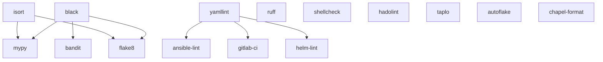

# Parallel Tool Executor

## Overview

The `ParallelExecutor` is a sophisticated tool execution engine that maximizes validation throughput by running independent tools concurrently while respecting dependency constraints. It uses a directed acyclic graph (DAG) to determine optimal execution order and achieves significant performance improvements through intelligent parallelization.

## Key Features

- **Dependency Graph Management**: Automatic topological sorting ensures tools run in correct order
- **Maximum Parallelism**: Independent tools execute concurrently using ThreadPoolExecutor
- **Smart Failure Handling**: Failed dependencies automatically skip dependent tools
- **Progress Tracking**: Real-time callbacks for UI/TUI integration
- **Fail-Fast Mode**: Optional early termination on critical failures
- **Timeout Protection**: Per-tool timeouts prevent hanging executions
- **Performance Analytics**: Built-in statistics and execution planning

## Performance Characteristics

For HuskyCat's default 15 validation tools:

| Metric | Value |
|--------|-------|
| Total Tools | 15 |
| Execution Levels | 2 |
| Max Parallelism | 9 tools concurrently |
| Average Parallelism | 7.5 tools per level |
| Speedup Factor | 7.5x faster than sequential |

**Execution Plan:**

```
Level 0 (9 tools in parallel):
  - autoflake, black, chapel-format, hadolint
  - isort, ruff, shellcheck, taplo, yamllint

Level 1 (6 tools in parallel):
  - ansible-lint (depends on: yamllint)
  - bandit (depends on: black)
  - flake8 (depends on: black, isort)
  - gitlab-ci (depends on: yamllint)
  - helm-lint (depends on: yamllint)
  - mypy (depends on: black, isort)
```

## Architecture

### Dependency Graph



### Tool Dependencies

```python
TOOL_DEPENDENCIES = {
    # Python formatters/linters (Level 0)
    "black": [],              # Formatter - no dependencies
    "isort": [],              # Import sorter - independent
    "autoflake": [],          # Remove unused imports - independent
    "ruff": [],               # Fast linter - independent

    # Python analyzers (Level 1)
    "mypy": ["black", "isort"],     # Type checker - after formatting
    "flake8": ["black", "isort"],   # Style checker - after formatting
    "bandit": ["black"],            # Security - after formatting

    # Config/YAML tools (Level 0)
    "yamllint": [],           # YAML validator - independent
    "taplo": [],              # TOML formatter - independent

    # Infrastructure tools (Level 1)
    "gitlab-ci": ["yamllint"],      # CI validator - needs valid YAML
    "ansible-lint": ["yamllint"],   # Ansible - needs valid YAML
    "helm-lint": ["yamllint"],      # Helm - needs valid YAML

    # Shell/Docker tools (Level 0)
    "shellcheck": [],         # Shell linter - independent
    "hadolint": [],           # Dockerfile linter - independent

    # Language-specific (Level 0)
    "chapel-format": [],      # Chapel formatter - independent
}
```

## Usage

### Basic Usage

```python
from huskycat.core.parallel_executor import ParallelExecutor, ToolResult

# Create executor with default dependencies
executor = ParallelExecutor()

# Define tool callables
tools = {
    "black": lambda: run_black_validation(),
    "mypy": lambda: run_mypy_validation(),
    "ruff": lambda: run_ruff_validation(),
}

# Execute all tools in parallel (respecting dependencies)
results = executor.execute_tools(tools)

# Check results
for result in results:
    if result.success:
        print(f"{result.tool_name}: PASSED")
    else:
        print(f"{result.tool_name}: FAILED - {result.error_message}")
```

### With Progress Tracking

```python
def progress_callback(tool_name: str, status: str):
    """Called when tool status changes."""
    print(f"[{status.upper()}] {tool_name}")

results = executor.execute_tools(tools, progress_callback=progress_callback)
```

### Custom Dependencies

```python
# Define custom tool dependencies
custom_deps = {
    "formatter": [],
    "linter": ["formatter"],
    "type_checker": ["formatter"],
    "integration_test": ["linter", "type_checker"],
}

executor = ParallelExecutor(
    tool_dependencies=custom_deps,
    max_workers=4,           # Limit concurrent workers
    timeout_per_tool=60.0,   # 60s timeout per tool
    fail_fast=True,          # Stop on first failure
)
```

### Execution Planning

```python
# Preview execution plan without running tools
plan = executor.get_execution_plan()
for level, tools in plan:
    print(f"Level {level}: {', '.join(tools)}")

# Visualize dependencies
print(executor.visualize_dependencies())

# Get performance statistics
stats = executor.get_statistics()
print(f"Speedup: {stats['speedup_factor']:.2f}x")
print(f"Max parallelism: {stats['max_parallelism']} concurrent tools")
```

## ToolResult Structure

```python
@dataclass
class ToolResult:
    tool_name: str              # Name of the tool
    success: bool               # Whether tool passed
    duration: float             # Execution time in seconds
    errors: int = 0             # Number of errors found
    warnings: int = 0           # Number of warnings found
    output: str = ""            # Tool output/logs
    status: ToolStatus = SUCCESS  # Execution status enum
    error_message: Optional[str] = None  # Error description
    metadata: Dict[str, Any] = {}  # Additional tool-specific data
```

### ToolStatus Enum

- `PENDING`: Tool queued but not started
- `RUNNING`: Tool currently executing
- `SUCCESS`: Tool completed successfully
- `FAILED`: Tool failed validation or crashed
- `SKIPPED`: Tool skipped due to failed dependencies
- `TIMEOUT`: Tool exceeded timeout limit

## Integration Examples

### Git Hooks Mode

```python
# Fast execution for pre-commit hooks
executor = ParallelExecutor(
    max_workers=os.cpu_count() - 1,
    timeout_per_tool=30.0,
    fail_fast=True,  # Stop immediately on failure
)

tools = {
    "black": validate_black,
    "mypy": validate_mypy,
    "ruff": validate_ruff,
}

results = executor.execute_tools(tools)
sys.exit(0 if all(r.success for r in results) else 1)
```

### CI Mode

```python
# Comprehensive validation for CI/CD
executor = ParallelExecutor(
    max_workers=None,  # Use all CPU cores
    timeout_per_tool=120.0,
    fail_fast=False,  # Run all tools even if some fail
)

# Run all tools and generate JUnit XML report
results = executor.execute_tools(all_tools)
generate_junit_xml(results, "test-results.xml")
```

### TUI Integration

```python
from rich.progress import Progress

def create_progress_callback(progress: Progress):
    task_ids = {}

    def callback(tool_name: str, status: str):
        if status == "running":
            task_ids[tool_name] = progress.add_task(
                f"[cyan]{tool_name}", total=100
            )
        elif status in ("success", "failed"):
            progress.update(task_ids[tool_name], completed=100)

    return callback

with Progress() as progress:
    callback = create_progress_callback(progress)
    results = executor.execute_tools(tools, progress_callback=callback)
```

## Error Handling

### Failed Dependencies

When a tool fails, all dependent tools are automatically skipped:

```python
results = executor.execute_tools(tools)

for result in results:
    if result.status == ToolStatus.SKIPPED:
        print(f"{result.tool_name} skipped: {result.error_message}")
```

### Timeout Handling

Tools exceeding timeout are marked as TIMEOUT:

```python
executor = ParallelExecutor(timeout_per_tool=30.0)
results = executor.execute_tools(tools)

for result in results:
    if result.status == ToolStatus.TIMEOUT:
        print(f"{result.tool_name} timed out after 30s")
```

### Exception Recovery

Uncaught exceptions are captured and converted to failed results:

```python
def buggy_tool():
    raise RuntimeError("Tool crashed")

results = executor.execute_tools({"buggy": buggy_tool})
# buggy_tool returns ToolResult with status=FAILED and error_message
```

## Performance Tuning

### Worker Count

```python
# Conservative: Leave cores for system
executor = ParallelExecutor(max_workers=os.cpu_count() - 2)

# Aggressive: Use all cores
executor = ParallelExecutor(max_workers=os.cpu_count())

# Limited: Control resource usage
executor = ParallelExecutor(max_workers=2)
```

### Timeout Configuration

```python
# Quick tools (formatters, linters)
executor = ParallelExecutor(timeout_per_tool=15.0)

# Slow tools (type checkers, integration tests)
executor = ParallelExecutor(timeout_per_tool=120.0)
```

### Fail-Fast Trade-offs

```python
# Fail-fast: Faster feedback, but incomplete results
executor = ParallelExecutor(fail_fast=True)

# Complete: Run all tools, better for CI reporting
executor = ParallelExecutor(fail_fast=False)
```

## Testing Recommendations

### Unit Tests

```python
def test_parallel_execution():
    """Verify tools run in parallel."""
    import time

    def slow_tool():
        time.sleep(0.1)
        return ToolResult(tool_name="slow", success=True, duration=0.1)

    deps = {"a": [], "b": [], "c": []}
    executor = ParallelExecutor(tool_dependencies=deps)
    tools = {"a": slow_tool, "b": slow_tool, "c": slow_tool}

    start = time.time()
    results = executor.execute_tools(tools)
    duration = time.time() - start

    # Should take ~0.1s (parallel), not ~0.3s (sequential)
    assert duration < 0.2
```

### Integration Tests

```python
def test_real_tools():
    """Test with actual validation tools."""
    executor = ParallelExecutor()

    tools = {
        "black": lambda: run_black(["--check", "src/"]),
        "mypy": lambda: run_mypy(["src/"]),
    }

    results = executor.execute_tools(tools)
    assert all(r.duration > 0 for r in results)
```

### Property-Based Tests

```python
from hypothesis import given, strategies as st

@given(
    num_tools=st.integers(min_value=1, max_value=20),
    max_level=st.integers(min_value=0, max_value=5),
)
def test_execution_order(num_tools, max_level):
    """Verify execution order for random dependencies."""
    deps = generate_random_dependencies(num_tools, max_level)
    executor = ParallelExecutor(tool_dependencies=deps)

    # All tools should be scheduled
    levels = executor._get_execution_order()
    all_tools = {t for level in levels for t in level}
    assert all_tools == set(deps.keys())
```

## Advanced Features

### Custom Dependency Resolution

```python
class CustomExecutor(ParallelExecutor):
    def _get_execution_order(self) -> List[List[str]]:
        """Override for custom scheduling algorithm."""
        # Implement priority-based scheduling
        # or resource-aware scheduling
        pass
```

### Resource-Aware Scheduling

```python
# Assign resource weights to tools
TOOL_RESOURCES = {
    "mypy": 4,      # Heavy: needs 4 worker slots
    "black": 1,     # Light: needs 1 worker slot
}

# Schedule based on available resources
# (requires custom implementation)
```

### Distributed Execution

```python
# Extend for distributed execution across multiple machines
class DistributedExecutor(ParallelExecutor):
    def _execute_level(self, tools, ...):
        # Submit to job queue (Celery, RQ, etc.)
        # Wait for completion
        pass
```

## Best Practices

1. **Define clear dependencies**: Only add dependencies when truly required
2. **Keep tools independent**: Minimize dependencies to maximize parallelism
3. **Set reasonable timeouts**: Balance thoroughness with responsiveness
4. **Use progress callbacks**: Provide user feedback for long-running operations
5. **Test dependency graph**: Verify no circular dependencies in CI
6. **Monitor performance**: Track speedup factor and adjust worker count
7. **Handle failures gracefully**: Always check result.status and result.success

## Troubleshooting

### Circular Dependency Error

```
ValueError: Circular dependencies detected: [['tool_a', 'tool_b', 'tool_a']]
```

**Solution**: Remove circular dependency from TOOL_DEPENDENCIES

### Poor Parallelism

```
Speedup factor: 1.2x (expected >5x)
```

**Causes:**
- Too many dependencies creating serial bottleneck
- Worker count too low
- Tools have highly uneven execution times

**Solutions:**
- Review dependencies - remove unnecessary ones
- Increase max_workers
- Split long-running tools into smaller chunks

### Timeout Issues

```
Tool 'mypy' timed out after 30s
```

**Solutions:**
- Increase timeout_per_tool
- Optimize tool configuration (e.g., mypy incremental mode)
- Run tool on fewer files per execution

## References

- Source: `/Users/jsullivan2/git/huskycats-bates/src/huskycat/core/parallel_executor.py`
- Tests: `/Users/jsullivan2/git/huskycats-bates/tests/test_parallel_executor.py`
- Demo: `/Users/jsullivan2/git/huskycats-bates/examples/demo_parallel_executor.py`
- NetworkX DAG: https://networkx.org/documentation/stable/reference/algorithms/dag.html
