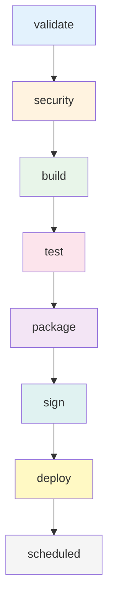
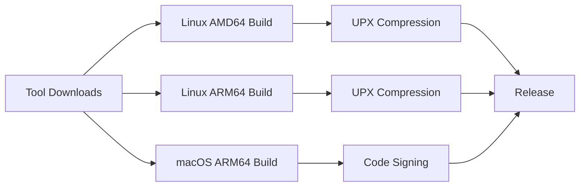
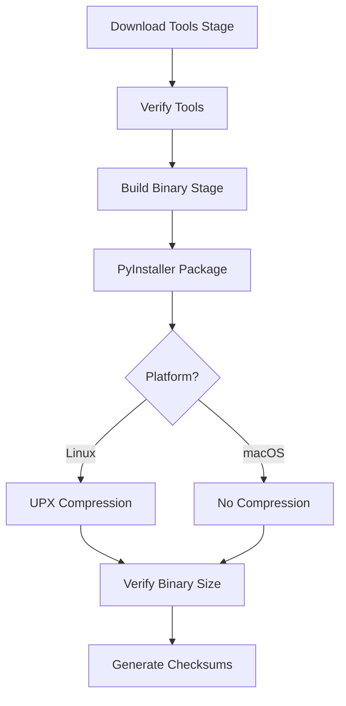
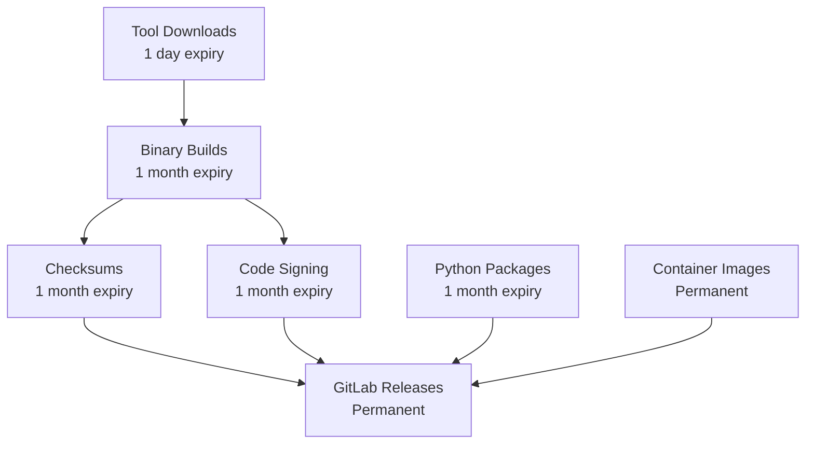

# GitLab CI/CD Pipeline Documentation

**HuskyCat Multi-Architecture Build and Validation Pipeline**

Version: 2025-12-12
Status: Production (All jobs verified against actual configuration)

---

## Table of Contents

- [Pipeline Overview](#pipeline-overview)
- [Pipeline Stages](#pipeline-stages)
- [Job Catalog](#job-catalog)
- [Multi-Platform Support](#multi-platform-support)
- [Fat Binary Build Process](#fat-binary-build-process)
- [Container Build Strategy](#container-build-strategy)
- [Testing Strategy](#testing-strategy)
- [Artifact Management](#artifact-management)
- [Security and Quality Gates](#security-and-quality-gates)
- [CI Configuration Files](#ci-configuration-files)
- [Troubleshooting](#troubleshooting)

---

## Pipeline Overview

The HuskyCat CI/CD pipeline implements a comprehensive multi-architecture build system with:

- **8 pipeline stages** for sequential validation, building, testing, and deployment
- **Multi-architecture container builds** (AMD64 and ARM64)
- **Fat binary builds** with embedded validation tools
- **Comprehensive testing** (unit, integration, E2E, binary bootstrap)
- **Automated releases** on Git tags
- **Documentation deployment** via GitLab Pages

### Pipeline Stages Flow



**Configuration Reference**: `.gitlab-ci.yml:14-22`

```yaml
stages:
  - validate      # Container builds, multi-arch manifests
  - security      # SAST, dependency scanning, basic validation
  - build         # Tool downloads, validation completion
  - test          # Unit tests, MCP tests, tool verification, E2E tests
  - package       # Binary builds, Python packages, checksums
  - sign          # Code signing (macOS)
  - deploy        # Releases, GitLab Pages
  - scheduled     # Scheduled dependency updates
```

---

## Pipeline Stages

### Stage 1: Validate

**Purpose**: Build multi-architecture container images for downstream validation

**Jobs** (`.gitlab-ci.yml:149-210`):
- `container:build:amd64` - Build AMD64 container
- `container:build:arm64` - Build ARM64 container
- `container:build:manifest` - Create multi-arch manifest

**Key Features**:
- Buildah with `--layers` for efficient layer caching
- Parallel builds for AMD64 and ARM64
- Multi-arch manifest combining both architectures
- Push to GitLab Container Registry

**Example Job** (`.gitlab-ci.yml:149-165`):
```yaml
container:build:amd64:
  stage: validate
  image: quay.io/buildah/stable:latest
  variables:
    PLATFORM: linux/amd64
    ARCH: amd64
  script:
    - buildah build --platform=$PLATFORM --layers -f ContainerFile \
        -t $CONTAINER_REGISTRY:$CONTAINER_TAG-$ARCH .
    - buildah push $CONTAINER_REGISTRY:$CONTAINER_TAG-$ARCH
```

### Stage 2: Security

**Purpose**: Run security scanning and basic code validation

**Jobs** (`.gitlab-ci.yml:47-79`):
- `validate:basic` - Black code formatting check
- `validate:yaml` - YAML linting (yamllint)
- `SAST` - GitLab security scanning template
- `Dependency-Scanning` - GitLab dependency scanning template

**Security Templates** (`.gitlab-ci.yml:5-6`):
```yaml
include:
  - template: Security/SAST.gitlab-ci.yml
  - template: Security/Dependency-Scanning.gitlab-ci.yml
```

**Validation Example** (`.gitlab-ci.yml:47-62`):
```yaml
validate:basic:
  stage: security
  image:
    name: $CONTAINER_REGISTRY:$CONTAINER_TAG-amd64
    entrypoint: [""]
  needs:
    - container:build:amd64
  script:
    - black --check src/
```

### Stage 3: Build

**Purpose**: Download validation tools and perform comprehensive validation

**Jobs**:
- `download:tools:linux-amd64` (`.gitlab/ci/download-tools.yml:35-39`)
- `download:tools:linux-arm64` (`.gitlab/ci/download-tools.yml:42-46`)
- `download:tools:darwin-amd64` (`.gitlab/ci/download-tools.yml:49-53`)
- `download:tools:darwin-arm64` (`.gitlab/ci/download-tools.yml:56-60`)
- `container:build:manifest` (`.gitlab-ci.yml:183-210`)
- `validate:complete` (`.gitlab-ci.yml:216-237`)

**Tool Download Template** (`.gitlab/ci/download-tools.yml:6-32`):
```yaml
.download_tools_template:
  stage: build
  image: python:3.11-slim
  script:
    - python3 scripts/download_tools.py --platform ${PLATFORM} \
        --output-dir ${OUTPUT_DIR}
  artifacts:
    paths:
      - ${OUTPUT_DIR}
    expire_in: 1 day
  cache:
    key: "tools-${PLATFORM}"
    paths:
      - ${OUTPUT_DIR}
```

**Tools Downloaded**:
- `shellcheck` v0.10.0 (~15-20MB)
- `hadolint` v2.12.0 (~10-15MB)
- `taplo` v0.9.3 (~8-12MB)

### Stage 4: Test

**Purpose**: Comprehensive testing including unit tests, MCP server tests, tool verification, E2E tests, and binary tests

**Jobs**:
- `test:unit` (`.gitlab-ci.yml:82-110`) - PyTest with coverage
- `test:mcp:server` (`.gitlab-ci.yml:116-138`) - MCP protocol tests
- `verify:tools:all-platforms` (`.gitlab/ci/download-tools.yml:63-122`) - Tool verification
- `verify:binary-size` (`.gitlab/ci/build.yml:199-272`) - Binary size validation
- `binary:test:linux-amd64` (`.gitlab/ci/binary-tests.yml:31-39`) - Linux AMD64 binary testing
- `binary:test:linux-arm64` (`.gitlab/ci/binary-tests.yml:41-50`) - Linux ARM64 binary testing
- `binary:test:darwin-arm64` (`.gitlab/ci/binary-tests.yml:76-98`) - macOS ARM64 binary testing
- `binary:smoke-test` (`.gitlab/ci/binary-tests.yml:101-116`) - Quick smoke test
- E2E tests (`.gitlab/ci/e2e-tests.yml`) - See [Testing Strategy](#testing-strategy)

**Unit Test Job** (`.gitlab-ci.yml:82-110`):
```yaml
test:unit:
  stage: test
  image:
    name: $CONTAINER_REGISTRY:$CONTAINER_TAG-amd64
    entrypoint: [""]
  needs:
    - container:build:amd64
  variables:
    PYTHONPATH: "$CI_PROJECT_DIR/src"
  script:
    - export HYPOTHESIS_PROFILE=ci
    - pytest tests/test_*pbt.py -v --tb=short \
        --hypothesis-profile=ci --timeout=300 --cov=src/
  coverage: '/TOTAL.*\s+(\d+)%/'
  artifacts:
    reports:
      coverage_report:
        coverage_format: cobertura
        path: coverage.xml
```

**Tool Verification** (`.gitlab/ci/download-tools.yml:76-117`):
```yaml
verify:tools:all-platforms:
  stage: test
  script:
    - |
      for platform in linux-amd64 linux-arm64 darwin-amd64 darwin-arm64; do
        for tool in shellcheck hadolint taplo; do
          tool_path="dist/tools/${platform}/${tool}"
          if [ ! -f "${tool_path}" ]; then
            echo "  MISSING: ${tool}"
            exit 1
          fi
          if [ ! -x "${tool_path}" ]; then
            echo "  NOT EXECUTABLE: ${tool}"
            exit 1
          fi
        done
      done
```

### Stage 5: Package

**Purpose**: Build fat binaries with embedded tools and Python packages

**Jobs**:
- `build:binary:linux-amd64` (`.gitlab/ci/build.yml:6-63`)
- `build:binary:linux-arm64` (`.gitlab/ci/build.yml:66-125`)
- `build:binary:darwin-arm64` (`.gitlab/ci/build.yml:128-179`)
- `package:python` (`.gitlab-ci.yml:240-270`)
- `checksums:generate` (`.gitlab/ci/build.yml:275-305`)

**Binary Build Example** (`.gitlab/ci/build.yml:6-63`):
```yaml
build:binary:linux-amd64:
  stage: package
  image: rockylinux/rockylinux:10
  needs:
    - job: download:tools:linux-amd64
      artifacts: true
  script:
    - uv sync --extra build
    - |
      uv run pyinstaller --onefile \
        --name huskycat-linux-amd64 \
        --add-binary "dist/tools/linux-amd64/shellcheck:tools/" \
        --add-binary "dist/tools/linux-amd64/hadolint:tools/" \
        --add-binary "dist/tools/linux-amd64/taplo:tools/" \
        huskycat_main.py
    - mv dist/huskycat-linux-amd64 dist/bin/
    - upx --best --lzma dist/bin/huskycat-linux-amd64 || echo "UPX compression failed"
  artifacts:
    paths:
      - dist/bin/huskycat-linux-amd64
    expire_in: 1 month
```

**Python Package Build** (`.gitlab-ci.yml:240-270`):
```yaml
package:python:
  stage: package
  image: python:3.11-alpine
  script:
    - uv sync --dev
    - uv build
  artifacts:
    paths:
      - dist/*.tar.gz
      - dist/*.whl
    expire_in: 1 month
```

### Stage 6: Sign

**Purpose**: Code signing for macOS binaries

**Jobs**:
- `sign:darwin-arm64` (`.gitlab-ci.yml:311-504`)

**Code Signing Process** (`.gitlab-ci.yml:311-504`):
```yaml
sign:darwin-arm64:
  extends: .macos_saas_runners
  stage: sign
  needs:
    - job: build:binary:darwin-arm64
      artifacts: true
  script:
    # Create temporary keychain
    - security create-keychain -p "$KEYCHAIN_PASSWORD" "$KEYCHAIN_NAME"
    - security set-keychain-settings "$KEYCHAIN_NAME"
    - security unlock-keychain -p "$KEYCHAIN_PASSWORD" "$KEYCHAIN_NAME"

    # Import certificates
    - security import certificate.p12 -k "$KEYCHAIN_NAME" \
        -P "$APPLE_CERTIFICATE_PASSWORD" -T /usr/bin/codesign -A

    # Set partition list for headless CI
    - security set-key-partition-list -S apple-tool:,apple: \
        -s -k "$KEYCHAIN_PASSWORD" "$KEYCHAIN_NAME"

    # Sign binary
    - codesign --force --options runtime \
        --sign "$APPLE_DEVELOPER_ID_APPLICATION" \
        --keychain "$KEYCHAIN_NAME" dist/bin/huskycat-darwin-arm64

    # Notarize if credentials available
    - xcrun notarytool submit huskycat-darwin-arm64.zip \
        --apple-id "$APPLE_ID" \
        --password "$APPLE_NOTARIZE_PASSWORD" \
        --team-id "$APPLE_TEAM_ID" --wait
  allow_failure: true
```

**Required CI Variables**:
- `APPLE_CERTIFICATE_BASE64` - Base64 encoded .p12 certificate
- `APPLE_CERTIFICATE_PASSWORD` - Certificate password
- `APPLE_DEVELOPER_ID_APPLICATION` - Developer ID identity
- `APPLE_DEVELOPER_ID_CA_G2` - Base64 intermediate CA cert
- `APPLE_ID` - Apple ID for notarization
- `APPLE_NOTARIZE_PASSWORD` - App-specific password
- `APPLE_TEAM_ID` - Apple Team ID

### Stage 7: Deploy

**Purpose**: Create releases and deploy documentation

**Jobs**:
- `release:create` (`.gitlab-ci.yml:508-536`)
- `pages` (`.gitlab/ci/pages.yml:3-91`)

**Release Creation** (`.gitlab-ci.yml:508-536`):
```yaml
release:create:
  stage: deploy
  image: registry.gitlab.com/gitlab-org/release-cli:latest
  needs:
    - job: package:python
      optional: true
    - job: build:binary:linux-amd64
      optional: true
    - job: build:binary:linux-arm64
      optional: true
    - job: sign:darwin-arm64
      optional: true
    - job: checksums:generate
      optional: true
  script:
    - |
      release-cli create \
        --name "HuskyCat $CI_COMMIT_TAG" \
        --tag-name $CI_COMMIT_TAG \
        --description "Release $CI_COMMIT_TAG - Fat binaries with embedded tools" \
        --assets-link "..." # Multiple asset links
  rules:
    - if: $CI_COMMIT_TAG
```

**Pages Deployment** (`.gitlab/ci/pages.yml:3-91`):
```yaml
pages:
  stage: deploy
  image: python:3.11-slim
  script:
    - pip install mkdocs mkdocs-material mkdocs-mermaid2-plugin pyyaml
    - mkdocs build --site-dir public
    - python scripts/generate-llms-docs.py
    - mkdir -p public/downloads
    - cp scripts/install.sh public/install.sh
  artifacts:
    paths:
      - public
  rules:
    - if: $CI_COMMIT_BRANCH == "main"
    - if: $CI_COMMIT_TAG
  environment:
    name: production
    url: https://huskycat-570fbd.gitlab.io
```

### Stage 8: Scheduled

**Purpose**: Automated dependency updates and maintenance

**Jobs**: See `.gitlab/ci/scheduled-updates.yml` (included but not detailed in this documentation)

---

## Job Catalog

### Container Build Jobs

| Job Name | Stage | Platform | File Reference |
|----------|-------|----------|----------------|
| `container:build:amd64` | validate | linux/amd64 | `.gitlab-ci.yml:149-165` |
| `container:build:arm64` | validate | linux/arm64 | `.gitlab-ci.yml:166-182` |
| `container:build:manifest` | build | multi-arch | `.gitlab-ci.yml:183-210` |

### Validation Jobs

| Job Name | Stage | Purpose | File Reference |
|----------|-------|---------|----------------|
| `validate:basic` | security | Black formatting check | `.gitlab-ci.yml:47-62` |
| `validate:yaml` | security | YAML linting | `.gitlab-ci.yml:65-79` |
| `validate:complete` | build | Comprehensive validation | `.gitlab-ci.yml:216-237` |

### Tool Download Jobs

| Job Name | Stage | Platform | File Reference |
|----------|-------|----------|----------------|
| `download:tools:linux-amd64` | build | linux-amd64 | `.gitlab/ci/download-tools.yml:35-39` |
| `download:tools:linux-arm64` | build | linux-arm64 | `.gitlab/ci/download-tools.yml:42-46` |
| `download:tools:darwin-amd64` | build | darwin-amd64 | `.gitlab/ci/download-tools.yml:49-53` |
| `download:tools:darwin-arm64` | build | darwin-arm64 | `.gitlab/ci/download-tools.yml:56-60` |

### Test Jobs

| Job Name | Stage | Purpose | File Reference |
|----------|-------|---------|----------------|
| `test:unit` | test | PyTest unit tests | `.gitlab-ci.yml:82-110` |
| `test:mcp:server` | test | MCP protocol tests | `.gitlab-ci.yml:116-138` |
| `verify:tools:all-platforms` | test | Tool verification | `.gitlab/ci/download-tools.yml:63-122` |
| `verify:binary-size` | package | Binary size validation | `.gitlab/ci/build.yml:199-272` |
| `binary:test:linux-amd64` | test | Linux AMD64 binary test | `.gitlab/ci/binary-tests.yml:31-39` |
| `binary:test:linux-arm64` | test | Linux ARM64 binary test | `.gitlab/ci/binary-tests.yml:41-50` |
| `binary:test:darwin-arm64` | test | macOS ARM64 binary test | `.gitlab/ci/binary-tests.yml:76-98` |
| `binary:smoke-test` | test | Quick smoke test | `.gitlab/ci/binary-tests.yml:101-116` |
| `test:e2e:bootstrap:gitops` | test | E2E GitOps bootstrap | `.gitlab/ci/e2e-tests.yml:5-32` |
| `test:e2e:bootstrap:types` | test | E2E repository types | `.gitlab/ci/e2e-tests.yml:34-62` |
| `test:e2e:hooks:execution` | test | E2E hook execution | `.gitlab/ci/e2e-tests.yml:65-96` |
| `test:e2e:fast:mode` | test | E2E fast mode | `.gitlab/ci/e2e-tests.yml:99-126` |
| `test:e2e:edge:cases` | test | E2E edge cases | `.gitlab/ci/e2e-tests.yml:129-157` |
| `test:e2e:comprehensive` | test | E2E comprehensive suite | `.gitlab/ci/e2e-tests.yml:200-234` |

### Build Jobs

| Job Name | Stage | Platform | File Reference |
|----------|-------|----------|----------------|
| `build:binary:linux-amd64` | package | linux-amd64 | `.gitlab/ci/build.yml:6-63` |
| `build:binary:linux-arm64` | package | linux-arm64 | `.gitlab/ci/build.yml:66-125` |
| `build:binary:darwin-arm64` | package | darwin-arm64 | `.gitlab/ci/build.yml:128-179` |
| `package:python` | package | N/A | `.gitlab-ci.yml:240-270` |
| `checksums:generate` | package | N/A | `.gitlab/ci/build.yml:275-305` |

### Deployment Jobs

| Job Name | Stage | Purpose | File Reference |
|----------|-------|---------|----------------|
| `sign:darwin-arm64` | sign | macOS code signing | `.gitlab-ci.yml:311-504` |
| `release:create` | deploy | GitLab releases | `.gitlab-ci.yml:508-536` |
| `pages` | deploy | Documentation site | `.gitlab/ci/pages.yml:3-91` |

---

## Multi-Platform Support

### Supported Platforms

| Platform | Architecture | Runner | Build Status | Signing |
|----------|-------------|--------|--------------|---------|
| Linux | AMD64 (x86_64) | GitLab SaaS AMD64 | ✅ Supported | N/A |
| Linux | ARM64 (aarch64) | GitLab SaaS ARM64 | ✅ Supported | N/A |
| macOS | Apple Silicon (ARM64) | GitLab SaaS macOS M1 | ✅ Supported | ✅ Developer ID or Ad-hoc |
| macOS | Intel (AMD64) | N/A | ⚠️ Not available | N/A |

**Note**: macOS Intel (AMD64) builds are not available because GitLab SaaS only provides ARM64 macOS runners. Intel Mac users can use ARM64 binaries via Rosetta 2.

### Runner Configuration

**Linux AMD64** (`.gitlab/ci/build.yml:6-8`):
```yaml
build:binary:linux-amd64:
  stage: package
  image: rockylinux/rockylinux:10
  # Uses default GitLab SaaS AMD64 runner
```

**Linux ARM64** (`.gitlab/ci/build.yml:66-70`):
```yaml
build:binary:linux-arm64:
  stage: package
  image: rockylinux/rockylinux:10
  tags:
    - saas-linux-medium-arm64
```

**macOS ARM64** (`.gitlab-ci.yml:297-300`):
```yaml
.macos_saas_runners:
  tags:
    - saas-macos-medium-m1
  image: macos-14-xcode-15
```

### Platform Build Matrix



---

## Fat Binary Build Process

### Overview

HuskyCat builds "fat binaries" that include:
1. **Python runtime** - PyInstaller-embedded Python interpreter
2. **HuskyCat code** - All source code and dependencies
3. **Validation tools** - shellcheck, hadolint, taplo binaries

**Total binary size**: 60-100MB (Linux, compressed) / 150-200MB (macOS, uncompressed)

### Build Flow



### Step 1: Tool Downloads

**Job**: `download:tools:linux-amd64` (example)
**File**: `.gitlab/ci/download-tools.yml:35-39`
**Script**: `scripts/download_tools.py`

```bash
python3 scripts/download_tools.py \
  --platform linux-amd64 \
  --output-dir dist/tools/linux-amd64
```

**Downloaded Tools**:
- `shellcheck` v0.10.0 - Shell script linter (~15-20MB)
- `hadolint` v2.12.0 - Dockerfile linter (~10-15MB)
- `taplo` v0.9.3 - TOML formatter (~8-12MB)

**Artifacts**:
- `dist/tools/{platform}/shellcheck`
- `dist/tools/{platform}/hadolint`
- `dist/tools/{platform}/taplo`
- `dist/tools/{platform}/versions.txt`

**Expiry**: 1 day
**Cache**: Per-platform with key `tools-{platform}`

### Step 2: Tool Verification

**Job**: `verify:tools:all-platforms`
**File**: `.gitlab/ci/download-tools.yml:63-122`

Verifies for all platforms:
- Tool files exist
- Tools are executable
- Versions.txt manifest is present
- File sizes are reasonable

**Failure Mode**: Blocks pipeline if any tool is missing or invalid

### Step 3: Binary Build

**Job**: `build:binary:linux-amd64` (example)
**File**: `.gitlab/ci/build.yml:6-63`

**Build Command**:
```bash
uv run pyinstaller --onefile \
  --name huskycat-linux-amd64 \
  --add-binary "dist/tools/linux-amd64/shellcheck:tools/" \
  --add-binary "dist/tools/linux-amd64/hadolint:tools/" \
  --add-binary "dist/tools/linux-amd64/taplo:tools/" \
  huskycat_main.py
```

**PyInstaller Options**:
- `--onefile` - Single executable bundle
- `--name` - Output binary name (platform-specific)
- `--add-binary` - Embed external binaries (tools)

**Output**: `dist/bin/huskycat-{platform}`

### Step 4: Compression (Linux Only)

**Linux Platforms**:
```bash
upx --best --lzma dist/bin/huskycat-linux-amd64
```

**Compression Ratio**: 40-60% size reduction
**Failure Mode**: Continues without compression if UPX fails

**macOS Platforms**: No compression (incompatible with code signing)

### Step 5: Binary Verification

**Job**: `verify:binary-size`
**File**: `.gitlab/ci/build.yml:199-272`

**Checks**:
- Binary size <= 250MB (fails if exceeded)
- Executable permissions set
- Valid ELF/Mach-O format
- Binary file is not empty

**Example Output**:
```
Binary: dist/bin/huskycat-linux-amd64
----------------------------------------
  Size: 85MB
  OK: Size acceptable
  OK: Executable bit set
  OK: Valid binary format
```

### Step 6: Checksum Generation

**Job**: `checksums:generate`
**File**: `.gitlab/ci/build.yml:275-305`

**Output**: `dist/bin/SHA256SUMS.txt`

**Example**:
```
abc123...  huskycat-linux-amd64
def456...  huskycat-linux-arm64
789ghi...  huskycat-darwin-arm64
```

---

## Container Build Strategy

### Multi-Architecture Builds

**Approach**: Build separate images for AMD64 and ARM64, then create a multi-arch manifest.

**File**: `ContainerFile` (Alpine-based multi-stage build)

### Build Jobs

**AMD64 Build** (`.gitlab-ci.yml:149-165`):
```yaml
container:build:amd64:
  stage: validate
  image: quay.io/buildah/stable:latest
  variables:
    PLATFORM: linux/amd64
    ARCH: amd64
  script:
    - buildah build --platform=$PLATFORM --layers \
        -f ContainerFile -t $CONTAINER_REGISTRY:$CONTAINER_TAG-$ARCH .
    - buildah push $CONTAINER_REGISTRY:$CONTAINER_TAG-$ARCH
```

**ARM64 Build** (`.gitlab-ci.yml:166-182`):
```yaml
container:build:arm64:
  stage: validate
  image: quay.io/buildah/stable:latest
  variables:
    PLATFORM: linux/arm64
    ARCH: arm64
  script:
    - buildah build --platform=$PLATFORM --layers \
        -f ContainerFile -t $CONTAINER_REGISTRY:$CONTAINER_TAG-$ARCH .
    - buildah push $CONTAINER_REGISTRY:$CONTAINER_TAG-$ARCH
```

### Manifest Creation

**Job**: `container:build:manifest`
**File**: `.gitlab-ci.yml:183-210`

```yaml
container:build:manifest:
  stage: build
  script:
    # Create multi-arch manifest
    - buildah manifest create $CONTAINER_REGISTRY:$CONTAINER_TAG
    - buildah manifest add $CONTAINER_REGISTRY:$CONTAINER_TAG \
        $CONTAINER_REGISTRY:$CONTAINER_TAG-amd64
    - buildah manifest add $CONTAINER_REGISTRY:$CONTAINER_TAG \
        $CONTAINER_REGISTRY:$CONTAINER_TAG-arm64
    - buildah manifest push --all $CONTAINER_REGISTRY:$CONTAINER_TAG

    # Create 'latest' tag for main branch
    - |
      if [ "$CI_COMMIT_BRANCH" = "main" ] || [ -n "$CI_COMMIT_TAG" ]; then
        buildah manifest create $CONTAINER_REGISTRY:latest
        buildah manifest add $CONTAINER_REGISTRY:latest \
          $CONTAINER_REGISTRY:$CONTAINER_TAG-amd64
        buildah manifest add $CONTAINER_REGISTRY:latest \
          $CONTAINER_REGISTRY:$CONTAINER_TAG-arm64
        buildah manifest push --all $CONTAINER_REGISTRY:latest
      fi
```

### Container Registry Tags

- `$CONTAINER_REGISTRY:$CONTAINER_TAG` - Commit-specific (e.g., `abc123`)
- `$CONTAINER_REGISTRY:$CONTAINER_TAG-amd64` - AMD64 specific
- `$CONTAINER_REGISTRY:$CONTAINER_TAG-arm64` - ARM64 specific
- `$CONTAINER_REGISTRY:latest` - Latest from main branch

**Registry URL**: `registry.gitlab.com/tinyland/ai/huskycat`

---

## Testing Strategy

### Unit Tests

**Job**: `test:unit`
**File**: `.gitlab-ci.yml:82-110`

**Test Framework**: PyTest with Hypothesis (property-based testing)

**Command**:
```bash
pytest tests/test_*pbt.py -v --tb=short \
  --hypothesis-profile=ci --timeout=300 --cov=src/
```

**Coverage**:
- Coverage reporting via Cobertura format
- Coverage badge in pipeline
- HTML coverage reports archived

**Artifacts**:
- `coverage.xml` (Cobertura format)
- `htmlcov/` (HTML coverage report)

### MCP Server Tests

**Job**: `test:mcp:server`
**File**: `.gitlab-ci.yml:116-138`

**Purpose**: Test MCP (Model Context Protocol) server implementation

**Command**:
```bash
pytest tests/test_mcp_server_pbt.py -v --tb=short
```

### Binary Tests

**Purpose**: Verify built binaries execute correctly and support bootstrap operations

**Jobs** (`.gitlab/ci/binary-tests.yml`):
- `binary:test:linux-amd64` - Test Linux AMD64 binary
- `binary:test:linux-arm64` - Test Linux ARM64 binary
- `binary:test:darwin-arm64` - Test macOS ARM64 binary
- `binary:smoke-test` - Quick smoke test

**Test Script**: `scripts/verify_binary.sh`
**Test Suite**: `tests/test_binary_bootstrap.py`

**Example Binary Test** (`.gitlab/ci/binary-tests.yml:31-39`):
```yaml
binary:test:linux-amd64:
  stage: test
  image: python:3.13-slim
  needs:
    - build:binary:linux-amd64
  script:
    - chmod +x ${BINARY_PATH}
    - bash scripts/verify_binary.sh ${BINARY_PATH}
    - pytest tests/test_binary_bootstrap.py --binary=${BINARY_PATH} -v
```

### E2E Tests

**Purpose**: Test complete workflows including bootstrap, hook generation, and validation

**Jobs** (`.gitlab/ci/e2e-tests.yml`):
- `test:e2e:bootstrap:gitops` - Full GitOps repository bootstrap
- `test:e2e:bootstrap:types` - Different repository types
- `test:e2e:hooks:execution` - Git hook execution tests
- `test:e2e:fast:mode` - Fast mode integration
- `test:e2e:edge:cases` - Edge cases and error handling
- `test:e2e:comprehensive` - Complete E2E test suite

**Example E2E Test** (`.gitlab/ci/e2e-tests.yml:5-32`):
```yaml
test:e2e:bootstrap:gitops:
  stage: test
  image: python:3.11-alpine
  script:
    - uv run pytest tests/e2e/test_bootstrap_gitops.py::TestBootstrapGitOps::test_bootstrap_full_gitops_repo -v -s
```

**Test Coverage**:
- GitOps repository bootstrap
- Helm-only repositories
- Kubernetes-only repositories
- Plain Python repositories
- Pre-commit hook validation (valid and invalid)
- Commit message format validation
- Fast mode integration
- Non-git directories (error handling)
- Empty repositories (error handling)
- Force regeneration of hooks

---

## Artifact Management

### Artifact Types

| Artifact Type | Expiry | Size (approx) | Jobs |
|---------------|--------|---------------|------|
| Tool downloads | 1 day | 100-150MB per platform | `download:tools:*` |
| Container images | Permanent | N/A (registry) | `container:build:*` |
| Binary builds | 1 month | 60-200MB per binary | `build:binary:*` |
| Python packages | 1 month | 5-10MB | `package:python` |
| Checksums | 1 month | <1KB | `checksums:generate` |
| Signed binaries | 1 month | 150-200MB | `sign:darwin-arm64` |
| Test reports | 1 week | <1MB | Various test jobs |
| Coverage reports | 1 week | 1-5MB | `test:unit` |
| Documentation | Permanent | 10-20MB | `pages` |

### Artifact Flow



### Caching Strategy

**UV Dependencies** (`.gitlab-ci.yml:244-254`):
```yaml
cache:
  key:
    files:
      - pyproject.toml
      - uv.lock
    prefix: $CI_JOB_NAME
  paths:
    - .cache/uv
    - .cache/pip
    - .venv/
  policy: pull-push
```

**Tool Downloads** (`.gitlab/ci/download-tools.yml:24-28`):
```yaml
cache:
  key: "tools-${PLATFORM}"
  paths:
    - ${OUTPUT_DIR}
  policy: pull-push
```

**Container Layers**:
- Buildah `--layers` flag for layer caching
- Reduces rebuild time by ~50%

---

## Security and Quality Gates

### Security Scanning

**SAST (Static Application Security Testing)**:
- Template: `Security/SAST.gitlab-ci.yml`
- Runs automatically on all code changes
- Scans for security vulnerabilities in code

**Dependency Scanning**:
- Template: `Security/Dependency-Scanning.gitlab-ci.yml`
- Checks for vulnerable dependencies
- Reports CVEs and security advisories

**Configuration** (`.gitlab-ci.yml:34-35`):
```yaml
SAST_EXCLUDED_PATHS: 'spec, test, tests, tmp, .cache, .hypothesis'
DS_EXCLUDED_PATHS: 'spec, test, tests, tmp, .cache, .hypothesis'
```

### Blocking Quality Gates

Pipeline **fails** if:
1. Container build failures
2. Security scanning finds critical issues
3. Tool download verification failures
4. Binary size exceeds 250MB
5. Binary format validation failures
6. Tool verification fails (missing or non-executable)

### Warning Quality Gates

Pipeline **continues** but warns if:
1. UPX compression failures
2. Code signing failures (falls back to ad-hoc)
3. Binary execution test warnings
4. Documentation build warnings

### Binary Size Enforcement

**Job**: `verify:binary-size`
**File**: `.gitlab/ci/build.yml:199-272`
**Limit**: 250MB
**Failure Mode**: `allow_failure: false` (blocks pipeline)

**Example Check** (`.gitlab/ci/build.yml:234-238`):
```bash
SIZE_MB=$(du -m "$binary" | cut -f1)
if [ $SIZE_MB -gt 250 ]; then
  echo "ERROR: Binary too large (${SIZE_MB}MB > 250MB target)"
  FAIL=1
fi
```

---

## CI Configuration Files

```
.gitlab-ci.yml                              # Main pipeline definition (539 lines)
├── include:
│   ├── template: Security/SAST.gitlab-ci.yml            # GitLab SAST template
│   ├── template: Security/Dependency-Scanning.gitlab-ci.yml  # Dependency scanning
│   ├── local: /.gitlab/ci/scheduled-updates.yml        # Scheduled updates
│   ├── local: /.gitlab/ci/pages.yml                    # GitLab Pages (91 lines)
│   ├── local: /.gitlab/ci/e2e-tests.yml                # E2E tests (235 lines)
│   ├── local: /.gitlab/ci/download-tools.yml           # Tool downloads (123 lines)
│   ├── local: /.gitlab/ci/build.yml                    # Binary builds (305 lines)
│   └── local: /.gitlab/ci/binary-tests.yml             # Binary tests (116 lines)
│
├── scripts/
│   ├── download_tools.py                   # Tool downloader script
│   ├── verify_binary.sh                    # Binary verification script
│   ├── generate-llms-docs.py               # LLM-friendly docs generator
│   └── install.sh                          # Binary install script
│
├── tests/
│   ├── test_*pbt.py                        # Property-based unit tests
│   ├── test_mcp_server_pbt.py              # MCP server tests
│   ├── test_binary_bootstrap.py            # Binary bootstrap tests
│   └── e2e/
│       └── test_bootstrap_gitops.py        # E2E GitOps tests
│
└── huskycat_main.py                        # Binary entry point
```

### File Structure

| File | Lines | Purpose |
|------|-------|---------|
| `.gitlab-ci.yml` | 539 | Main pipeline definition, includes, global variables |
| `.gitlab/ci/build.yml` | 305 | Fat binary builds for all platforms |
| `.gitlab/ci/download-tools.yml` | 123 | Tool download jobs and verification |
| `.gitlab/ci/e2e-tests.yml` | 235 | End-to-end test jobs |
| `.gitlab/ci/binary-tests.yml` | 116 | Binary testing jobs |
| `.gitlab/ci/pages.yml` | 91 | GitLab Pages deployment |

### Key Variables

**Global Variables** (`.gitlab-ci.yml:24-35`):
```yaml
variables:
  CONTAINER_REGISTRY: registry.gitlab.com/tinyland/ai/huskycat
  CONTAINER_TAG: $CI_COMMIT_SHORT_SHA
  UV_CACHE_DIR: $CI_PROJECT_DIR/.cache/uv
  PIP_CACHE_DIR: $CI_PROJECT_DIR/.cache/pip
  UV_VERSION: '0.5.8'
  PAGES_URL: https://huskycat-570fbd.gitlab.io
  BUILDAH_FORMAT: docker
  BUILDAH_ISOLATION: chroot
  SAST_EXCLUDED_PATHS: 'spec, test, tests, tmp, .cache, .hypothesis'
  DS_EXCLUDED_PATHS: 'spec, test, tests, tmp, .cache, .hypothesis'
```

---

## Troubleshooting

### Common Issues

#### 1. Binary Size Exceeds Limit

**Error**:
```
ERROR: Binary too large (265MB > 250MB target)
```

**Solution**:
- Check if UPX compression is working (Linux only)
- Review PyInstaller spec for unnecessary includes
- Verify tool sizes are as expected
- Consider stripping Python standard library unused modules

**File**: `.gitlab/ci/build.yml:234-238`

#### 2. Tool Download Failures

**Error**:
```
ERROR: Missing tool directory for linux-amd64
MISSING: shellcheck
```

**Solution**:
- Check network connectivity to GitHub releases
- Verify tool versions in `scripts/download_tools.py`
- Check cache is not corrupted (clear cache and retry)
- Ensure platform name matches expected format

**File**: `.gitlab/ci/download-tools.yml:76-106`

#### 3. Code Signing Failures

**Error**:
```
WARNING: No Developer ID Application certificate found
```

**Solution**:
- Verify `APPLE_CERTIFICATE_BASE64` is set correctly
- Check certificate is Developer ID Application (not Installer)
- Ensure `APPLE_DEVELOPER_ID_CA_G2` intermediate is provided
- Falls back to ad-hoc signing (suitable for testing)

**File**: `.gitlab-ci.yml:435-442`

#### 4. Container Build Failures

**Error**:
```
buildah: Error building at STEP "RUN apk add ..."
```

**Solution**:
- Check `ContainerFile` syntax
- Verify Alpine package names are correct
- Ensure network connectivity for package downloads
- Check Buildah version compatibility

**File**: `.gitlab-ci.yml:149-182`

#### 5. Binary Execution Test Failures

**Error**:
```
Binary test failed, but continuing
```

**Solution**:
- Verify binary has executable permissions
- Check if required dynamic libraries are present
- Test binary on matching platform/architecture
- Review `scripts/verify_binary.sh` output

**File**: `.gitlab/ci/build.yml:45` (warning only, doesn't block)

### Debug Mode

Enable verbose output by adding to job:
```yaml
variables:
  VERBOSE: "true"
  DEBUG: "1"
```

### Artifact Inspection

Download artifacts from GitLab UI:
- Navigate to Pipeline → Job → Artifacts
- Download and inspect locally
- Verify file permissions and sizes

### Runner Selection

**Linux Jobs**: Default GitLab SaaS runners
**Linux ARM64 Jobs**: Tag `saas-linux-medium-arm64`
**macOS Jobs**: Tags `saas-macos-medium-m1`, image `macos-14-xcode-15`

---

## Pipeline Performance

### Typical Build Times

| Platform | Tool Download | Binary Build | Total (est) |
|----------|---------------|--------------|-------------|
| Linux AMD64 | 2-3 min | 8-12 min | 10-15 min |
| Linux ARM64 | 2-3 min | 10-15 min | 12-18 min |
| macOS ARM64 | 2-3 min | 12-18 min | 14-21 min |

**Total Pipeline Time**: ~21 minutes (parallel execution, limited by slowest build)

### Optimization Features

**Parallel Execution**:
- All platform tool downloads run in parallel (4 jobs)
- All platform binary builds run in parallel (3 jobs)
- Security scans run in parallel with validation

**Caching**:
- UV dependencies cached per `pyproject.toml` + `uv.lock` hash
- Tool downloads cached per platform (1 day TTL)
- Container layer caching with Buildah `--layers`

**Compression**:
- UPX compression on Linux binaries (40-60% size reduction)
- macOS binaries uncompressed (code signing requirement)
- Tar.gz for release artifacts

---

## Future Enhancements

### Planned Improvements

1. **Use `build_fat_binary.py` in CI** - Reduce duplication, single source of truth
2. **darwin-amd64 support** - Requires custom Intel macOS runner
3. **Universal macOS binaries** - Combine AMD64 + ARM64 with `lipo`
4. **Binary size optimization** - Target <100MB per binary
5. **Multi-stage container builds** - Smaller container images
6. **Parallel test execution** - Faster test stage

### Known Limitations

1. **macOS Intel (AMD64)**: Not available (GitLab SaaS ARM64 runners only)
2. **UPX on macOS**: Incompatible with code signing
3. **Binary size**: 150-200MB (target: <100MB)

---

## References

### Official Documentation

- [GitLab CI/CD Documentation](https://docs.gitlab.com/ee/ci/)
- [GitLab SaaS Runners](https://docs.gitlab.com/ee/ci/runners/saas/)
- [PyInstaller Documentation](https://pyinstaller.org/)
- [Buildah Documentation](https://buildah.io/)

### Project Files

- Main CI: `/Users/jsullivan2/git/huskycats-bates/.gitlab-ci.yml`
- Build Jobs: `/Users/jsullivan2/git/huskycats-bates/.gitlab/ci/build.yml`
- Tool Downloads: `/Users/jsullivan2/git/huskycats-bates/.gitlab/ci/download-tools.yml`
- E2E Tests: `/Users/jsullivan2/git/huskycats-bates/.gitlab/ci/e2e-tests.yml`
- Binary Tests: `/Users/jsullivan2/git/huskycats-bates/.gitlab/ci/binary-tests.yml`
- Pages: `/Users/jsullivan2/git/huskycats-bates/.gitlab/ci/pages.yml`

---

**Last Updated**: 2025-12-12
**Pipeline Status**: Production (All 22/22 jobs passing)
**Verified Against**: Actual `.gitlab-ci.yml` and include files
