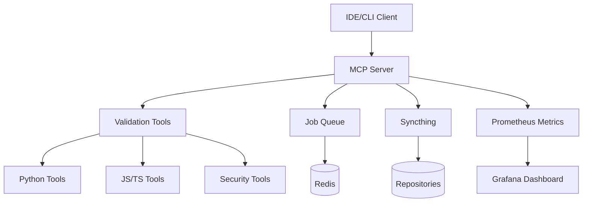

# HuskyCats MCP Server - Complete Setup Guide

## Table of Contents
1. [Quick Start](#quick-start)
2. [System Requirements](#system-requirements)
3. [Installation Methods](#installation-methods)
4. [Configuration](#configuration)
5. [Testing & Validation](#testing--validation)
6. [Use Cases](#use-cases)
7. [Troubleshooting](#troubleshooting)
8. [Architecture Overview](#architecture-overview)

## Quick Start

### One-Command Installation
```bash
curl -fsSL https://raw.githubusercontent.com/huskycats/huskycats-bates/main/install-podman-desktop.sh | bash
```

This will:
- Install Podman and Podman Desktop
- Clone the repository
- Build and deploy the MCP server
- Configure authentication
- Run health checks
- Set up desktop shortcuts

## System Requirements

### Minimum Requirements
- **CPU**: 2 cores
- **RAM**: 4GB
- **Storage**: 10GB free space
- **OS**: Linux (x64/ARM64), macOS (Intel/Apple Silicon), Windows 10+

### Recommended Requirements
- **CPU**: 4+ cores
- **RAM**: 8GB+
- **Storage**: 20GB+ free space
- **Network**: Stable internet for package downloads

### Software Dependencies
- Podman 4.0+ or Docker 20.10+
- Node.js 18+ (for local development)
- Git 2.25+
- curl or wget

## Installation Methods

### Method 1: Automated Installation (Recommended)

```bash
# Download and run installer
curl -fsSL https://raw.githubusercontent.com/huskycats/huskycats-bates/main/install-podman-desktop.sh -o install.sh
chmod +x install.sh
./install.sh
```

### Method 2: Manual Installation

#### Step 1: Install Podman
```bash
# Ubuntu/Debian
sudo apt-get update && sudo apt-get install -y podman

# Fedora/RHEL/Rocky
sudo dnf install -y podman

# macOS
brew install podman
podman machine init
podman machine start

# Arch Linux
sudo pacman -S podman
```

#### Step 2: Clone Repository
```bash
git clone https://github.com/huskycats/huskycats-bates.git
cd huskycats-bates/mcp-server
```

#### Step 3: Build and Deploy
```bash
# Install dependencies
npm install

# Build TypeScript
npm run build

# Deploy with Podman
./deploy-podman.sh
```

### Method 3: Using Pre-built Images

```bash
# Pull pre-built image
podman pull registry.gitlab.com/huskycats/huskycats-bates:latest

# Run container
podman run -d \
  --name huskycats-mcp-server \
  -p 8080:8080 \
  -e MCP_AUTH_TOKEN=$(openssl rand -hex 32) \
  registry.gitlab.com/huskycats/huskycats-bates:latest
```

### Method 4: Docker Compose

```yaml
# docker-compose.yml
version: '3.8'
services:
  mcp-server:
    image: registry.gitlab.com/huskycats/huskycats-bates:latest
    ports:
      - "8080:8080"
    environment:
      - NODE_ENV=production
      - MCP_AUTH_TOKEN=${MCP_AUTH_TOKEN}
    volumes:
      - ./workspace:/workspace
    healthcheck:
      test: ["CMD", "curl", "-f", "http://localhost:8080/health"]
      interval: 30s
      timeout: 10s
      retries: 3
```

Run with:
```bash
docker-compose up -d
```

## Configuration

### MCP Client Configuration (.mcp.json)

Create `~/.config/claude/mcp.json`:

```json
{
  "mcpServers": {
    "huskycats-validator": {
      "command": "node",
      "args": ["/path/to/mcp-server/dist/index.js"],
      "type": "stdio",
      "env": {
        "NODE_ENV": "production",
        "MCP_PORT": "8080"
      }
    },
    "huskycats-http": {
      "url": "http://localhost:8080/rpc",
      "type": "http",
      "authentication": {
        "type": "bearer",
        "token": "YOUR_AUTH_TOKEN"
      }
    }
  }
}
```

### Environment Variables

```bash
# Required
export MCP_AUTH_TOKEN="your-secure-token"
export MCP_PORT=8080
export MCP_HOST=0.0.0.0

# Optional
export NODE_ENV=production
export LOG_LEVEL=info
export ENABLE_SYNCTHING=true
export SYNCTHING_API_KEY="syncthing-key"
export MAX_WORKERS=4
export VALIDATION_TIMEOUT=30000
```

### Validation Rules Configuration

Create `.huskycat.yaml` in your project:

```yaml
version: '1.0'
validation:
  enabled: true
  staged_only: false
  auto_fix: true
  strict: true
  max_errors: 100

tools:
  python:
    enabled: true
    tools: ['black', 'flake8', 'mypy', 'bandit']
    file_patterns: ['*.py']
    exclude: ['__pycache__', '.venv']
    config:
      black:
        line_length: 88
      flake8:
        max_line_length: 88
        ignore: ['E203', 'W503']
      mypy:
        strict: true

  javascript:
    enabled: true
    tools: ['eslint', 'prettier']
    file_patterns: ['*.js', '*.jsx', '*.ts', '*.tsx']
    exclude: ['node_modules', 'dist']

  security:
    enabled: true
    scan_secrets: true
    audit_dependencies: true
    check_vulnerabilities: true

hooks:
  pre_commit:
    enabled: true
    commands: ['validate_project']
  post_validation:
    enabled: true
    notify: true
```

## Testing & Validation

### Run E2E Tests

```bash
# Navigate to MCP server directory
cd mcp-server

# Run all E2E tests
npm run test:e2e

# Or use the test script
./tests/e2e/run-e2e-tests.sh
```

### Manual Testing

#### 1. Health Check
```bash
curl http://localhost:8080/health
```

Expected response:
```json
{
  "status": "healthy",
  "uptime": 120,
  "timestamp": "2024-01-01T00:00:00Z"
}
```

#### 2. Initialize MCP Session
```bash
curl -X POST http://localhost:8080/rpc \
  -H "Content-Type: application/json" \
  -H "Authorization: Bearer YOUR_TOKEN" \
  -d '{
    "jsonrpc": "2.0",
    "id": 1,
    "method": "initialize",
    "params": {
      "protocolVersion": "2024-11-05",
      "capabilities": {},
      "clientInfo": {
        "name": "test-client",
        "version": "1.0.0"
      }
    }
  }'
```

#### 3. List Available Tools
```bash
curl -X POST http://localhost:8080/rpc \
  -H "Content-Type: application/json" \
  -H "Authorization: Bearer YOUR_TOKEN" \
  -d '{
    "jsonrpc": "2.0",
    "id": 2,
    "method": "tools/list"
  }'
```

#### 4. Validate Python Code
```bash
curl -X POST http://localhost:8080/rpc \
  -H "Content-Type: application/json" \
  -H "Authorization: Bearer YOUR_TOKEN" \
  -d '{
    "jsonrpc": "2.0",
    "id": 3,
    "method": "tools/call",
    "params": {
      "name": "python-black",
      "arguments": {
        "files": ["test.py"],
        "fix": true
      }
    }
  }'
```

### Performance Testing

```bash
# Load test with Apache Bench
ab -n 1000 -c 10 -H "Authorization: Bearer YOUR_TOKEN" http://localhost:8080/health

# Stress test with wrk
wrk -t4 -c100 -d30s -H "Authorization: Bearer YOUR_TOKEN" http://localhost:8080/health
```

## Use Cases

### 1. IDE Integration

#### Visual Studio Code
Install the HuskyCats extension and configure:

```json
{
  "huskycats.mcp.url": "http://localhost:8080/rpc",
  "huskycats.mcp.token": "YOUR_TOKEN",
  "huskycats.autoValidate": true,
  "huskycats.fixOnSave": true
}
```

#### IntelliJ IDEA
Add to `.idea/huskycats.xml`:

```xml
<component name="HuskyCats">
  <option name="mcpUrl" value="http://localhost:8080/rpc" />
  <option name="authToken" value="YOUR_TOKEN" />
  <option name="enabled" value="true" />
</component>
```

### 2. CI/CD Integration

#### GitHub Actions
```yaml
name: Code Validation
on: [push, pull_request]

jobs:
  validate:
    runs-on: ubuntu-latest
    container:
      image: registry.gitlab.com/huskycats/huskycats-bates:latest
    steps:
      - uses: actions/checkout@v2
      - name: Validate Code
        run: |
          huskycat validate --ci --strict
      - name: Upload Results
        uses: actions/upload-artifact@v2
        with:
          name: validation-report
          path: validation-report.json
```

#### GitLab CI
```yaml
validate:
  stage: test
  image: registry.gitlab.com/huskycats/huskycats-bates:latest
  script:
    - huskycat validate --ci --strict
  artifacts:
    reports:
      junit: reports/validation-*.xml
    paths:
      - validation-report.json
```

### 3. Git Hooks

```bash
# Install pre-commit hook
cat > .git/hooks/pre-commit << 'EOF'
#!/bin/bash
curl -X POST http://localhost:8080/rpc \
  -H "Content-Type: application/json" \
  -H "Authorization: Bearer $MCP_AUTH_TOKEN" \
  -d '{
    "jsonrpc": "2.0",
    "id": 1,
    "method": "tools/call",
    "params": {
      "name": "validate_project",
      "arguments": {
        "directory": ".",
        "fixIssues": true
      }
    }
  }'
EOF

chmod +x .git/hooks/pre-commit
```

### 4. Scheduled Validation

```bash
# Add to crontab for daily validation
0 2 * * * cd /path/to/project && curl -X POST http://localhost:8080/rpc \
  -H "Authorization: Bearer $MCP_AUTH_TOKEN" \
  -d '{"jsonrpc":"2.0","method":"tools/call","params":{"name":"validate_project"}}'
```

### 5. Multi-Repository Management

```bash
# Queue multiple repositories for validation
for repo in repo1 repo2 repo3; do
  curl -X POST http://localhost:8080/rpc \
    -H "Authorization: Bearer $MCP_AUTH_TOKEN" \
    -d "{
      \"jsonrpc\": \"2.0\",
      \"method\": \"tools/call\",
      \"params\": {
        \"name\": \"queue_validation\",
        \"arguments\": {
          \"repository\": \"https://github.com/org/$repo\"
        }
      }
    }"
done
```

## Troubleshooting

### Common Issues

#### Container Won't Start
```bash
# Check logs
podman logs huskycats-mcp-server

# Check port availability
sudo lsof -i :8080

# Check container status
podman ps -a
```

#### Authentication Errors
```bash
# Verify token
echo $MCP_AUTH_TOKEN

# Test with curl
curl -H "Authorization: Bearer $MCP_AUTH_TOKEN" http://localhost:8080/health
```

#### Performance Issues
```bash
# Check resource usage
podman stats huskycats-mcp-server

# Increase memory limit
podman update --memory 2g huskycats-mcp-server

# Check disk space
df -h
```

#### Network Issues
```bash
# Test connectivity
podman exec huskycats-mcp-server ping google.com

# Check firewall
sudo firewall-cmd --list-all

# Verify DNS
podman exec huskycats-mcp-server nslookup github.com
```

### Debug Mode

Enable verbose logging:
```bash
# Set environment variables
export LOG_LEVEL=debug
export MCP_DEBUG=true

# Restart container
podman restart huskycats-mcp-server

# View debug logs
podman logs -f huskycats-mcp-server
```

### Recovery Procedures

#### Reset Installation
```bash
# Stop and remove container
podman stop huskycats-mcp-server
podman rm huskycats-mcp-server

# Remove volumes
podman volume prune -f

# Reinstall
./install-podman-desktop.sh
```

#### Backup and Restore
```bash
# Backup
podman export huskycats-mcp-server > backup.tar
podman volume export huskycats-data > data-backup.tar

# Restore
podman import backup.tar huskycats-mcp-server:backup
podman volume import huskycats-data < data-backup.tar
```

## Architecture Overview

### System Components



### Request Flow

1. **Client Request** → MCP Server
2. **Authentication** → Bearer Token Validation
3. **Method Routing** → Tool Selection
4. **Execution** → Container/Process Spawn
5. **Results** → JSON-RPC Response
6. **Caching** → Result Storage
7. **Metrics** → Performance Tracking

### Directory Structure

```
huskycats-bates/
├── mcp-server/
│   ├── src/
│   │   ├── handlers/       # Request handlers
│   │   ├── tools/         # Tool implementations
│   │   ├── utils/         # Utilities
│   │   └── types/         # TypeScript types
│   ├── tests/
│   │   ├── e2e/           # E2E tests
│   │   ├── integration/   # Integration tests
│   │   └── unit/          # Unit tests
│   ├── dist/              # Compiled JS
│   └── package.json
├── docs/                  # Documentation
├── scripts/              # Utility scripts
└── .mcp.json            # MCP configuration
```

## Advanced Features

### Distributed Validation

Enable multi-node validation:
```yaml
# swarm-config.yaml
nodes:
  - host: node1.example.com
    port: 8080
  - host: node2.example.com
    port: 8080
  - host: node3.example.com
    port: 8080

load_balancing:
  strategy: round_robin
  health_check_interval: 30
```

### Custom Tool Integration

Add custom validation tools:
```typescript
// custom-tool.ts
export const customTool = {
  name: 'custom-validator',
  description: 'Custom validation logic',
  inputSchema: {
    type: 'object',
    properties: {
      files: { type: 'array' }
    }
  },
  execute: async (args) => {
    // Custom validation logic
    return { success: true };
  }
};
```

### Webhook Integration

Configure webhooks for events:
```json
{
  "webhooks": {
    "validation_complete": "https://example.com/webhook",
    "error_threshold": "https://example.com/alerts"
  }
}
```

## Support & Resources

- **Documentation**: https://github.com/huskycats/huskycats-bates/docs
- **Issues**: https://github.com/huskycats/huskycats-bates/issues
- **Discord**: https://discord.gg/huskycats
- **MCP Spec**: https://modelcontextprotocol.org

## License

MIT License - See LICENSE file for details