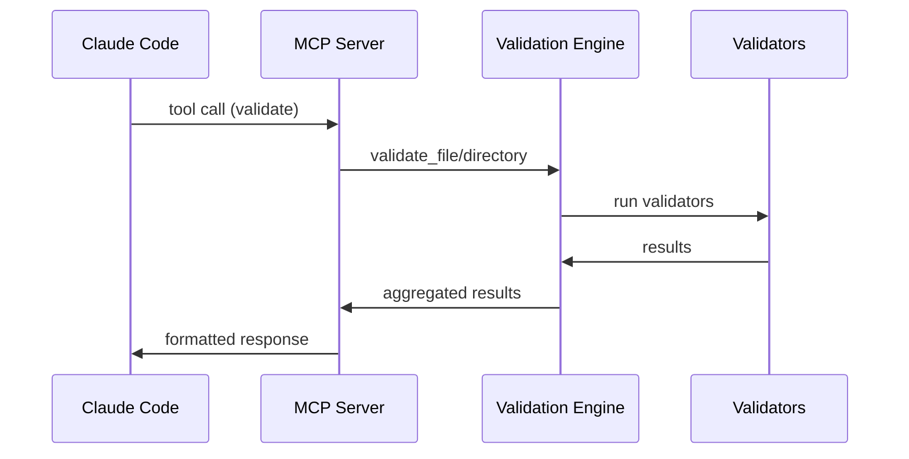

# MCP Server Integration

HuskyCat includes a built-in **stdio-based MCP Server** that exposes validation tools via MCP protocol, enabling AI-powered code quality feedback through Claude Code integration.

## What is MCP?

The Model Context Protocol (MCP) is an open standard that allows AI assistants like Claude to connect with external tools and data sources. HuskyCat's MCP server exposes its validation capabilities as tools that Claude Code can use.

## Quick Setup

### Option 1: Automatic Registration (Recommended)

Install HuskyCat with automatic Claude Code integration:

```bash
HUSKYCAT_WITH_CLAUDE=1 curl -fsSL https://huskycat-570fbd.gitlab.io/install.sh | bash
```

This automatically:
1. Downloads and installs the HuskyCat binary
2. Registers the MCP server with Claude Code
3. Verifies the installation

### Option 2: Manual Registration

If HuskyCat is already installed, register manually:

```bash
# Using Claude CLI
claude mcp add huskycat -- huskycat mcp-server

# Or with explicit scope
claude mcp add huskycat --scope user -- huskycat mcp-server
```

### Option 3: Build from Source

```bash
git clone https://gitlab.com/tinyland/ai/huskycat.git
cd huskycat
npm install
uv sync --dev

# Build container (required for validation)
npm run container:build

# Build binary entry point
npm run build:binary

# Install with Claude Code integration
./dist/huskycat install --with-claude
```

### MCP Configuration Reference

The MCP server configuration in `.mcp.json` or `~/.claude/.mcp.json`:

```json
{
  "mcpServers": {
    "huskycat": {
      "command": "huskycat",
      "args": ["mcp-server"],
      "type": "stdio"
    }
  }
}
```

**Note**: HuskyCat uses stdio protocol by default - no port needed.

### 3. Verify Installation

In Claude Code, you should now see HuskyCat tools available:

- `validate` - Validate files or directories
- `validate_staged` - Validate staged Git files
- Individual validator tools (e.g., `validate_python-black`, `validate_flake8`, `validate_mypy`)

## Available Tools

### Core Tools

#### `validate`
Validates files or directories with all applicable validators.

**Parameters:**
- `path` (required): File or directory path to validate
- `fix` (optional): Auto-fix issues where possible (default: false)

**Example usage in Claude Code:**
```
Please validate the Python files in my src/ directory and fix any issues.
```

#### `validate_staged`
Validates files staged for Git commit.

**Parameters:**
- `fix` (optional): Auto-fix issues where possible (default: false)

**Example usage in Claude Code:**
```
Check my staged files before I commit them.
```

### Individual Validator Tools

Each validator has its own tool for targeted validation:

- `validate_python-black` - Python code formatting
- `validate_autoflake` - Python unused import removal
- `validate_flake8` - Python linting
- `validate_mypy` - Python type checking
- `validate_ruff` - Python fast linting
- `validate_bandit` - Python security scanning
- `validate_js-eslint` - JavaScript/TypeScript linting
- `validate_js-prettier` - JavaScript/TypeScript formatting
- `validate_yamllint` - YAML validation
- `validate_hadolint` - Dockerfile validation
- `validate_shellcheck` - Shell script validation
- `validate_gitlab-ci` - GitLab CI validation

**Parameters:**
- `path` (required): File path to validate
- `fix` (optional): Auto-fix issues where possible (default: false)

## Architecture



## Example Workflows

### 1. Pre-Commit Validation

In Claude Code:
```
I'm about to commit my changes. Can you validate my staged files and fix any issues?
```

This will:
1. Run `validate_staged` with `fix: true`
2. Show you exactly what was validated
3. Apply auto-fixes where possible
4. Report any remaining issues

### 2. Directory Validation

In Claude Code:
```
Please check all Python files in my project for type errors and style issues.
```

This will:
1. Run `validate` on your project directory
2. Focus on Python files
3. Run MyPy, Black, Flake8, and Ruff
4. Provide a detailed report

### 3. Specific Tool Validation

In Claude Code:
```
Run ESLint on my main.js file and fix any issues.
```

This will:
1. Run `validate_eslint` with `fix: true`
2. Apply ESLint auto-fixes
3. Report the results

## Configuration

### MCP Server Settings

The MCP server reads the same configuration as the CLI tool. You can customize validation behavior through:

1. **Project configuration** (pyproject.toml, .flake8, etc.)
2. **Environment variables** (HUSKYCAT_LOG_LEVEL, etc.)
3. **Tool parameters** (passed through MCP calls)

### Logging

MCP server logs are written to stderr to avoid interfering with the stdio protocol. Set the log level:

```bash
HUSKYCAT_LOG_LEVEL=DEBUG claude mcp add huskycat "huskycat mcp-server"
```

## Advanced Usage

### Custom Validation Workflows

You can combine multiple MCP tools in Claude Code workflows:

```
1. First, validate my Python code with Black and fix formatting
2. Then run MyPy for type checking
3. Finally, validate my YAML configuration files
```

### Integration with Git Hooks

The MCP server works seamlessly with Git hooks. You can:

1. Validate staged files before committing
2. Set up pre-push validation
3. Integrate with CI/CD workflows

### Execution Model

The MCP server uses HuskyCat's multi-modal execution:

```bash
# Start MCP server (uses best available execution model)
./dist/huskycat mcp-server

# Verify installation
huskycat status
```

**Execution Priority**:
1. **Bundled tools** (~/.huskycat/tools/) - fastest, no dependencies
2. **System PATH** - local tools if available
3. **Container delegation** - fallback when runtime available

See [Execution Models](../architecture/execution-models.md) for details.

## Troubleshooting

### Common Issues

1. **Tool not found**: Ensure HuskyCat is properly installed and in your PATH
2. **Permission errors**: Check file permissions and directory access
3. **Python not found**: Some validators require Python to be installed

### Debug Mode

Enable verbose logging for troubleshooting:

```bash
HUSKYCAT_LOG_LEVEL=DEBUG huskycat mcp-server
```

### Manual Testing

Test the MCP server manually:

```bash
# Start the server
huskycat mcp-server

# Send a test request (JSON-RPC format)
echo '{"jsonrpc":"2.0","method":"initialize","params":{},"id":1}' | huskycat mcp-server
```

## Technical Details

### Protocol Compliance

HuskyCat's MCP server implements MCP version 2024-11-05 and supports:

- Tool discovery and invocation
- JSON-RPC 2.0 communication
- Error handling and reporting
- Structured result formatting

### Performance

- **Fast startup**: < 100ms initialization time
- **Efficient validation**: Parallel execution of validators
- **Smart caching**: Avoid re-running unchanged validators
- **Resource management**: Automatic cleanup and memory management

### Security

- **Sandboxed execution**: Validators run in controlled environments
- **Path validation**: Prevent directory traversal attacks
- **Input sanitization**: Clean and validate all inputs
- **Error isolation**: Failures don't crash the server

## API Reference

For complete API documentation, see our [MCP Tools API Reference](../api/mcp-tools.md).

---

The MCP server integration makes HuskyCat incredibly powerful when combined with Claude Code's AI capabilities, enabling intelligent code validation workflows that adapt to your specific needs.