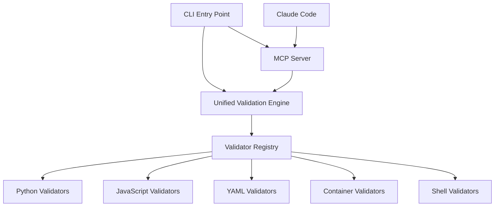

# HuskyCat Universal Code Validation Platform

Welcome to HuskyCat, the **Universal Code Validation Platform** with integrated **MCP (Model Context Protocol) Server** support for seamless Claude Code integration.

## What is HuskyCat?

HuskyCat is a modern, unified validation platform that combines:

- **Universal Code Validation**: Support for Python, JavaScript/TypeScript, YAML, Shell scripts, Dockerfiles, and more
- **MCP Server Integration**: Direct integration with Claude Code for AI-powered development workflows
- **Git Hooks**: Automated validation on commit with customizable rules
- **CI/CD Integration**: Native GitLab CI/CD support with artifact publishing
- **Container Support**: Run validation in isolated environments
- **UV Package Manager**: Lightning-fast Python dependency management

## Quick Start

### Build from Source

```bash
git clone <repository>
cd huskycats-bates
npm install
npm run build:binary
```

### For Claude Code Integration

After building, set up the MCP server:

```bash
./dist/huskycat mcp-server
```

### Setup in Your Repository

```bash
cd your-project
./path/to/huskycat setup-hooks
```

## Key Features

### 🔍 Universal Validation
- **Python**: Black, Flake8, MyPy, Ruff
- **JavaScript/TypeScript**: ESLint
- **YAML**: yamllint
- **Shell**: shellcheck
- **Containers**: hadolint
- **Auto-fix**: Automatic code formatting where possible

### 🤖 MCP Server for Claude Code
- Direct integration with Claude Code
- Validate files and directories from within Claude
- Support for individual validator tools
- Staged file validation for git workflows

### ⚡ Performance
- Built with UV for ultra-fast Python package management
- Parallel validation execution
- Smart caching and incremental builds
- Binary distributions for zero-dependency installation

### 🔧 Developer Experience
- Simple CLI interface
- JSON output for programmatic use
- Comprehensive error reporting
- Container isolation option

## Architecture

HuskyCat uses a simplified, unified architecture:



## Getting Started

Choose your installation method:

=== "Build from Source (Recommended)"

    ```bash
    git clone <repository>
    cd huskycats-bates
    npm install
    npm run build:binary
    uv sync --dev
    ```

=== "Development Mode"

    ```bash
    npm run dev -- --help      # Show available commands
    npm run validate           # Validate using Python module
    npm run hooks:install      # Setup hooks via npm script
    ```

=== "Container Build"

    ```bash
    npm run container:build
    podman run --rm -v "$(pwd):/workspace" huskycat:local validate --all
    ```

## Usage Examples

### Basic Validation

```bash
# Validate current directory
./dist/huskycat validate

# Validate specific file
./dist/huskycat validate src/main.py

# Validate all files
./dist/huskycat validate --all

# Validate staged files (for git hooks)
./dist/huskycat validate --staged
```

### MCP Server Usage

```bash
# Start MCP server for Claude Code (stdio mode)
./dist/huskycat mcp-server

# Start MCP server on specific port
./dist/huskycat mcp-server --port 8080
```

### Git Integration

```bash
# Setup git hooks
./dist/huskycat setup-hooks

# Manual hook testing
git add .
git commit -m "feat: add validation"  # Hooks run automatically
```

## Next Steps

- [Installation Guide](installation.md) - Detailed installation instructions
- [Configuration](configuration.md) - Customize validation rules
- [MCP Server](features/mcp-server.md) - Claude Code integration
- [Git Hooks](features/git-hooks.md) - Automated validation setup
- [API Reference](api/cli.md) - Complete command reference

## Support

- **Documentation**: [https://huskycat.pages.io](https://huskycat.pages.io)
- **Issues**: [GitLab Issues](https://gitlab.com/tinyland/ai/huskycat/-/issues)
- **Discussions**: [GitLab Discussions](https://gitlab.com/tinyland/ai/huskycat/-/issues)

---

**HuskyCat** - Making code validation universal, fast, and intelligent.