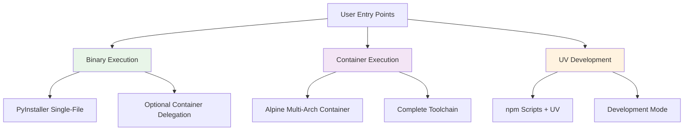

# HuskyCat Universal Code Validation Platform

Welcome to HuskyCat, the **Universal Code Validation Platform** with integrated **MCP (Model Context Protocol) Server** support for seamless Claude Code integration.

## What is HuskyCat?

HuskyCat is a multi-modal validation platform designed for consistent toolchains, flexible execution, and AI integration:

- **Multi-Modal Execution**: Three execution models (Binary, Container, UV Development) for flexibility
- **Five Product Modes**: Git Hooks, CI, CLI, Pipeline, MCP Server with mode-specific behavior
- **Repository Safety**: Optional container isolation with read-only mounting
- **MCP Server Integration**: stdio-based JSON-RPC 2.0 server for Claude Code integration
- **Git Hooks**: Binary-first execution with optional container delegation
- **Universal Validation**: Python, JavaScript, YAML, Shell, Docker, security scanning
- **Auto-Fix Support**: Interactive auto-repair of validation issues

See [Architecture Documentation](architecture/) for complete technical details with code references.

## Quick Start

### Prerequisites & Setup
```bash
# Optional: Container runtime (podman or docker) for container execution
# Install podman: brew install podman (macOS) or apt install podman (Ubuntu)

# Install dependencies
npm install
uv sync --dev

# Optional: Build container for container-based execution
npm run container:build

# Build binary entry point
npm run build:binary

# Verify installation
./dist/huskycat --version
./dist/huskycat status
```

## Key Features

### Multi-Modal Execution
- **Binary Execution**: PyInstaller single-file, optional container delegation (`unified_validation.py:85-170`)
- **Container Execution**: Alpine multi-arch images with complete toolchain
- **UV Development**: npm scripts for local development
- See [Execution Models](architecture/execution-models.md) for details

### Repository Safety & Isolation
- Binary configs stored separately from repository (`~/.huskycat/`)
- Optional container isolation for maximum security
- Read-only repository mounting when using containers

### AI Integration via MCP
- stdio-based MCP server for Claude Code (`mcp_server.py:1-150`)
- Validation tools exposed as AI-callable functions
- Real-time code quality feedback

### Universal Validation with Auto-Fix
- **Core Tools**: Black, Flake8, MyPy, Ruff
- **Extended Tools**: yamllint, shellcheck, hadolint, eslint
- **Security**: bandit, safety, dependency scanning
- **GitLab CI**: Schema validation and pipeline testing
- **Auto-Fix**: Interactive prompts for automatic issue resolution

## Architecture

HuskyCat supports three execution models with flexible routing:



**Five Product Modes** (see [Product Modes](architecture/product-modes.md)):
- **Git Hooks**: Fast subset (4 tools), <5s execution
- **CI**: All tools (15+), JUnit XML output
- **CLI**: Interactive, colored output, auto-fix prompts
- **Pipeline**: JSON output, machine-readable
- **MCP Server**: JSON-RPC 2.0, AI integration

## Getting Started

Choose your execution model based on your needs:

=== "Binary Entry Point (Recommended)"

    ```bash
    ./dist/huskycat [command]            # Fast startup, optional container delegation
    ```
    **Implementation**: `huskycat_main.py:1-27` → `__main__.py:1-50`
    **Best for**: Git hooks, CI/CD, production deployments
    **Container**: Optional delegation when runtime available

=== "Container Execution"

    ```bash
    npm run container:validate           # Alpine multi-arch
    ```
    **Implementation**: `ContainerFile:1-153`, `.gitlab-ci.yml:158-218`
    **Best for**: Maximum isolation, consistent toolchain
    **Requirement**: Container runtime (podman or docker)

=== "UV Development Mode"

    ```bash
    npm run dev -- [command]             # UV + npm scripts
    ```
    **Implementation**: `package.json:8-38`
    **Best for**: Development, testing, convenience
    **Requirement**: UV package manager, Python 3.8+

=== "MCP Server Mode"

    ```bash
    ./dist/huskycat mcp-server           # stdio JSON-RPC server
    ```
    **Implementation**: `mcp_server.py:1-150`
    **Best for**: Claude Code integration, AI-powered validation

## Usage Examples

### Core Operations
```bash
# Binary execution (recommended for git hooks)
./dist/huskycat validate --staged    # Validate staged files
./dist/huskycat setup-hooks          # Install git hooks
./dist/huskycat ci-validate .gitlab-ci.yml

# Auto-fix validation
./dist/huskycat validate --fix       # Auto-fix validation issues
git addf <files>                     # Interactive auto-fix before staging
git addf .                           # Validate and auto-fix all files

# Development mode (NPM scripts + UV)
npm run validate                     # Quick validation
npm run validate:ci                  # CI configuration
npm run mcp:server                   # Start MCP server

# Container mode (when runtime available)
npm run container:validate           # Container-based validation
```

### Claude Code Integration
```bash
# Start MCP server (stdio protocol)
./dist/huskycat mcp-server

# Test connection
echo '{"jsonrpc": "2.0", "method": "tools/list", "id": 1}' | npm run mcp:server
```

## Product Modes

HuskyCat automatically detects and adapts to different usage contexts:

| Mode | Output | Tools | Interactive | Detection |
|------|--------|-------|-------------|-----------|
| **Git Hooks** | Minimal | Fast subset (4) | Auto-detect TTY | Git env vars |
| **CI** | JUnit XML | All (15+) | Never | CI=true env |
| **CLI** | Rich colored | Configurable | Yes | Default/TTY |
| **Pipeline** | JSON | All | Never | --json flag |
| **MCP Server** | JSON-RPC 2.0 | All | Never | mcp-server cmd |

**Mode Detection**: `mode_detector.py:30-82` (priority: flag → env → command → git → CI → TTY → default)

See [Product Modes Documentation](architecture/product-modes.md) for complete comparison matrix.

## Next Steps

- [Architecture Overview](architecture/)
  - [Execution Models](architecture/execution-models.md) - Binary, Container, UV modes
  - [Product Modes](architecture/product-modes.md) - 5 modes with code references
- [Installation Guide](installation.md) - Detailed installation instructions
- [Configuration](configuration.md) - Customize validation rules
- [MCP Server](features/mcp-server.md) - Claude Code integration
- [Non-Blocking Hooks](nonblocking-hooks.md) - Fast commit workflow with background validation
- [CLI Reference](cli-reference.md) - Complete command reference

## Support

- **Documentation**: [https://huskycat.pages.io](https://huskycat.pages.io)
- **Issues**: [GitLab Issues](https://gitlab.com/tinyland/ai/huskycat/-/issues)
- **Discussions**: [GitLab Discussions](https://gitlab.com/tinyland/ai/huskycat/-/issues)

---

**HuskyCat** - Making code validation universal, fast, and intelligent.
