# HuskyCat Universal Code Validation Platform

Welcome to HuskyCat, the **Universal Code Validation Platform** with integrated **MCP (Model Context Protocol) Server** support for seamless Claude Code integration.

## What is HuskyCat?

HuskyCat is a **container-only** validation platform designed for consistent toolchains, repository isolation, and AI integration:

- **Container-Only Execution**: Complete toolchain consistency across all environments
- **Repository Safety**: Validation tools run in isolation from your actual repository
- **MCP Server Integration**: stdio-based server for seamless Claude Code integration
- **Git Hooks**: Binary-first execution with container-backed validation
- **Universal Validation**: Python, JavaScript, YAML, Shell, Docker, security scanning
- **Auto-Fix Support**: Interactive auto-repair of validation issues

## Quick Start

### Prerequisites & Setup
```bash
# Required: Container runtime (podman or docker)
# Install podman: brew install podman (macOS) or apt install podman (Ubuntu)

# Install dependencies
npm install
uv sync --dev

# Build container (required for all validation)
npm run container:build

# Build binary entry point
npm run build:binary

# Verify installation
./dist/huskycat --version
./dist/huskycat status
```

## Key Features

### 🐳 **Container-Only Execution**
- Consistent toolchain across all environments
- Complete isolation from host repository
- No "tool not found" errors - ever

### 🔒 **Repository Safety & Isolation**
- Binary configs stored separately from repository
- Validation tools cannot interfere with actual files
- Read-only repository mounting for security

### 🤖 **AI Integration via MCP**
- stdio-based MCP server for Claude Code
- Container-backed validation tools as AI-callable functions
- Real-time code quality feedback with full toolchain

### 🔄 **Universal Validation with Auto-Fix**
- **Core Tools**: Black, Flake8, MyPy, Ruff
- **Extended Tools**: yamllint, shellcheck, hadolint, eslint
- **Security**: bandit, safety, dependency scanning
- **GitLab CI**: Schema validation and pipeline testing
- **Auto-Fix**: Interactive prompts for automatic issue resolution

## Architecture

HuskyCat enforces container-only execution for all validation operations:

```mermaid
graph LR
    A["🚀 Binary Entry Point"] --> B["Container Runtime"]
    C["🛠️ NPM Scripts"] --> B
    D["🤖 MCP Server"] --> B
    
    B --> E["🐳 Container Execution"]
    E --> F["Complete Toolchain"]
    E --> G["Repository Isolation"] 
    E --> H["Consistent Environment"]
    
    style B fill:#f3e5f5
    style E fill:#e8f5e8
    style F fill:#fff3e0
```



## Getting Started

Choose your installation method:

All execution modes use **container-only validation** for consistency:

=== "🚀 Binary Entry Point (Recommended)"

    ```bash
    ./dist/huskycat [command]            # Fast startup, container execution
    ```
    **Best for**: Git hooks, CI/CD, production deployments

=== "🛠️ NPM Script Development"

    ```bash
    npm run dev -- [command]            # Python module via NPM
    ```
    **Best for**: Development, testing, convenience

=== "🤖 MCP Server Mode"

    ```bash
    ./dist/huskycat mcp-server           # stdio JSON-RPC server
    ```
    **Best for**: Claude Code integration, AI-powered validation

**All modes provide**: Complete toolchain (Python + Node.js + Shell + Docker + Security) via container execution

## Usage Examples

### Core Operations
```bash
# Fast binary execution (git hooks, production)
./dist/huskycat validate --staged    # Validate staged files
./dist/huskycat setup-hooks          # Install git hooks
./dist/huskycat ci-validate .gitlab-ci.yml

# Auto-fix validation (NEW)
./dist/huskycat validate --fix       # Auto-fix validation issues
git addf <files>                     # Interactive auto-fix before staging
git addf .                          # Validate and auto-fix all files

# Development mode (NPM scripts)
npm run validate                     # Quick validation
npm run validate:ci                  # CI configuration
npm run mcp:server                   # Start MCP server

# Container mode (comprehensive)
npm run container:test:validate      # Full toolchain
```

### Claude Code Integration
```bash
# Start MCP server (stdio protocol)
./dist/huskycat mcp-server

# Test connection
echo '{"jsonrpc": "2.0", "method": "tools/list", "id": 1}' | npm run mcp:server
```

## Next Steps

- [Installation Guide](installation.md) - Detailed installation instructions
- [Configuration](configuration.md) - Customize validation rules
- [MCP Server](features/mcp-server.md) - Claude Code integration
- [MCP Tools API](api/mcp-tools.md) - MCP server tools reference
- [GitLab CI/CD](gitlab-ci-cd.md) - GitLab integration guide

## Support

- **Documentation**: [https://huskycat.pages.io](https://huskycat.pages.io)
- **Issues**: [GitLab Issues](https://gitlab.com/tinyland/ai/huskycat/-/issues)
- **Discussions**: [GitLab Discussions](https://gitlab.com/tinyland/ai/huskycat/-/issues)

---

**HuskyCat** - Making code validation universal, fast, and intelligent.