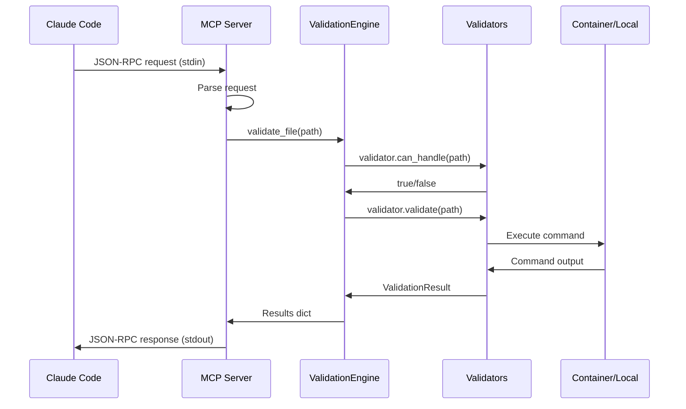

# HuskyCat MCP Server Architecture v2.0.0

## Overview

The HuskyCat MCP Server provides AI-powered code validation through the Model Context Protocol (MCP). It uses a **stdio-based JSON-RPC 2.0** implementation for seamless Claude Code integration.

## Architecture Diagram

```mermaid
graph TB
    subgraph "Claude Code"
        CC[Claude Code] --> |JSON-RPC stdin| MCP
    end

    subgraph "HuskyCat MCP Server"
        MCP[MCPServer] --> |parse request| RH[Request Handler]
        RH --> |initialize| INIT[Initialize Handler]
        RH --> |tools/list| TL[Tools List Handler]
        RH --> |tools/call| TC[Tool Call Handler]

        TC --> |validate| VE[Validation Engine]
        TC --> |validate_staged| VE
        TC --> |validate_{tool}| VE

        VE --> |run validators| V1[BlackValidator]
        VE --> V2[Flake8Validator]
        VE --> V3[MypyValidator]
        VE --> V4[...12 validators]
    end

    subgraph "Execution Layer"
        V1 --> |in container| CONT[Container Runtime]
        V1 --> |direct| DIRECT[Local Execution]
        CONT --> |podman/docker| TOOLS[Validation Tools]
        DIRECT --> TOOLS
    end

    MCP --> |JSON-RPC stdout| CC

    style MCP fill:#e1f5fe
    style VE fill:#e8f5e8
    style CONT fill:#fff3e0
```

## Key Components

### 1. Entry Point (`src/huskycat/mcp_server.py`)

The MCP server is a single Python module that:
- Reads JSON-RPC requests from stdin
- Processes requests through the ValidationEngine
- Writes JSON-RPC responses to stdout

```python
class MCPServer:
    def __init__(self):
        self.container_available = self._detect_container_available()
        self.engine = ValidationEngine(auto_fix=False)

    def run(self):
        while True:
            line = sys.stdin.readline()
            request = json.loads(line.strip())
            response = self.handle_request(request)
            sys.stdout.write(json.dumps(response) + "\n")
            sys.stdout.flush()
```

**File**: `src/huskycat/mcp_server.py:26-474`

### 2. Request Handling

The server handles three MCP methods:

| Method | Handler | Purpose |
|--------|---------|---------|
| `initialize` | `_handle_initialize()` | Protocol handshake |
| `tools/list` | `_handle_list_tools()` | Discover available tools |
| `tools/call` | `_handle_tool_call()` | Execute validation |

**File**: `src/huskycat/mcp_server.py:143-164`

### 3. Validation Engine (`src/huskycat/unified_validation.py`)

Single source of truth for all validation logic:

```python
class ValidationEngine:
    def __init__(self, auto_fix: bool = False):
        self.auto_fix = auto_fix
        self.validators = [
            BlackValidator(auto_fix),
            AutoflakeValidator(auto_fix),
            Flake8Validator(auto_fix),
            # ... 12 validators total
        ]
```

**File**: `src/huskycat/unified_validation.py:1-1000+`

### 4. Validator Base Class

Each validator follows a common pattern:

```python
class Validator(ABC):
    @property
    @abstractmethod
    def name(self) -> str:
        """Unique validator name (e.g., 'python-black')"""

    @property
    @abstractmethod
    def extensions(self) -> Set[str]:
        """File extensions this validator handles"""

    @abstractmethod
    def validate(self, filepath: Path) -> ValidationResult:
        """Validate a single file"""
```

**File**: `src/huskycat/unified_validation.py:62-179`

## Available Validators

| Validator Class | Name Property | Extensions | Command |
|-----------------|---------------|------------|---------|
| `BlackValidator` | `python-black` | `.py`, `.pyi` | `black` |
| `AutoflakeValidator` | `autoflake` | `.py` | `autoflake` |
| `Flake8Validator` | `flake8` | `.py` | `flake8` |
| `MypyValidator` | `mypy` | `.py` | `mypy` |
| `RuffValidator` | `ruff` | `.py` | `ruff` |
| `BanditValidator` | `bandit` | `.py` | `bandit` |
| `ESLintValidator` | `js-eslint` | `.js`, `.ts`, `.jsx`, `.tsx` | `eslint` |
| `PrettierValidator` | `js-prettier` | `.js`, `.ts`, `.json`, `.md` | `prettier` |
| `YamlLintValidator` | `yamllint` | `.yml`, `.yaml` | `yamllint` |
| `HadolintValidator` | `docker-hadolint` | `Dockerfile`, `ContainerFile` | `hadolint` |
| `ShellcheckValidator` | `shellcheck` | `.sh`, `.bash` | `shellcheck` |
| `GitLabCIValidator` | `gitlab-ci` | `.gitlab-ci.yml` | `glab` |

**File**: `src/huskycat/unified_validation.py:184-1000+`

## MCP Tools Exposed

The server exposes these tools to Claude Code:

### Core Tools

1. **`validate`** - Validate files or directories
   ```json
   {
     "name": "validate",
     "inputSchema": {
       "properties": {
         "path": { "type": "string", "description": "File or directory path" },
         "fix": { "type": "boolean", "default": false }
       },
       "required": ["path"]
     }
   }
   ```

2. **`validate_staged`** - Validate git staged files
   ```json
   {
     "name": "validate_staged",
     "inputSchema": {
       "properties": {
         "fix": { "type": "boolean", "default": false }
       }
     }
   }
   ```

### Individual Validator Tools

Each validator is exposed as `validate_{name}`:
- `validate_python-black`
- `validate_autoflake`
- `validate_flake8`
- `validate_mypy`
- `validate_ruff`
- `validate_bandit`
- `validate_js-eslint`
- `validate_js-prettier`
- `validate_yamllint`
- `validate_docker-hadolint`
- `validate_shellcheck`
- `validate_gitlab-ci`

**File**: `src/huskycat/mcp_server.py:188-257`

## Execution Modes

### Container Execution (Preferred)

When a container runtime (podman/docker) is available:

```python
def _build_container_command(self, cmd: List[str]) -> List[str]:
    return [
        container_runtime,
        "run", "--rm",
        "--entrypoint=",  # Override entrypoint
        "-v", f"{Path.cwd()}:/workspace",
        "-w", "/workspace",
        "huskycat:local",
    ] + cmd
```

**File**: `src/huskycat/unified_validation.py:134-152`

### Direct Execution (Fallback)

When running inside a container or no runtime available:

```python
def _is_running_in_container(self) -> bool:
    return (
        os.path.exists("/.dockerenv") or
        bool(os.environ.get("container")) or
        os.path.exists("/run/.containerenv")
    )
```

**File**: `src/huskycat/unified_validation.py:111-120`

## Protocol Details

### JSON-RPC 2.0 Format

**Request**:
```json
{
  "jsonrpc": "2.0",
  "id": 1,
  "method": "tools/call",
  "params": {
    "name": "validate",
    "arguments": { "path": "src/", "fix": false }
  }
}
```

**Response**:
```json
{
  "jsonrpc": "2.0",
  "id": 1,
  "result": {
    "content": [{
      "type": "text",
      "text": "{\"summary\": {...}, \"results\": {...}}"
    }]
  }
}
```

### Error Codes

| Code | Meaning |
|------|---------|
| -32700 | Parse error |
| -32601 | Method not found |
| -32602 | Invalid params |
| -32603 | Internal error |

**File**: `src/huskycat/mcp_server.py:432-440`

## Starting the Server

```bash
# Via binary
./dist/huskycat mcp-server

# Via npm
npm run mcp:server

# Via Python module
uv run python -m src.huskycat mcp-server
```

The server runs in stdio mode only - no HTTP server, no ports.

## Claude Code Configuration

Add to your MCP configuration:

```json
{
  "mcpServers": {
    "huskycat": {
      "command": "/path/to/huskycat",
      "args": ["mcp-server"]
    }
  }
}
```

## Logging

Logs are written to stderr to avoid interfering with stdio:

```python
logging.basicConfig(
    level=os.getenv("HUSKYCAT_LOG_LEVEL", "INFO"),
    format="%(asctime)s - %(name)s - %(levelname)s - %(message)s",
    stream=sys.stderr,
)
```

Set `HUSKYCAT_LOG_LEVEL=DEBUG` for verbose output.

**File**: `src/huskycat/mcp_server.py:17-23`

## Data Flow



## Performance Characteristics

- **Startup time**: < 100ms
- **Per-file validation**: 50-500ms depending on tool
- **Memory usage**: ~50MB base + tool overhead
- **Concurrent requests**: Single-threaded (stdin/stdout)

## Security Model

1. **Process isolation**: MCP server runs as user process
2. **Container isolation**: Validators run in containers when available
3. **Read-only by default**: No auto-fix unless explicitly requested
4. **Path validation**: Validates paths before execution
5. **No network**: stdio-only, no network exposure

## File Reference

| Component | File | Lines |
|-----------|------|-------|
| MCP Server | `src/huskycat/mcp_server.py` | 1-485 |
| Validation Engine | `src/huskycat/unified_validation.py` | 1-1000+ |
| MCP Command | `src/huskycat/commands/mcp.py` | 1-50 |
| MCP Adapter | `src/huskycat/core/adapters/mcp.py` | 1-137 |
