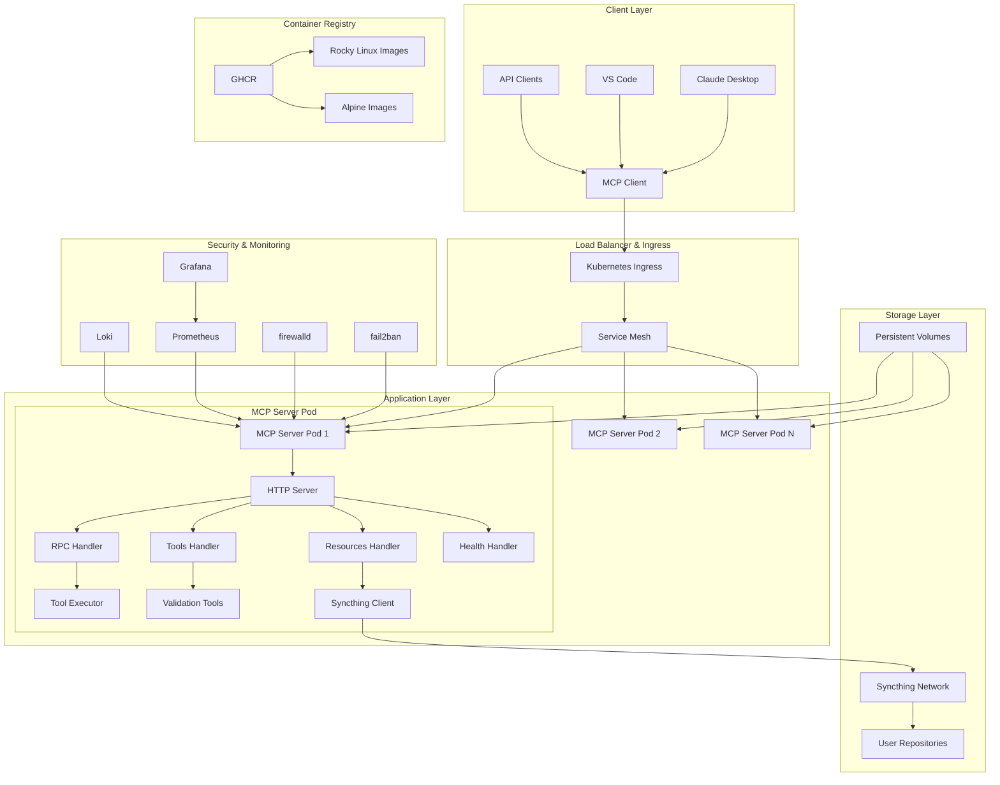
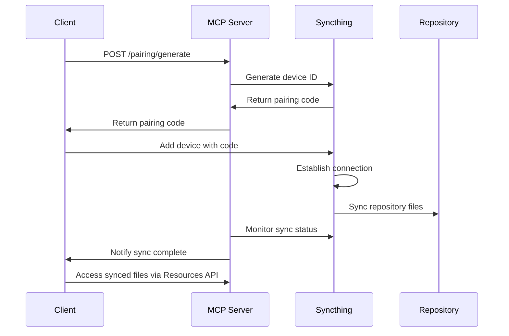
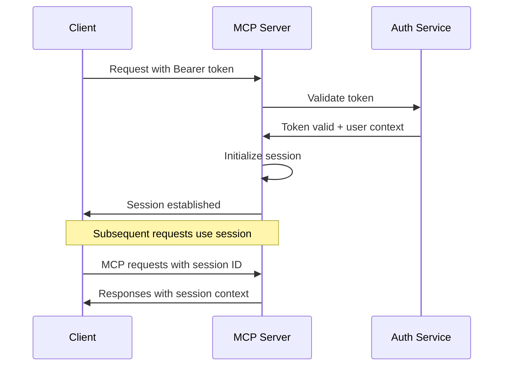

# HuskyCats MCP Server Architecture v2.0.0

## Executive Summary

This document outlines the comprehensive system architecture for the HuskyCats MCP (Model Context Protocol) Server v2.0.0, designed for production-grade code validation services with enterprise security, scalability, and maintainability requirements.

## System Overview

The HuskyCats MCP Server provides a secure, scalable platform for AI-powered code validation, supporting multiple deployment modes from local development to production Kubernetes clusters.

### Key Architectural Principles
- **Security First**: Rocky Linux 10 base with hardening
- **Cloud Native**: Kubernetes-ready with horizontal autoscaling
- **Modern TypeScript**: No compilation, tsx execution, fat arrows
- **Zero Trust**: Authentication, authorization, and audit trails
- **Filesystem Sync**: Real-time repository synchronization
- **Container Native**: Podman/Docker compatible with multi-stage builds

## Architecture Diagram



## Component Architecture

### 1. Container Architecture

#### Multi-Stage Container Build
```dockerfile
# Stage 1: Node.js tools
FROM node:20-alpine AS node-builder
RUN npm install -g eslint prettier tsx

# Stage 2: Python tools  
FROM python:3.11-alpine AS python-builder
RUN pip install black flake8 mypy pylint

# Stage 3: Rocky Linux production
FROM rockylinux/rockylinux:9 AS production
COPY --from=node-builder /usr/local /usr/local
COPY --from=python-builder /usr/local /usr/local
```

#### Security Hardening
- **Non-root execution**: UID 1001 (mcp-server)
- **Read-only filesystem**: Except for /tmp and /workspace
- **Minimal attack surface**: Only required packages
- **fail2ban integration**: Automated threat response
- **firewalld rules**: Port-specific access control
- **SSH hardening**: Key-based auth only, no root login

### 2. Application Architecture

#### Server Core (`src/server.ts`)
```typescript
// Modern ES modules with top-level await
import { createServer } from 'http';

const server = createServer(handleRequest);

// Fat arrow request handler
const handleRequest = async (req: IncomingMessage, res: ServerResponse) => {
  // Route to specialized handlers
  switch (url) {
    case '/health': await handleHealth(req, res); break;
    case '/tools': await handleTools(req, res); break;
    case '/rpc': await handleRPC(req, res); break;
    case '/pairing': await handlePairing(req, res); break;
  }
};
```

#### MCP Protocol Implementation
- **JSON-RPC 2.0**: Standard protocol compliance
- **HTTP Transport**: RESTful with RPC endpoint
- **Session Management**: Persistent connections with cleanup
- **Capabilities Negotiation**: Dynamic feature enablement
- **Real-time Notifications**: WebSocket-like behavior over HTTP

#### Handler Architecture
```
src/handlers/
├── health.ts      # Kubernetes health probes
├── tools.ts       # Tool discovery and execution  
├── rpc.ts         # MCP protocol implementation
├── resources.ts   # File system access
├── prompts.ts     # Validation workflows
└── hooks.ts       # Claude Code integration
```

### 3. Security Architecture

#### Multi-Layer Security Model

1. **Container Security**
   - Rocky Linux 10 hardened base
   - Non-root execution (UID 1001)
   - Read-only root filesystem
   - Resource limits (CPU: 500m, Memory: 512Mi)
   - Security contexts with dropped capabilities

2. **Network Security**
   ```yaml
   # fail2ban configuration
   [mcp-server]
   enabled = true
   maxretry = 5
   bantime = 3600
   findtime = 600
   
   # firewalld rules
   ports: 8080/tcp, 8384/tcp, 22000/tcp, 21027/udp
   ```

3. **Authentication & Authorization**
   - Bearer token authentication
   - Session-based access control
   - User isolation with volume keying
   - API rate limiting

4. **File System Security**
   - User-isolated workspaces
   - Syncthing receive-only mode
   - SELinux contexts (`:z` volumes)
   - Temporary file cleanup

### 4. Syncthing Integration Architecture

#### Repository Synchronization Flow


#### Syncthing Configuration
```xml
<configuration>
    <device id="server-device-id" name="MCP Server"/>
    <folder id="user-repo" path="/mnt/repos/user-repo" type="receiveonly">
        <device id="client-device-id"/>
    </folder>
</configuration>
```

### 5. Kubernetes Architecture

#### Deployment Strategy
```yaml
apiVersion: apps/v1
kind: Deployment
spec:
  replicas: 2
  strategy:
    type: RollingUpdate
    rollingUpdate:
      maxSurge: 1
      maxUnavailable: 0
```

#### Horizontal Pod Autoscaling
```yaml
apiVersion: autoscaling/v2
kind: HorizontalPodAutoscaler
spec:
  minReplicas: 2
  maxReplicas: 10
  metrics:
  - type: Resource
    resource:
      name: cpu
      target:
        type: Utilization
        averageUtilization: 70
  - type: Resource
    resource:
      name: memory
      target:
        type: Utilization
        averageUtilization: 80
```

#### Service Mesh Integration
- **Ingress Controller**: NGINX or Istio
- **Load Balancing**: Round-robin with health checks
- **TLS Termination**: Automatic certificate management
- **Traffic Policies**: Rate limiting and circuit breakers

### 6. Monitoring & Observability

#### Metrics Collection
```typescript
// Prometheus metrics
const metrics = {
  'mcp_server_uptime': process.uptime(),
  'mcp_server_memory_usage': process.memoryUsage().heapUsed,
  'mcp_tool_execution_duration': executionTime,
  'mcp_api_requests_total': requestCount,
  'mcp_api_errors_total': errorCount
};
```

#### Health Checks
```yaml
livenessProbe:
  httpGet:
    path: /health
    port: 8080
  initialDelaySeconds: 10
  periodSeconds: 10

readinessProbe:
  httpGet:
    path: /health
    port: 8080
  initialDelaySeconds: 5
  periodSeconds: 5
```

#### Logging Strategy
- **Structured Logging**: JSON format with context
- **Log Aggregation**: Fluentd/Fluent Bit to Loki
- **Security Logs**: fail2ban events to SIEM
- **Audit Trails**: User actions and API calls

## Validation Tools Architecture

### Tool Categories & Implementation

#### Python Tools
```typescript
const pythonTools = [
  { name: 'python-black', command: 'black', category: 'formatter' },
  { name: 'python-flake8', command: 'flake8', category: 'linter' },
  { name: 'python-mypy', command: 'mypy', category: 'type-checker' },
  { name: 'python-bandit', command: 'bandit', category: 'security' }
];
```

#### JavaScript/TypeScript Tools
```typescript
const jsTools = [
  { name: 'js-eslint', command: 'eslint', category: 'linter' },
  { name: 'js-prettier', command: 'prettier', category: 'formatter' }
];
```

#### Infrastructure Tools
```typescript
const infraTools = [
  { name: 'shell-shellcheck', command: 'shellcheck', category: 'linter' },
  { name: 'docker-hadolint', command: 'hadolint', category: 'linter' },
  { name: 'yaml-yamllint', command: 'yamllint', category: 'linter' },
  { name: 'gitlab-ci-validate', command: 'python3', category: 'validator' }
];
```

### Tool Execution Architecture

#### Containerized Execution
```typescript
class ToolExecutor {
  async execute(command: string, args: string[], options: ExecutionOptions) {
    if (this.useContainer) {
      return this.executeInContainer(command, args, options);
    }
    return this.executeNative(command, args, options);
  }
  
  private async executeInContainer(command: string, args: string[], options: ExecutionOptions) {
    const containerArgs = [
      'run', '--rm',
      '--security-opt', 'no-new-privileges:true',
      '--cap-drop', 'ALL',
      '--read-only',
      '--tmpfs', '/tmp:size=100M,noexec',
      '-v', `${options.workdir}:/workspace:ro,z`,
      'huskycats/validator:latest',
      command, ...args
    ];
    
    return this.spawn(this.containerRuntime, containerArgs);
  }
}
```

## API Design

### RESTful Endpoints

```typescript
// Health and metrics
GET  /health              -> Health status
GET  /metrics             -> Prometheus metrics
GET  /tools               -> Available tools list

// MCP Protocol
POST /rpc                 -> JSON-RPC 2.0 endpoint

// Syncthing integration  
POST /pairing/generate    -> Generate pairing code
POST /pairing/process     -> Process pairing code
```

### MCP Protocol Methods

```typescript
// Core MCP methods
"initialize"              -> Session initialization
"tools/list"             -> List available tools
"tools/call"             -> Execute validation tool
"resources/list"         -> List file resources
"resources/read"         -> Read file content
"resources/subscribe"    -> Subscribe to file changes
"prompts/list"           -> List workflow templates
"prompts/get"            -> Get prompt details
"logging/setLevel"       -> Configure logging
```

### Authentication Flow



## Data Models

### MCP Protocol Types

```typescript
interface MCPRequest {
  jsonrpc: '2.0';
  id: string | number;
  method: string;
  params?: any;
}

interface MCPResponse {
  jsonrpc: '2.0';
  id: string | number;
  result?: any;
  error?: MCPError;
}

interface MCPServerCapabilities {
  tools: { listChanged: boolean };
  resources: { subscribe: boolean; listChanged: boolean };
  prompts: { listChanged: boolean };
  logging: { level: string };
}
```

### Tool Definition Schema

```typescript
interface ValidationTool {
  name: string;
  description: string;
  command: string;
  args?: string[];
  category: 'linter' | 'formatter' | 'type-checker' | 'security' | 'validator';
  filePatterns?: string[];
  supportsFix?: boolean;
  containerImage?: string;
}
```

### Resource Schema

```typescript
interface MCPResource {
  uri: string;
  name: string;
  description?: string;
  mimeType?: string;
  metadata?: {
    userId: string;
    syncStatus: 'synced' | 'syncing' | 'error';
    lastModified: string;
  };
}
```

## Deployment Strategies

### Local Development
```bash
# Direct TypeScript execution
npm install
npm run dev

# Container development
podman build -f ContainerFile -t huskycats-dev .
podman run -p 8080:8080 huskycats-dev
```

### Production Deployment

#### Container Registry Strategy
```bash
# Multi-architecture builds
podman build --platform linux/amd64,linux/arm64 \
  -f ContainerFile.rocky \
  -t ghcr.io/huskycats/mcp-server:rocky .

podman push ghcr.io/huskycats/mcp-server:rocky
```

#### Kubernetes Deployment
```bash
# Apply manifests
kubectl apply -f config/k8s/

# Verify deployment
kubectl get pods -l app=huskycats-mcp
kubectl get hpa huskycats-mcp-server
```

#### Production Configuration
```yaml
# Environment variables
MCP_AUTH_TOKEN: ${SECRET_AUTH_TOKEN}
ENABLE_SYNCTHING: "true"
NODE_ENV: "production"
CORS_ORIGIN: "https://claude.ai"
```

## Performance Optimization

### Resource Management
- **CPU Limits**: 500m per pod
- **Memory Limits**: 512Mi per pod
- **Horizontal Scaling**: 2-10 pods based on load
- **Tool Execution**: Containerized with resource limits

### Caching Strategy
- **Tool Results**: In-memory cache with TTL
- **File Content**: Redis cache for large files  
- **Session Data**: Memory store with persistence
- **Container Images**: Pre-pulled on nodes

### Network Optimization
- **HTTP/2**: Multiplexed connections
- **Compression**: gzip for API responses
- **CDN**: Static asset delivery
- **Connection Pooling**: Syncthing client connections

## Security Considerations

### Threat Model
1. **Unauthorized Access**: Mitigated by bearer token auth
2. **Code Injection**: Mitigated by containerized execution
3. **Resource Exhaustion**: Mitigated by resource limits
4. **Data Exfiltration**: Mitigated by user isolation
5. **Network Attacks**: Mitigated by fail2ban/firewalld

### Security Controls
- **Authentication**: Bearer token with expiration
- **Authorization**: Role-based access control
- **Encryption**: TLS 1.3 for all communications
- **Audit Logging**: All API calls and tool executions
- **Vulnerability Scanning**: Container image scanning
- **Secrets Management**: Kubernetes secrets with rotation

## Disaster Recovery

### Backup Strategy
- **Configuration**: GitOps with version control
- **User Data**: Syncthing peer redundancy
- **Logs**: Centralized logging with retention
- **Metrics**: Long-term storage in Prometheus

### Recovery Procedures
1. **Pod Failure**: Automatic restart by Kubernetes
2. **Node Failure**: Automatic rescheduling
3. **Cluster Failure**: Multi-region deployment
4. **Data Loss**: Restore from Syncthing peers

## Future Enhancements

### Planned Features
- **WebSocket Support**: Real-time bidirectional communication
- **Plugin System**: Custom tool integrations
- **AI Code Suggestions**: Integration with code LLMs
- **Team Collaboration**: Shared validation workspaces
- **Custom Rules**: User-defined validation rules

### Scalability Roadmap
- **Multi-cluster**: Federation across regions
- **Edge Deployment**: CDN-like code validation
- **Serverless**: Function-as-a-Service for tools
- **Stream Processing**: Real-time code quality metrics

## Conclusion

The HuskyCats MCP Server v2.0.0 architecture provides a robust, secure, and scalable foundation for AI-powered code validation. The combination of modern TypeScript development, container-native deployment, and enterprise security features makes it suitable for both individual developers and large organizations.

The architecture emphasizes:
- **Developer Experience**: Zero-compilation TypeScript with tsx
- **Security**: Multi-layer defense with hardened containers
- **Scalability**: Kubernetes-native with horizontal autoscaling
- **Integration**: Seamless Claude Desktop and API integration
- **Maintainability**: Clean separation of concerns and modern patterns

This design supports the full spectrum of deployment scenarios while maintaining consistent functionality and security across all environments.