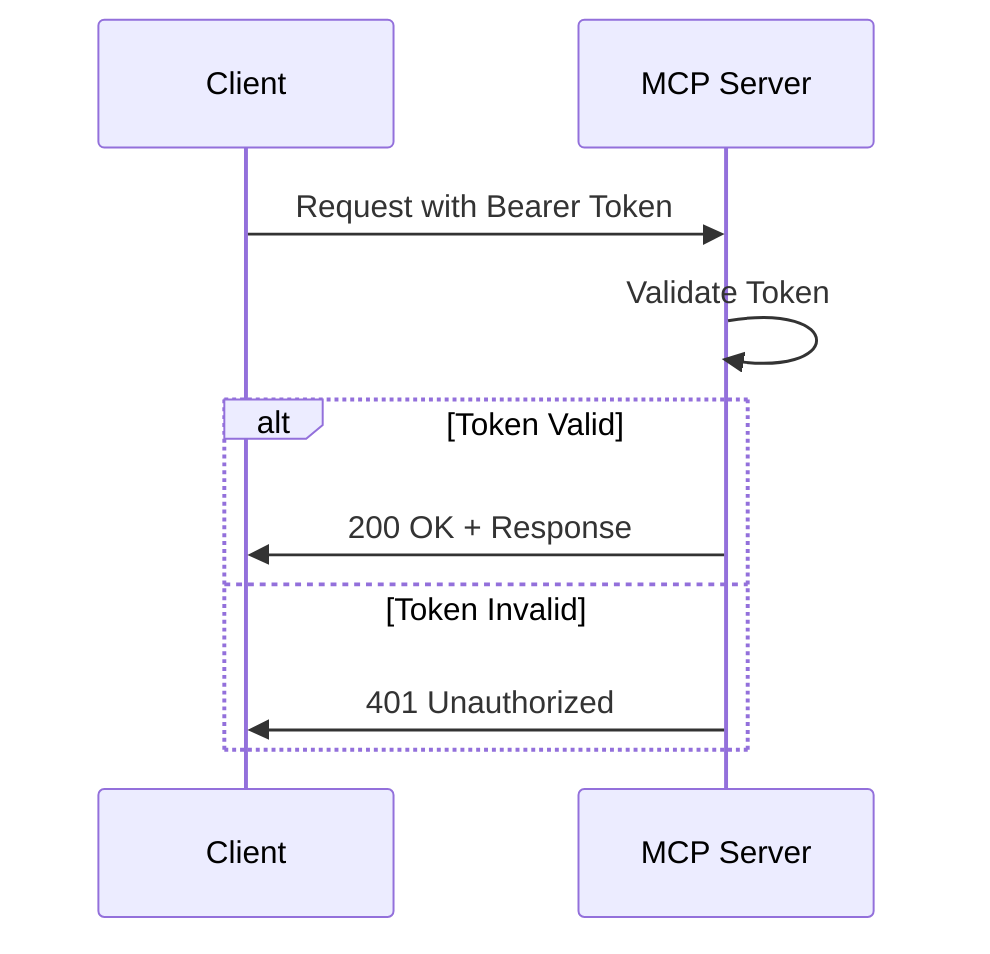

# MCP Server Authentication Guide

## Overview

The HuskyCats MCP Server uses Bearer token authentication to secure access to its API endpoints and validation tools. This guide explains how to configure, authenticate, and troubleshoot authentication with the MCP server.

## Quick Start

### 1. Set Environment Variable

First, set your authentication token as an environment variable:

```bash
export MCP_AUTH_TOKEN="your-secure-token-here"
```

### 2. Configure MCP Server

The server expects authentication via the `MCP_AUTH_TOKEN` environment variable. This is configured in `.mcp.json`:

```json
{
  "mcpServers": {
    "huskycats-validator": {
      "url": "http://localhost:3000/rpc",
      "type": "http",
      "authentication": {
        "type": "bearer",
        "token": "${MCP_AUTH_TOKEN}"
      }
    }
  }
}
```

### 3. Start the Server

```bash
cd mcp-server
npm run dev
```

## Authentication Methods

### Bearer Token Authentication

The MCP server uses Bearer token authentication for all API requests. Include the token in the `Authorization` header:

```bash
Authorization: Bearer ${MCP_AUTH_TOKEN}
```

### Example cURL Request

```bash
curl -X GET http://localhost:3000/health \
  -H "Authorization: Bearer ${MCP_AUTH_TOKEN}"
```

### Example with Claude CLI

When using Claude CLI, ensure the token is configured:

```bash
# Set token in environment
export MCP_AUTH_TOKEN="your-secure-token-here"

# Claude will automatically use the token from .mcp.json configuration
claude mcp connect huskycats-validator
```

## Configuration Details

### Environment Variables

| Variable | Description | Default | Required |
|----------|-------------|---------|----------|
| `MCP_AUTH_TOKEN` | Bearer authentication token | `dev-token-please-change` | Yes |
| `MCP_REQUIRE_AUTH` | Enable/disable authentication | `true` | No |
| `NODE_ENV` | Environment mode | `production` | No |

### Token Requirements

- **Length**: Minimum 32 characters recommended
- **Characters**: Alphanumeric and special characters
- **Case Sensitive**: Yes
- **Format**: Must be provided as `Bearer <token>`

## Authentication Flow

### 1. Initial Connection



### 2. MCP Protocol Authentication

For MCP protocol requests (JSON-RPC):

```json
{
  "jsonrpc": "2.0",
  "id": 1,
  "method": "initialize",
  "params": {
    "protocolVersion": "2024-11-05",
    "capabilities": {},
    "clientInfo": {
      "name": "your-client",
      "version": "1.0.0"
    }
  }
}
```

Headers:
```
Authorization: Bearer ${MCP_AUTH_TOKEN}
Content-Type: application/json
```

## Endpoints Requiring Authentication

All endpoints require authentication:

- `/` - Server info
- `/health` - Health check
- `/rpc` - MCP JSON-RPC endpoint
- `/mcp` - Alternative MCP endpoint
- `/tools` - Tools discovery
- `/metrics` - Prometheus metrics

## Common Authentication Issues

### 1. 401 Unauthorized Error

**Symptoms:**
```json
{
  "error": "Unauthorized",
  "message": "Invalid or missing authentication token"
}
```

**Solutions:**
- Verify `MCP_AUTH_TOKEN` is set: `echo $MCP_AUTH_TOKEN`
- Check token format: Must include "Bearer " prefix
- Ensure token matches server configuration
- Verify no extra spaces or characters in token

### 2. Connection Refused

**Symptoms:**
- Cannot connect to server
- "Failed to reconnect" error

**Solutions:**
```bash
# Check if server is running
curl http://localhost:3000/health

# Verify server logs
docker logs huskycats-mcp-server

# Check environment variables
env | grep MCP_
```

### 3. Token Not Found

**Symptoms:**
- Server starts with default token warning
- Authentication works with wrong token

**Solutions:**
```bash
# Set token before starting server
export MCP_AUTH_TOKEN="your-secure-token"

# Or use .env file
echo "MCP_AUTH_TOKEN=your-secure-token" > mcp-server/.env
```

## Security Best Practices

### 1. Token Generation

Generate secure tokens using:

```bash
# Using openssl
openssl rand -hex 32

# Using Node.js
node -e "console.log(require('crypto').randomBytes(32).toString('hex'))"

# Using Python
python -c "import secrets; print(secrets.token_hex(32))"
```

### 2. Token Storage

- **Never** commit tokens to version control
- Use environment variables or secret management systems
- Rotate tokens regularly (recommended: every 90 days)
- Use different tokens for different environments

### 3. Environment-Specific Configuration

```bash
# Development
export MCP_AUTH_TOKEN="dev-token-$(openssl rand -hex 16)"

# Staging
export MCP_AUTH_TOKEN="${STAGING_MCP_TOKEN}"

# Production
export MCP_AUTH_TOKEN="${PRODUCTION_MCP_TOKEN}"
```

## Testing Authentication

### 1. Basic Health Check

```bash
# Should return 200 OK with valid token
curl -I http://localhost:3000/health \
  -H "Authorization: Bearer ${MCP_AUTH_TOKEN}"
```

### 2. Test Invalid Token

```bash
# Should return 401 Unauthorized
curl -I http://localhost:3000/health \
  -H "Authorization: Bearer invalid-token"
```

### 3. Test MCP Protocol

```bash
# Initialize MCP connection
curl -X POST http://localhost:3000/rpc \
  -H "Authorization: Bearer ${MCP_AUTH_TOKEN}" \
  -H "Content-Type: application/json" \
  -d '{
    "jsonrpc": "2.0",
    "id": 1,
    "method": "initialize",
    "params": {
      "protocolVersion": "2024-11-05",
      "capabilities": {},
      "clientInfo": {
        "name": "test-client",
        "version": "1.0.0"
      }
    }
  }'
```

### 4. Run E2E Authentication Tests

```bash
cd mcp-server
npm run test:e2e -- authentication-authorization.test.ts
```

## Docker/Podman Deployment

### Using Docker Compose

```yaml
version: '3.8'
services:
  mcp-server:
    image: huskycats-mcp-server:latest
    environment:
      - MCP_AUTH_TOKEN=${MCP_AUTH_TOKEN}
      - NODE_ENV=production
    ports:
      - "3000:3000"
```

### Using Podman

```bash
podman run -d \
  --name huskycats-mcp-server \
  -e MCP_AUTH_TOKEN="${MCP_AUTH_TOKEN}" \
  -p 3000:3000 \
  huskycats-mcp-server:latest
```

## Kubernetes Deployment

### Secret Creation

```bash
kubectl create secret generic mcp-auth \
  --from-literal=token="${MCP_AUTH_TOKEN}"
```

### Deployment Configuration

```yaml
apiVersion: apps/v1
kind: Deployment
metadata:
  name: mcp-server
spec:
  template:
    spec:
      containers:
      - name: mcp-server
        env:
        - name: MCP_AUTH_TOKEN
          valueFrom:
            secretKeyRef:
              name: mcp-auth
              key: token
```

## Monitoring and Auditing

### Authentication Logs

The server logs all authentication attempts:

```bash
# View authentication logs
docker logs huskycats-mcp-server | grep -i auth

# Monitor in real-time
docker logs -f huskycats-mcp-server | grep -i auth
```

### Log Format

```json
{
  "timestamp": "2024-01-10T10:30:00Z",
  "level": "info",
  "message": "Authentication attempt",
  "clientInfo": {
    "ip": "127.0.0.1",
    "userAgent": "claude-cli/1.0.0"
  },
  "result": "success"
}
```

### Failed Authentication Tracking

Monitor failed authentication attempts:

```bash
# Count failed attempts
docker logs huskycats-mcp-server | grep "401" | wc -l

# View recent failures
docker logs --since 1h huskycats-mcp-server | grep "Unauthorized"
```

## Troubleshooting Checklist

1. **Server not accepting connections:**
   - [ ] Server is running: `docker ps | grep mcp-server`
   - [ ] Port 3000 is accessible: `nc -zv localhost 3000`
   - [ ] No firewall blocking: `sudo iptables -L`

2. **Authentication failing:**
   - [ ] Token is set: `echo $MCP_AUTH_TOKEN`
   - [ ] Token format correct: Includes "Bearer " prefix
   - [ ] Token matches server config
   - [ ] No special characters causing issues

3. **MCP protocol errors:**
   - [ ] Correct Content-Type header: `application/json`
   - [ ] Valid JSON-RPC format
   - [ ] Protocol version matches: `2024-11-05`

4. **Environment issues:**
   - [ ] Environment variables loaded
   - [ ] .env file in correct location
   - [ ] No conflicting configurations

## Advanced Configuration

### Custom Authentication Middleware

For advanced use cases, you can extend the authentication:

```typescript
// Custom authentication handler
const customAuth = async (request: FastifyRequest) => {
  const token = request.headers.authorization?.replace('Bearer ', '');
  
  // Custom validation logic
  if (!token || !validateCustomToken(token)) {
    throw new Error('Unauthorized');
  }
  
  // Add user context
  request.user = await getUserFromToken(token);
};
```

### Rate Limiting

Protect against brute force attacks:

```typescript
// Rate limiting configuration
const rateLimitConfig = {
  max: 100, // Maximum requests
  timeWindow: '1 minute',
  ban: 3, // Ban after 3 429 responses
  skipFailedRequests: false,
};
```

## Support and Resources

- **GitHub Issues**: Report authentication problems
- **Documentation**: Full MCP protocol documentation
- **Security**: Report security issues privately
- **Community**: Discord server for help

## Summary

The MCP server authentication system provides:
- ✅ Bearer token authentication
- ✅ Environment-based configuration
- ✅ Comprehensive logging
- ✅ E2E test coverage
- ✅ Production-ready security

Remember to:
1. Always use strong, unique tokens
2. Never expose tokens in logs or version control
3. Monitor authentication failures
4. Rotate tokens regularly
5. Test authentication in all environments