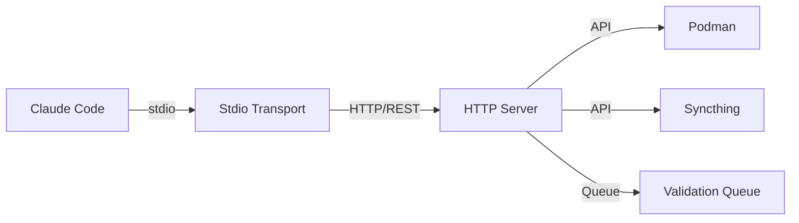

# MCP Stdio Transport Architecture

## Overview

The stdio transport layer acts as a **client-side bridge** that connects Claude Code (stdio) to the fully-featured HTTP MCP server, preserving 100% functionality while enabling seamless integration.



## Architecture Benefits

### 1. Full Feature Preservation
- ✅ **All tools available** - No functionality loss
- ✅ **Streaming support** - Container logs, progress updates
- ✅ **Async operations** - Queue management, batch validation
- ✅ **Stateful connections** - Session persistence, connection pooling
- ✅ **Real-time updates** - Via polling and SSE emulation

### 2. Smart Features
- **Auto-generated bearer tokens** from CWD context
- **Automatic syncthing initialization** on connection
- **Connection pooling** for performance
- **Graceful error handling** with retries
- **Session management** across requests

### 3. Performance Optimizations
- Async syncthing kickoff on connect
- Connection reuse via pooling
- Smart request batching
- Progress streaming for long operations

## Implementation Details

### Stdio Transport (`stdio-transport.ts`)

```typescript
class StdioTransport {
  // Maintains HTTP client connection to local server
  private httpServerUrl: string = 'http://localhost:3000';
  
  // Auto-generates token from CWD for security
  private generateBearerToken(): string {
    const cwd = process.cwd();
    return createHash('sha256').update(`${cwd}:${secret}`).digest('hex');
  }
  
  // Handles streaming responses
  private async handleStreamingRequest(request): Promise<void> {
    // Converts HTTP SSE to stdio messages
  }
  
  // Manages async operations
  private async handleAsyncRequest(request): Promise<void> {
    // Submits job and polls for completion
  }
}
```

### Key Components

1. **Protocol Translation**
   - stdio JSON-RPC ↔ HTTP REST
   - Preserves all MCP semantics
   - Handles batch requests

2. **Streaming Support**
   ```typescript
   // Container logs streaming
   method: 'container_logs' → HTTP SSE → stdio chunks
   
   // Progress updates
   method: 'batch_validate' → Polling → stdio updates
   ```

3. **Session Management**
   - Unique session ID per connection
   - Bearer token from environment
   - Connection pool for reuse

4. **Auto-Initialization**
   ```typescript
   // On connect:
   1. Validate HTTP server
   2. Generate bearer token
   3. Initialize syncthing for CWD
   4. Send MCP initialization
   ```

## Setup Instructions

### 1. Build the Server

```bash
cd mcp-server
npm install
npm run build
```

### 2. Start HTTP Server

```bash
# Option A: Direct
npm run mcp:http

# Option B: With Podman
podman-compose up -d

# Option C: Using startup script
./start-mcp.sh
```

### 3. Configure Claude Code

Update `.claude/mcp.json`:

```json
{
  "mcpServers": {
    "huskycats-mcp": {
      "command": "node",
      "args": [
        "/path/to/mcp-server/dist/stdio-server.js"
      ],
      "type": "stdio",
      "env": {
        "MCP_HTTP_SERVER_URL": "http://localhost:3000",
        "MCP_AUTO_TOKEN": "true",
        "MCP_SYNCTHING_AUTO": "true"
      }
    }
  }
}
```

### 4. Test Connection

```bash
# Restart Claude Code to reload MCP servers
claude mcp list

# Should show:
# huskycats-mcp: ✓ Connected
```

## Environment Variables

| Variable | Default | Description |
|----------|---------|-------------|
| `MCP_HTTP_SERVER_URL` | `http://localhost:3000` | HTTP server endpoint |
| `MCP_BEARER_TOKEN` | Auto-generated | Authentication token |
| `MCP_AUTO_TOKEN` | `true` | Auto-generate token from CWD |
| `MCP_SYNCTHING_AUTO` | `true` | Auto-start syncthing sync |
| `MCP_POOL_SIZE` | `10` | Connection pool size |
| `MCP_REQUEST_TIMEOUT` | `30000` | Request timeout (ms) |

## Tool Availability

All tools are available through stdio:

### Validation Tools
- `python-black`, `python-flake8`, `python-mypy`
- `js-eslint`, `js-prettier`
- `shell-shellcheck`, `docker-hadolint`
- `yaml-yamllint`, `gitlab-ci-validate`

### Project Tools
- `validate_project` - Full project validation
- `batch_validate` - Batch file validation
- `queue_validation` - Async validation queue
- `queue_status` - Check job status

### Security Tools
- `security_secrets_scan` - Scan for secrets
- `security_dependency_audit` - Audit dependencies

### Container Tools
- `container_list` - List containers
- `container_inspect` - Inspect container
- `container_logs` - Stream container logs

### Syncthing Tools
- `syncthing_list_repos` - List synced repos
- `syncthing_add_repo` - Add repo to sync
- `syncthing_sync_status` - Get sync status

## Advanced Features

### 1. Streaming Container Logs

```javascript
// Request
{
  "method": "container_logs",
  "params": {
    "container": "my-app",
    "follow": true
  }
}

// Response (streamed)
{ "jsonrpc": "2.0", "id": 1, "result": { "line": "Starting application..." } }
{ "jsonrpc": "2.0", "id": 1, "result": { "line": "Server listening on :8080" } }
{ "jsonrpc": "2.0", "id": 1, "result": { "status": "completed" } }
```

### 2. Async Batch Validation

```javascript
// Request
{
  "method": "batch_validate",
  "params": {
    "files": ["src/*.py", "tests/*.py"],
    "tools": ["python-black", "python-mypy"]
  }
}

// Response (with job ID)
{ "jsonrpc": "2.0", "id": 1, "result": { "jobId": "job-123", "status": "queued" } }

// Progress updates (automatic polling)
{ "jsonrpc": "2.0", "id": 1, "result": { "jobId": "job-123", "status": "processing", "progress": 0.5 } }
{ "jsonrpc": "2.0", "id": 1, "result": { "jobId": "job-123", "status": "completed", "results": [...] } }
```

### 3. Syncthing Auto-Sync

On connection, automatically:
1. Detects current working directory
2. Adds as syncthing repository
3. Initiates sync with configured devices
4. Returns sync status

## Troubleshooting

### Connection Issues

```bash
# Check HTTP server
curl http://localhost:3000/health

# Test stdio transport directly
echo '{"jsonrpc":"2.0","id":1,"method":"initialize","params":{}}' | \
  node mcp-server/dist/stdio-server.js

# Check logs
journalctl -f -u mcp-server
```

### Authentication Errors

```bash
# Set explicit token
export MCP_BEARER_TOKEN="your-secure-token"

# Or use auto-generation
export MCP_AUTO_TOKEN=true
```

### Performance Tuning

```bash
# Increase connection pool
export MCP_POOL_SIZE=20

# Adjust timeout for slow operations
export MCP_REQUEST_TIMEOUT=60000
```

## Architecture Decision Record

### Why This Approach?

1. **Preservation of Investment**
   - Existing HTTP server remains unchanged
   - All features continue working
   - No regression in capabilities

2. **Best of Both Worlds**
   - Claude Code gets stdio integration
   - Complex features use HTTP optimally
   - Streaming and async preserved

3. **Future Flexibility**
   - Can add WebSocket support later
   - Easy to add more transports
   - HTTP server can serve multiple clients

4. **Security Benefits**
   - Token generation from context
   - Session isolation
   - Audit trail preservation

## Next Steps

1. **Testing**
   - Unit tests for stdio transport
   - Integration tests with HTTP server
   - E2E tests with Claude Code

2. **Enhancements**
   - WebSocket support for real-time
   - Metrics collection
   - Request caching

3. **Documentation**
   - API reference
   - Tool examples
   - Video tutorials