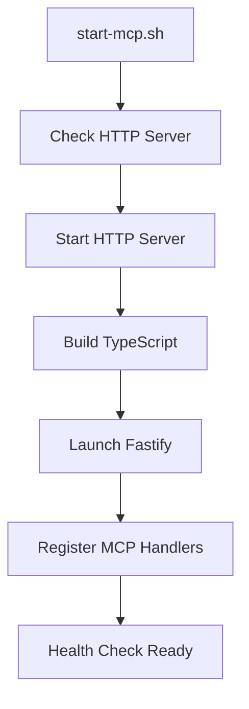
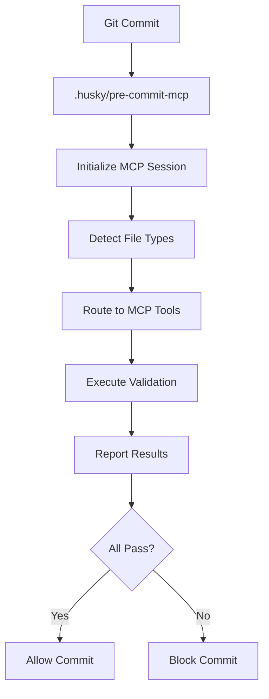
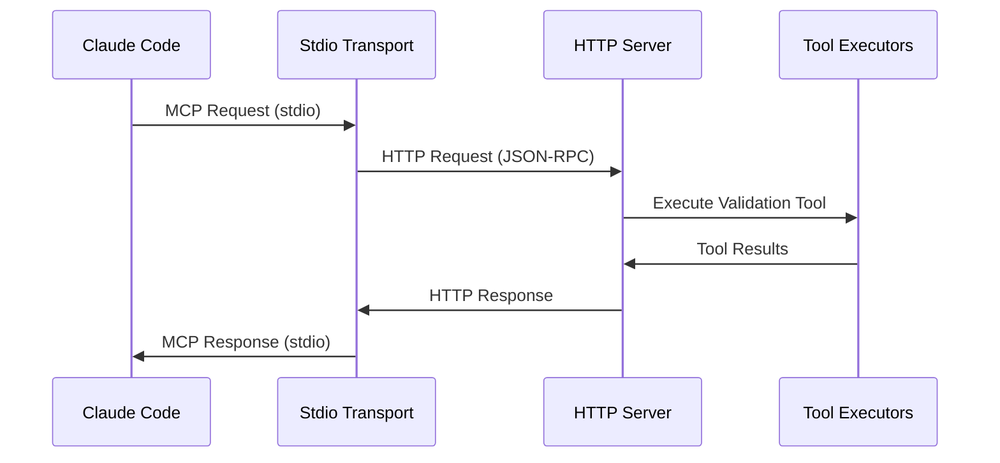

# MCP Server Bootstrap and Architecture Analysis

## Executive Summary

This analysis examines the MCP (Model Context Protocol) server implementation and its bootstrap processes for git hooks integration within the HuskyCats project. The system represents a sophisticated enterprise-grade code validation and synchronization platform built on TypeScript with comprehensive Podman/container integration.

## Project Structure Overview

### Core MCP Components

```
mcp-server/
├── src/
│   ├── index.ts                    # HTTP Server Entry Point
│   ├── stdio-server.ts             # Stdio Transport Server
│   ├── server.ts                   # Core Server Logic
│   ├── handlers/                   # Protocol Handlers
│   │   ├── mcp.ts                 # Basic MCP Protocol Handler
│   │   ├── mcp-enhanced.ts        # Enhanced MCP with Full Tool Support
│   │   ├── hooks.ts               # Git Hooks Integration
│   │   ├── tools.ts               # Tools Discovery Endpoint
│   │   ├── resources.ts           # Resources Handler
│   │   ├── prompts.ts             # Prompts Handler
│   │   ├── health.ts              # Health Check Handler
│   │   └── rpc.ts                 # JSON-RPC Handler
│   ├── tools/                     # Tool Implementations
│   │   ├── index.ts               # Tool Registry
│   │   ├── executor.ts            # Tool Execution Engine
│   │   ├── validation-queue.ts    # Async Validation Queue
│   │   ├── syncthing-operations.ts # Syncthing Integration
│   │   └── validators/            # Specialized Validators
│   ├── transports/
│   │   └── stdio-transport.ts     # Stdio-HTTP Bridge
│   ├── types/                     # Type Definitions
│   └── utils/                     # Utilities
├── config/                        # Configuration Files
├── tests/                         # Test Suite
└── package.json                   # Dependencies & Scripts
```

### Bootstrap Files and Scripts

1. **Root Level Bootstrap**
   - `/Users/jsullivan2/git/huskycats-bates/start-mcp.sh` (Line 1-50)
   - `/Users/jsullivan2/git/huskycats-bates/install.sh`
   - `/Users/jsullivan2/git/huskycats-bates/install-podman-desktop.sh`

2. **Git Hooks Integration**
   - `/Users/jsullivan2/git/huskycats-bates/.husky/pre-commit-mcp` (Line 1-249)

3. **MCP Configuration**
   - `/Users/jsullivan2/git/huskycats-bates/.mcp.json` (Line 1-62)
   - `/Users/jsullivan2/git/huskycats-bates/.roo/mcp.json` (Line 1-32)

## MCP Server Architecture

### Dual Transport Architecture

The MCP server implements a sophisticated dual transport system:

1. **HTTP Server** (`src/index.ts`):
   - Fastify-based HTTP server on port 3000
   - Full-featured REST API with JSON-RPC support
   - Comprehensive health checks and metrics

2. **Stdio Transport** (`src/stdio-server.ts`, `src/transports/stdio-transport.ts`):
   - Acts as stdio-to-HTTP bridge for Claude Code integration
   - Maintains feature parity with HTTP server
   - Supports streaming, async operations, and stateful connections

### Key Implementation Details

#### HTTP Server Bootstrap Process (src/index.ts:17-141)
```typescript
const bootstrap = async (): Promise<void> => {
  // 1. Environment validation
  const env = validateEnv();
  
  // 2. Fastify instance creation with logging
  const fastify = Fastify({ logger: false, trustProxy: true });
  
  // 3. CORS registration
  await fastify.register(fastifyCors, { origin: [...], credentials: true });
  
  // 4. Handler registration
  const mcpHandler = createEnhancedMCPHandler();
  fastify.post('/mcp', mcpHandler);
  fastify.post('/rpc', mcpHandler);
  
  // 5. Graceful shutdown handling
  process.on('SIGTERM', () => gracefulShutdown('SIGTERM'));
  
  // 6. Server startup
  const address = await fastify.listen({ port: env.PORT, host: env.HOST });
}
```

#### Stdio Transport Bootstrap (src/stdio-server.ts:21-76)
```typescript
async function main() {
  const transport = new StdioTransport({
    httpServerUrl: process.env.MCP_HTTP_SERVER_URL || 'http://localhost:3000',
    bearerToken: process.env.MCP_BEARER_TOKEN,
    autoGenerateToken: process.env.MCP_AUTO_TOKEN === 'true',
    syncthingAutoStart: process.env.MCP_SYNCTHING_AUTO === 'true'
  });
  
  await transport.start(); // Validates HTTP server and initializes stdio handlers
}
```

## MCP Tool Registry and Implementation

### Available Tools (src/tools/index.ts:5-111)

The system provides **38 comprehensive tools** across multiple categories:

#### Language-Specific Tools
- **Python**: `python-black`, `python-flake8`, `python-mypy`, `python-bandit`
- **JavaScript/TypeScript**: `js-eslint`, `js-prettier`
- **Shell**: `shell-shellcheck`

#### Infrastructure Tools
- **Docker**: `docker-hadolint`
- **YAML**: `yaml-yamllint`
- **Ansible**: `ansible-lint`

#### GitLab CI/CD Integration
- **Basic**: `gitlab-ci-validate`
- **Advanced AutoDevOps**: `gitlab-autodevops-validate`, `gitlab-autodevops-analyze`, `gitlab-ci-generate`

#### Project-Wide Tools
- `validate_project` - Comprehensive project validation
- `batch_validate` - Multi-file batch validation

#### Security Tools
- `security_secrets_scan` - Secret detection
- `security_dependency_audit` - Vulnerability scanning

#### Container Management
- `container_list`, `container_inspect`, `container_logs`

#### Synchronization
- `syncthing_list_repos`, `syncthing_add_repo`, `syncthing_sync_status`

### Enhanced MCP Handler (src/handlers/mcp-enhanced.ts:19-671)

The enhanced handler supports:
- **Batch Requests**: Multiple MCP requests in a single call
- **Streaming Operations**: Real-time progress updates
- **Async Job Management**: Long-running validation tasks
- **Resource Access**: Validation reports, queue status, container logs
- **Prompt Templates**: Pre-configured validation workflows

## Git Hooks Integration

### Pre-commit Hook Architecture (.husky/pre-commit-mcp:1-249)

The git hook system implements a sophisticated validation pipeline:

#### MCP Session Management (Lines 34-52)
```bash
init_mcp_session() {
    local response=$(curl -s -X POST "${MCP_SERVER}/rpc" \
        -H "Content-Type: application/json" \
        -H "X-Session-ID: ${SESSION_ID}" \
        -d '{
            "jsonrpc": "2.0",
            "method": "initialize",
            "params": {"protocolVersion": "2024-11-05", "capabilities": {"tools": {}}},
            "id": 1
        }')
}
```

#### File-Type Specific Validation (Lines 94-219)

1. **GitLab CI Validation** (Lines 94-116):
   - Detects `.gitlab-ci.yml` changes
   - Uses MCP `gitlab-ci-validate` tool
   - Fallback to local validation scripts

2. **Python Validation** (Lines 118-148):
   - Automatic formatting with Black
   - Linting with Flake8
   - Security scanning with Bandit

3. **JavaScript/TypeScript** (Lines 150-169):
   - Prettier formatting
   - ESLint validation

4. **YAML/Ansible** (Lines 171-190):
   - Yamllint validation
   - Ansible-specific checks

5. **Dockerfile/Container** (Lines 192-204):
   - Hadolint validation

6. **Shell Scripts** (Lines 206-219):
   - ShellCheck validation

#### Security Scanning (Lines 230-236)
```bash
# Check for secrets/credentials
if echo "$STAGED_FILES" | xargs -r grep -E -i '(password|secret|api[_-]?key|token|credential|private[_-]?key)\\s*[:=]\\s*["\'][^"\']+["\']' 2>/dev/null
```

## Configuration and Environment

### MCP Server Configuration (.mcp.json:1-62)

```json
{
  "mcpServers": {
    "huskycats-validator": {
      "url": "http://localhost:3000/rpc",
      "type": "http",
      "authentication": { "type": "bearer", "token": "..." },
      "capabilities": { "tools": true, "resources": true, "prompts": true },
      "tools": [
        "python-black", "python-flake8", "python-mypy", "python-bandit",
        "js-eslint", "js-prettier", "shell-shellcheck", "docker-hadolint",
        "yaml-yamllint", "gitlab-ci-validate", "validate_project",
        "batch_validate", "security_secrets_scan", "security_dependency_audit"
      ]
    }
  }
}
```

### Environment Variables

- `MCP_AUTH_TOKEN`: Authentication token
- `NODE_ENV`: Environment mode
- `ENABLE_SYNCTHING`: Syncthing integration flag
- `SYNCTHING_API_KEY`: Syncthing API key
- `PODMAN_HOST`: Podman socket path

## Bootstrap Flow Analysis

### 1. System Initialization



### 2. Git Hook Integration



### 3. MCP Protocol Flow



## Hooks System Implementation

### Hooks Manager (src/handlers/hooks.ts:34-281)

The hooks system provides sophisticated event handling:

#### Pre-Operation Hooks (Lines 44-63)
- User permission validation
- Operation audit logging
- Access control enforcement

#### Post-Operation Hooks (Lines 66-87)
- Metrics collection
- Audit trail maintenance
- File modification events

#### Error Handling (Lines 90-103)
- Error logging and analysis
- Rate limiting implementation
- User error count tracking

#### Claude-Specific Integrations (Lines 228-281)
- `claudeHooks.preEdit`: File modification preparation
- `claudeHooks.postEdit`: Change tracking
- `claudeHooks.preTask`/`postTask`: Task lifecycle management
- `claudeHooks.sessionStart`/`sessionEnd`: Session management

## Integration Points and Data Flow

### 1. Claude Code Integration

**Entry Point**: `npm run mcp:stdio` → `src/stdio-server.ts`
- Stdio transport bridges Claude Code to HTTP server
- Maintains full feature parity with HTTP endpoints
- Supports streaming and async operations

### 2. Git Workflow Integration

**Entry Point**: `.husky/pre-commit-mcp` → MCP HTTP Server
- Pre-commit hooks call MCP server via HTTP
- File-type detection routes to appropriate tools
- Results determine commit success/failure

### 3. Container/Podman Integration

**Entry Point**: Container tools → Podman CLI
- Container management through Podman commands
- Health monitoring and log access
- Integration with Syncthing for distributed sync

## Potential Issues and Risks

### 1. Bootstrap Dependencies
- **Risk**: HTTP server must be running before stdio transport
- **Mitigation**: `start-mcp.sh` includes health check loops (Lines 22-30)

### 2. Authentication and Security
- **Risk**: Bearer token management in environment
- **Mitigation**: Auto-generated tokens based on CWD context

### 3. Tool Availability
- **Risk**: External tools (black, flake8, etc.) must be installed
- **Mitigation**: Graceful fallback to local validation scripts

### 4. Concurrent Operations
- **Risk**: Multiple git hooks running simultaneously
- **Mitigation**: Session management with unique session IDs

## Performance Characteristics

### Tool Execution
- **Parallel Execution**: Batch validation supports parallel tool execution
- **Streaming**: Real-time progress updates for long-running operations
- **Caching**: HTTP responses cached where appropriate

### Resource Management
- **Connection Pooling**: Stdio transport maintains connection pools
- **Timeout Handling**: Configurable request timeouts (default: 30s)
- **Memory Management**: Cleanup handlers for graceful shutdown

## Deployment Architecture

### Service Configuration (config/systemd/)
- `mcp-server.service`: Main service unit
- `mcp-server-production.service`: Production configuration
- `mcp-server-monitoring.service`: Monitoring service
- `mcp-server-backup.service`: Backup automation

### Container Deployment (ContainerFile, podman-compose.yml)
- Podman-based containerization
- Multi-stage builds for optimization
- Health check endpoints
- Volume management for data persistence

## Conclusion

The HuskyCats MCP server represents a comprehensive, enterprise-grade code validation platform with sophisticated bootstrap processes and git hooks integration. The dual transport architecture (HTTP + Stdio) ensures compatibility with both direct API access and Claude Code integration, while maintaining full feature parity across all access methods.

Key strengths include:
- Comprehensive tool coverage (38+ validation tools)
- Robust error handling and graceful fallbacks
- Sophisticated hooks system for event-driven workflows
- Enterprise-ready deployment configuration
- Strong security and authentication mechanisms

The bootstrap process is well-architected with proper dependency management, health checking, and graceful shutdown handling, making it suitable for production deployment in enterprise environments.